# GitHub Emoji 图标索引

> 数据来源: [github-hovercard/emoji.json](https://github.com/Justineo/github-hovercard/blob/master/assets/emoji.json)  
> 共计 **1508** 个 emoji（去重图片 **1451** 个）  
> 生成时间: 2026-03-20 18:27:10

| 名称 | Code | 预览 | 原始 URL |
|------|------|------|----------|
| +1 | `1f44d` |  | [链接](https://github.githubassets.com/images/icons/emoji/unicode/1f44d.png?v8) |
| -1 | `1f44e` |  | [链接](https://github.githubassets.com/images/icons/emoji/unicode/1f44e.png?v8) |
| 100 | `1f4af` |  | [链接](https://github.githubassets.com/images/icons/emoji/unicode/1f4af.png?v8) |
| 1234 | `1f522` |  | [链接](https://github.githubassets.com/images/icons/emoji/unicode/1f522.png?v8) |
| 1st_place_medal | `1f947` |  | [链接](https://github.githubassets.com/images/icons/emoji/unicode/1f947.png?v8) |
| 2nd_place_medal | `1f948` |  | [链接](https://github.githubassets.com/images/icons/emoji/unicode/1f948.png?v8) |
| 3rd_place_medal | `1f949` |  | [链接](https://github.githubassets.com/images/icons/emoji/unicode/1f949.png?v8) |
| 8ball | `1f3b1` |  | [链接](https://github.githubassets.com/images/icons/emoji/unicode/1f3b1.png?v8) |
| a | `1f170` |  | [链接](https://github.githubassets.com/images/icons/emoji/unicode/1f170.png?v8) |
| ab | `1f18e` |  | [链接](https://github.githubassets.com/images/icons/emoji/unicode/1f18e.png?v8) |
| abc | `1f524` |  | [链接](https://github.githubassets.com/images/icons/emoji/unicode/1f524.png?v8) |
| abcd | `1f521` |  | [链接](https://github.githubassets.com/images/icons/emoji/unicode/1f521.png?v8) |
| accept | `1f251` |  | [链接](https://github.githubassets.com/images/icons/emoji/unicode/1f251.png?v8) |
| aerial_tramway | `1f6a1` |  | [链接](https://github.githubassets.com/images/icons/emoji/unicode/1f6a1.png?v8) |
| afghanistan | `1f1e6-1f1eb` |  | [链接](https://github.githubassets.com/images/icons/emoji/unicode/1f1e6-1f1eb.png?v8) |
| airplane | `2708` |  | [链接](https://github.githubassets.com/images/icons/emoji/unicode/2708.png?v8) |
| aland_islands | `1f1e6-1f1fd` |  | [链接](https://github.githubassets.com/images/icons/emoji/unicode/1f1e6-1f1fd.png?v8) |
| alarm_clock | `23f0` |  | [链接](https://github.githubassets.com/images/icons/emoji/unicode/23f0.png?v8) |
| albania | `1f1e6-1f1f1` |  | [链接](https://github.githubassets.com/images/icons/emoji/unicode/1f1e6-1f1f1.png?v8) |
| alembic | `2697` |  | [链接](https://github.githubassets.com/images/icons/emoji/unicode/2697.png?v8) |
| algeria | `1f1e9-1f1ff` |  | [链接](https://github.githubassets.com/images/icons/emoji/unicode/1f1e9-1f1ff.png?v8) |
| alien | `1f47d` |  | [链接](https://github.githubassets.com/images/icons/emoji/unicode/1f47d.png?v8) |
| ambulance | `1f691` |  | [链接](https://github.githubassets.com/images/icons/emoji/unicode/1f691.png?v8) |
| american_samoa | `1f1e6-1f1f8` |  | [链接](https://github.githubassets.com/images/icons/emoji/unicode/1f1e6-1f1f8.png?v8) |
| amphora | `1f3fa` |  | [链接](https://github.githubassets.com/images/icons/emoji/unicode/1f3fa.png?v8) |
| anchor | `2693` |  | [链接](https://github.githubassets.com/images/icons/emoji/unicode/2693.png?v8) |
| andorra | `1f1e6-1f1e9` |  | [链接](https://github.githubassets.com/images/icons/emoji/unicode/1f1e6-1f1e9.png?v8) |
| angel | `1f47c` |  | [链接](https://github.githubassets.com/images/icons/emoji/unicode/1f47c.png?v8) |
| anger | `1f4a2` |  | [链接](https://github.githubassets.com/images/icons/emoji/unicode/1f4a2.png?v8) |
| angola | `1f1e6-1f1f4` |  | [链接](https://github.githubassets.com/images/icons/emoji/unicode/1f1e6-1f1f4.png?v8) |
| angry | `1f620` |  | [链接](https://github.githubassets.com/images/icons/emoji/unicode/1f620.png?v8) |
| anguilla | `1f1e6-1f1ee` |  | [链接](https://github.githubassets.com/images/icons/emoji/unicode/1f1e6-1f1ee.png?v8) |
| anguished | `1f627` |  | [链接](https://github.githubassets.com/images/icons/emoji/unicode/1f627.png?v8) |
| ant | `1f41c` | 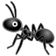 | [链接](https://github.githubassets.com/images/icons/emoji/unicode/1f41c.png?v8) |
| antarctica | `1f1e6-1f1f6` |  | [链接](https://github.githubassets.com/images/icons/emoji/unicode/1f1e6-1f1f6.png?v8) |
| antigua_barbuda | `1f1e6-1f1ec` |  | [链接](https://github.githubassets.com/images/icons/emoji/unicode/1f1e6-1f1ec.png?v8) |
| apple | `1f34e` |  | [链接](https://github.githubassets.com/images/icons/emoji/unicode/1f34e.png?v8) |
| aquarius | `2652` |  | [链接](https://github.githubassets.com/images/icons/emoji/unicode/2652.png?v8) |
| argentina | `1f1e6-1f1f7` |  | [链接](https://github.githubassets.com/images/icons/emoji/unicode/1f1e6-1f1f7.png?v8) |
| aries | `2648` |  | [链接](https://github.githubassets.com/images/icons/emoji/unicode/2648.png?v8) |
| armenia | `1f1e6-1f1f2` |  | [链接](https://github.githubassets.com/images/icons/emoji/unicode/1f1e6-1f1f2.png?v8) |
| arrow_backward | `25c0` |  | [链接](https://github.githubassets.com/images/icons/emoji/unicode/25c0.png?v8) |
| arrow_double_down | `23ec` |  | [链接](https://github.githubassets.com/images/icons/emoji/unicode/23ec.png?v8) |
| arrow_double_up | `23eb` |  | [链接](https://github.githubassets.com/images/icons/emoji/unicode/23eb.png?v8) |
| arrow_down | `2b07` |  | [链接](https://github.githubassets.com/images/icons/emoji/unicode/2b07.png?v8) |
| arrow_down_small | `1f53d` |  | [链接](https://github.githubassets.com/images/icons/emoji/unicode/1f53d.png?v8) |
| arrow_forward | `25b6` |  | [链接](https://github.githubassets.com/images/icons/emoji/unicode/25b6.png?v8) |
| arrow_heading_down | `2935` |  | [链接](https://github.githubassets.com/images/icons/emoji/unicode/2935.png?v8) |
| arrow_heading_up | `2934` |  | [链接](https://github.githubassets.com/images/icons/emoji/unicode/2934.png?v8) |
| arrow_left | `2b05` |  | [链接](https://github.githubassets.com/images/icons/emoji/unicode/2b05.png?v8) |
| arrow_lower_left | `2199` |  | [链接](https://github.githubassets.com/images/icons/emoji/unicode/2199.png?v8) |
| arrow_lower_right | `2198` |  | [链接](https://github.githubassets.com/images/icons/emoji/unicode/2198.png?v8) |
| arrow_right | `27a1` |  | [链接](https://github.githubassets.com/images/icons/emoji/unicode/27a1.png?v8) |
| arrow_right_hook | `21aa` |  | [链接](https://github.githubassets.com/images/icons/emoji/unicode/21aa.png?v8) |
| arrow_up | `2b06` |  | [链接](https://github.githubassets.com/images/icons/emoji/unicode/2b06.png?v8) |
| arrow_up_down | `2195` |  | [链接](https://github.githubassets.com/images/icons/emoji/unicode/2195.png?v8) |
| arrow_up_small | `1f53c` |  | [链接](https://github.githubassets.com/images/icons/emoji/unicode/1f53c.png?v8) |
| arrow_upper_left | `2196` |  | [链接](https://github.githubassets.com/images/icons/emoji/unicode/2196.png?v8) |
| arrow_upper_right | `2197` |  | [链接](https://github.githubassets.com/images/icons/emoji/unicode/2197.png?v8) |
| arrows_clockwise | `1f503` |  | [链接](https://github.githubassets.com/images/icons/emoji/unicode/1f503.png?v8) |
| arrows_counterclockwise | `1f504` |  | [链接](https://github.githubassets.com/images/icons/emoji/unicode/1f504.png?v8) |
| art | `1f3a8` |  | [链接](https://github.githubassets.com/images/icons/emoji/unicode/1f3a8.png?v8) |
| articulated_lorry | `1f69b` |  | [链接](https://github.githubassets.com/images/icons/emoji/unicode/1f69b.png?v8) |
| artificial_satellite | `1f6f0` |  | [链接](https://github.githubassets.com/images/icons/emoji/unicode/1f6f0.png?v8) |
| aruba | `1f1e6-1f1fc` |  | [链接](https://github.githubassets.com/images/icons/emoji/unicode/1f1e6-1f1fc.png?v8) |
| asterisk | `002a-20e3` |  | [链接](https://github.githubassets.com/images/icons/emoji/unicode/002a-20e3.png?v8) |
| astonished | `1f632` |  | [链接](https://github.githubassets.com/images/icons/emoji/unicode/1f632.png?v8) |
| athletic_shoe | `1f45f` |  | [链接](https://github.githubassets.com/images/icons/emoji/unicode/1f45f.png?v8) |
| atm | `1f3e7` |  | [链接](https://github.githubassets.com/images/icons/emoji/unicode/1f3e7.png?v8) |
| atom | `atom` |  | [链接](https://github.githubassets.com/images/icons/emoji/atom.png?v8) |
| atom_symbol | `269b` |  | [链接](https://github.githubassets.com/images/icons/emoji/unicode/269b.png?v8) |
| australia | `1f1e6-1f1fa` |  | [链接](https://github.githubassets.com/images/icons/emoji/unicode/1f1e6-1f1fa.png?v8) |
| austria | `1f1e6-1f1f9` |  | [链接](https://github.githubassets.com/images/icons/emoji/unicode/1f1e6-1f1f9.png?v8) |
| avocado | `1f951` |  | [链接](https://github.githubassets.com/images/icons/emoji/unicode/1f951.png?v8) |
| azerbaijan | `1f1e6-1f1ff` |  | [链接](https://github.githubassets.com/images/icons/emoji/unicode/1f1e6-1f1ff.png?v8) |
| b | `1f171` |  | [链接](https://github.githubassets.com/images/icons/emoji/unicode/1f171.png?v8) |
| baby | `1f476` |  | [链接](https://github.githubassets.com/images/icons/emoji/unicode/1f476.png?v8) |
| baby_bottle | `1f37c` |  | [链接](https://github.githubassets.com/images/icons/emoji/unicode/1f37c.png?v8) |
| baby_chick | `1f424` |  | [链接](https://github.githubassets.com/images/icons/emoji/unicode/1f424.png?v8) |
| baby_symbol | `1f6bc` |  | [链接](https://github.githubassets.com/images/icons/emoji/unicode/1f6bc.png?v8) |
| back | `1f519` |  | [链接](https://github.githubassets.com/images/icons/emoji/unicode/1f519.png?v8) |
| bacon | `1f953` |  | [链接](https://github.githubassets.com/images/icons/emoji/unicode/1f953.png?v8) |
| badminton | `1f3f8` |  | [链接](https://github.githubassets.com/images/icons/emoji/unicode/1f3f8.png?v8) |
| baggage_claim | `1f6c4` |  | [链接](https://github.githubassets.com/images/icons/emoji/unicode/1f6c4.png?v8) |
| baguette_bread | `1f956` | 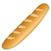 | [链接](https://github.githubassets.com/images/icons/emoji/unicode/1f956.png?v8) |
| bahamas | `1f1e7-1f1f8` |  | [链接](https://github.githubassets.com/images/icons/emoji/unicode/1f1e7-1f1f8.png?v8) |
| bahrain | `1f1e7-1f1ed` |  | [链接](https://github.githubassets.com/images/icons/emoji/unicode/1f1e7-1f1ed.png?v8) |
| balance_scale | `2696` |  | [链接](https://github.githubassets.com/images/icons/emoji/unicode/2696.png?v8) |
| balloon | `1f388` |  | [链接](https://github.githubassets.com/images/icons/emoji/unicode/1f388.png?v8) |
| ballot_box | `1f5f3` |  | [链接](https://github.githubassets.com/images/icons/emoji/unicode/1f5f3.png?v8) |
| ballot_box_with_check | `2611` |  | [链接](https://github.githubassets.com/images/icons/emoji/unicode/2611.png?v8) |
| bamboo | `1f38d` |  | [链接](https://github.githubassets.com/images/icons/emoji/unicode/1f38d.png?v8) |
| banana | `1f34c` |  | [链接](https://github.githubassets.com/images/icons/emoji/unicode/1f34c.png?v8) |
| bangbang | `203c` |  | [链接](https://github.githubassets.com/images/icons/emoji/unicode/203c.png?v8) |
| bangladesh | `1f1e7-1f1e9` |  | [链接](https://github.githubassets.com/images/icons/emoji/unicode/1f1e7-1f1e9.png?v8) |
| bank | `1f3e6` |  | [链接](https://github.githubassets.com/images/icons/emoji/unicode/1f3e6.png?v8) |
| bar_chart | `1f4ca` |  | [链接](https://github.githubassets.com/images/icons/emoji/unicode/1f4ca.png?v8) |
| barbados | `1f1e7-1f1e7` |  | [链接](https://github.githubassets.com/images/icons/emoji/unicode/1f1e7-1f1e7.png?v8) |
| barber | `1f488` |  | [链接](https://github.githubassets.com/images/icons/emoji/unicode/1f488.png?v8) |
| baseball | `26be` |  | [链接](https://github.githubassets.com/images/icons/emoji/unicode/26be.png?v8) |
| basecamp | `basecamp` |  | [链接](https://github.githubassets.com/images/icons/emoji/basecamp.png?v8) |
| basecampy | `basecampy` |  | [链接](https://github.githubassets.com/images/icons/emoji/basecampy.png?v8) |
| basketball | `1f3c0` |  | [链接](https://github.githubassets.com/images/icons/emoji/unicode/1f3c0.png?v8) |
| basketball_man | `26f9` |  | [链接](https://github.githubassets.com/images/icons/emoji/unicode/26f9.png?v8) |
| basketball_woman | `26f9-2640` |  | [链接](https://github.githubassets.com/images/icons/emoji/unicode/26f9-2640.png?v8) |
| bat | `1f987` | 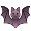 | [链接](https://github.githubassets.com/images/icons/emoji/unicode/1f987.png?v8) |
| bath | `1f6c0` |  | [链接](https://github.githubassets.com/images/icons/emoji/unicode/1f6c0.png?v8) |
| bathtub | `1f6c1` |  | [链接](https://github.githubassets.com/images/icons/emoji/unicode/1f6c1.png?v8) |
| battery | `1f50b` |  | [链接](https://github.githubassets.com/images/icons/emoji/unicode/1f50b.png?v8) |
| beach_umbrella | `1f3d6` |  | [链接](https://github.githubassets.com/images/icons/emoji/unicode/1f3d6.png?v8) |
| bear | `1f43b` |  | [链接](https://github.githubassets.com/images/icons/emoji/unicode/1f43b.png?v8) |
| bed | `1f6cf` | 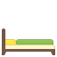 | [链接](https://github.githubassets.com/images/icons/emoji/unicode/1f6cf.png?v8) |
| bee | `1f41d` |  | [链接](https://github.githubassets.com/images/icons/emoji/unicode/1f41d.png?v8) |
| beer | `1f37a` |  | [链接](https://github.githubassets.com/images/icons/emoji/unicode/1f37a.png?v8) |
| beers | `1f37b` |  | [链接](https://github.githubassets.com/images/icons/emoji/unicode/1f37b.png?v8) |
| beetle | `1f41e` |  | [链接](https://github.githubassets.com/images/icons/emoji/unicode/1f41e.png?v8) |
| beginner | `1f530` |  | [链接](https://github.githubassets.com/images/icons/emoji/unicode/1f530.png?v8) |
| belarus | `1f1e7-1f1fe` |  | [链接](https://github.githubassets.com/images/icons/emoji/unicode/1f1e7-1f1fe.png?v8) |
| belgium | `1f1e7-1f1ea` |  | [链接](https://github.githubassets.com/images/icons/emoji/unicode/1f1e7-1f1ea.png?v8) |
| belize | `1f1e7-1f1ff` |  | [链接](https://github.githubassets.com/images/icons/emoji/unicode/1f1e7-1f1ff.png?v8) |
| bell | `1f514` |  | [链接](https://github.githubassets.com/images/icons/emoji/unicode/1f514.png?v8) |
| bellhop_bell | `1f6ce` |  | [链接](https://github.githubassets.com/images/icons/emoji/unicode/1f6ce.png?v8) |
| benin | `1f1e7-1f1ef` |  | [链接](https://github.githubassets.com/images/icons/emoji/unicode/1f1e7-1f1ef.png?v8) |
| bento | `1f371` |  | [链接](https://github.githubassets.com/images/icons/emoji/unicode/1f371.png?v8) |
| bermuda | `1f1e7-1f1f2` |  | [链接](https://github.githubassets.com/images/icons/emoji/unicode/1f1e7-1f1f2.png?v8) |
| bhutan | `1f1e7-1f1f9` |  | [链接](https://github.githubassets.com/images/icons/emoji/unicode/1f1e7-1f1f9.png?v8) |
| bicyclist | `1f6b4` |  | [链接](https://github.githubassets.com/images/icons/emoji/unicode/1f6b4.png?v8) |
| bike | `1f6b2` |  | [链接](https://github.githubassets.com/images/icons/emoji/unicode/1f6b2.png?v8) |
| biking_man | `1f6b4` |  | [链接](https://github.githubassets.com/images/icons/emoji/unicode/1f6b4.png?v8) |
| biking_woman | `1f6b4-2640` |  | [链接](https://github.githubassets.com/images/icons/emoji/unicode/1f6b4-2640.png?v8) |
| bikini | `1f459` |  | [链接](https://github.githubassets.com/images/icons/emoji/unicode/1f459.png?v8) |
| biohazard | `2623` |  | [链接](https://github.githubassets.com/images/icons/emoji/unicode/2623.png?v8) |
| bird | `1f426` |  | [链接](https://github.githubassets.com/images/icons/emoji/unicode/1f426.png?v8) |
| birthday | `1f382` |  | [链接](https://github.githubassets.com/images/icons/emoji/unicode/1f382.png?v8) |
| black_circle | `26ab` |  | [链接](https://github.githubassets.com/images/icons/emoji/unicode/26ab.png?v8) |
| black_flag | `1f3f4` |  | [链接](https://github.githubassets.com/images/icons/emoji/unicode/1f3f4.png?v8) |
| black_heart | `1f5a4` |  | [链接](https://github.githubassets.com/images/icons/emoji/unicode/1f5a4.png?v8) |
| black_joker | `1f0cf` |  | [链接](https://github.githubassets.com/images/icons/emoji/unicode/1f0cf.png?v8) |
| black_large_square | `2b1b` |  | [链接](https://github.githubassets.com/images/icons/emoji/unicode/2b1b.png?v8) |
| black_medium_small_square | `25fe` |  | [链接](https://github.githubassets.com/images/icons/emoji/unicode/25fe.png?v8) |
| black_medium_square | `25fc` |  | [链接](https://github.githubassets.com/images/icons/emoji/unicode/25fc.png?v8) |
| black_nib | `2712` |  | [链接](https://github.githubassets.com/images/icons/emoji/unicode/2712.png?v8) |
| black_small_square | `25aa` |  | [链接](https://github.githubassets.com/images/icons/emoji/unicode/25aa.png?v8) |
| black_square_button | `1f532` |  | [链接](https://github.githubassets.com/images/icons/emoji/unicode/1f532.png?v8) |
| blonde_man | `1f471` |  | [链接](https://github.githubassets.com/images/icons/emoji/unicode/1f471.png?v8) |
| blonde_woman | `1f471-2640` |  | [链接](https://github.githubassets.com/images/icons/emoji/unicode/1f471-2640.png?v8) |
| blossom | `1f33c` |  | [链接](https://github.githubassets.com/images/icons/emoji/unicode/1f33c.png?v8) |
| blowfish | `1f421` |  | [链接](https://github.githubassets.com/images/icons/emoji/unicode/1f421.png?v8) |
| blue_book | `1f4d8` |  | [链接](https://github.githubassets.com/images/icons/emoji/unicode/1f4d8.png?v8) |
| blue_car | `1f699` |  | [链接](https://github.githubassets.com/images/icons/emoji/unicode/1f699.png?v8) |
| blue_heart | `1f499` |  | [链接](https://github.githubassets.com/images/icons/emoji/unicode/1f499.png?v8) |
| blush | `1f60a` |  | [链接](https://github.githubassets.com/images/icons/emoji/unicode/1f60a.png?v8) |
| boar | `1f417` |  | [链接](https://github.githubassets.com/images/icons/emoji/unicode/1f417.png?v8) |
| boat | `26f5` |  | [链接](https://github.githubassets.com/images/icons/emoji/unicode/26f5.png?v8) |
| bolivia | `1f1e7-1f1f4` |  | [链接](https://github.githubassets.com/images/icons/emoji/unicode/1f1e7-1f1f4.png?v8) |
| bomb | `1f4a3` | 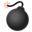 | [链接](https://github.githubassets.com/images/icons/emoji/unicode/1f4a3.png?v8) |
| book | `1f4d6` |  | [链接](https://github.githubassets.com/images/icons/emoji/unicode/1f4d6.png?v8) |
| bookmark | `1f516` |  | [链接](https://github.githubassets.com/images/icons/emoji/unicode/1f516.png?v8) |
| bookmark_tabs | `1f4d1` |  | [链接](https://github.githubassets.com/images/icons/emoji/unicode/1f4d1.png?v8) |
| books | `1f4da` |  | [链接](https://github.githubassets.com/images/icons/emoji/unicode/1f4da.png?v8) |
| boom | `1f4a5` |  | [链接](https://github.githubassets.com/images/icons/emoji/unicode/1f4a5.png?v8) |
| boot | `1f462` |  | [链接](https://github.githubassets.com/images/icons/emoji/unicode/1f462.png?v8) |
| bosnia_herzegovina | `1f1e7-1f1e6` |  | [链接](https://github.githubassets.com/images/icons/emoji/unicode/1f1e7-1f1e6.png?v8) |
| botswana | `1f1e7-1f1fc` |  | [链接](https://github.githubassets.com/images/icons/emoji/unicode/1f1e7-1f1fc.png?v8) |
| bouquet | `1f490` |  | [链接](https://github.githubassets.com/images/icons/emoji/unicode/1f490.png?v8) |
| bow | `1f647` |  | [链接](https://github.githubassets.com/images/icons/emoji/unicode/1f647.png?v8) |
| bow_and_arrow | `1f3f9` |  | [链接](https://github.githubassets.com/images/icons/emoji/unicode/1f3f9.png?v8) |
| bowing_man | `1f647` |  | [链接](https://github.githubassets.com/images/icons/emoji/unicode/1f647.png?v8) |
| bowing_woman | `1f647-2640` |  | [链接](https://github.githubassets.com/images/icons/emoji/unicode/1f647-2640.png?v8) |
| bowling | `1f3b3` |  | [链接](https://github.githubassets.com/images/icons/emoji/unicode/1f3b3.png?v8) |
| bowtie | `bowtie` |  | [链接](https://github.githubassets.com/images/icons/emoji/bowtie.png?v8) |
| boxing_glove | `1f94a` |  | [链接](https://github.githubassets.com/images/icons/emoji/unicode/1f94a.png?v8) |
| boy | `1f466` |  | [链接](https://github.githubassets.com/images/icons/emoji/unicode/1f466.png?v8) |
| brazil | `1f1e7-1f1f7` |  | [链接](https://github.githubassets.com/images/icons/emoji/unicode/1f1e7-1f1f7.png?v8) |
| bread | `1f35e` |  | [链接](https://github.githubassets.com/images/icons/emoji/unicode/1f35e.png?v8) |
| bride_with_veil | `1f470` |  | [链接](https://github.githubassets.com/images/icons/emoji/unicode/1f470.png?v8) |
| bridge_at_night | `1f309` |  | [链接](https://github.githubassets.com/images/icons/emoji/unicode/1f309.png?v8) |
| briefcase | `1f4bc` |  | [链接](https://github.githubassets.com/images/icons/emoji/unicode/1f4bc.png?v8) |
| british_indian_ocean_territory | `1f1ee-1f1f4` |  | [链接](https://github.githubassets.com/images/icons/emoji/unicode/1f1ee-1f1f4.png?v8) |
| british_virgin_islands | `1f1fb-1f1ec` |  | [链接](https://github.githubassets.com/images/icons/emoji/unicode/1f1fb-1f1ec.png?v8) |
| broken_heart | `1f494` |  | [链接](https://github.githubassets.com/images/icons/emoji/unicode/1f494.png?v8) |
| brunei | `1f1e7-1f1f3` |  | [链接](https://github.githubassets.com/images/icons/emoji/unicode/1f1e7-1f1f3.png?v8) |
| bug | `1f41b` |  | [链接](https://github.githubassets.com/images/icons/emoji/unicode/1f41b.png?v8) |
| building_construction | `1f3d7` |  | [链接](https://github.githubassets.com/images/icons/emoji/unicode/1f3d7.png?v8) |
| bulb | `1f4a1` |  | [链接](https://github.githubassets.com/images/icons/emoji/unicode/1f4a1.png?v8) |
| bulgaria | `1f1e7-1f1ec` |  | [链接](https://github.githubassets.com/images/icons/emoji/unicode/1f1e7-1f1ec.png?v8) |
| bullettrain_front | `1f685` |  | [链接](https://github.githubassets.com/images/icons/emoji/unicode/1f685.png?v8) |
| bullettrain_side | `1f684` |  | [链接](https://github.githubassets.com/images/icons/emoji/unicode/1f684.png?v8) |
| burkina_faso | `1f1e7-1f1eb` |  | [链接](https://github.githubassets.com/images/icons/emoji/unicode/1f1e7-1f1eb.png?v8) |
| burrito | `1f32f` | 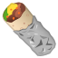 | [链接](https://github.githubassets.com/images/icons/emoji/unicode/1f32f.png?v8) |
| burundi | `1f1e7-1f1ee` |  | [链接](https://github.githubassets.com/images/icons/emoji/unicode/1f1e7-1f1ee.png?v8) |
| bus | `1f68c` |  | [链接](https://github.githubassets.com/images/icons/emoji/unicode/1f68c.png?v8) |
| business_suit_levitating | `1f574` |  | [链接](https://github.githubassets.com/images/icons/emoji/unicode/1f574.png?v8) |
| busstop | `1f68f` |  | [链接](https://github.githubassets.com/images/icons/emoji/unicode/1f68f.png?v8) |
| bust_in_silhouette | `1f464` |  | [链接](https://github.githubassets.com/images/icons/emoji/unicode/1f464.png?v8) |
| busts_in_silhouette | `1f465` |  | [链接](https://github.githubassets.com/images/icons/emoji/unicode/1f465.png?v8) |
| butterfly | `1f98b` |  | [链接](https://github.githubassets.com/images/icons/emoji/unicode/1f98b.png?v8) |
| cactus | `1f335` |  | [链接](https://github.githubassets.com/images/icons/emoji/unicode/1f335.png?v8) |
| cake | `1f370` |  | [链接](https://github.githubassets.com/images/icons/emoji/unicode/1f370.png?v8) |
| calendar | `1f4c6` |  | [链接](https://github.githubassets.com/images/icons/emoji/unicode/1f4c6.png?v8) |
| call_me_hand | `1f919` |  | [链接](https://github.githubassets.com/images/icons/emoji/unicode/1f919.png?v8) |
| calling | `1f4f2` |  | [链接](https://github.githubassets.com/images/icons/emoji/unicode/1f4f2.png?v8) |
| cambodia | `1f1f0-1f1ed` |  | [链接](https://github.githubassets.com/images/icons/emoji/unicode/1f1f0-1f1ed.png?v8) |
| camel | `1f42b` |  | [链接](https://github.githubassets.com/images/icons/emoji/unicode/1f42b.png?v8) |
| camera | `1f4f7` |  | [链接](https://github.githubassets.com/images/icons/emoji/unicode/1f4f7.png?v8) |
| camera_flash | `1f4f8` |  | [链接](https://github.githubassets.com/images/icons/emoji/unicode/1f4f8.png?v8) |
| cameroon | `1f1e8-1f1f2` |  | [链接](https://github.githubassets.com/images/icons/emoji/unicode/1f1e8-1f1f2.png?v8) |
| camping | `1f3d5` |  | [链接](https://github.githubassets.com/images/icons/emoji/unicode/1f3d5.png?v8) |
| canada | `1f1e8-1f1e6` |  | [链接](https://github.githubassets.com/images/icons/emoji/unicode/1f1e8-1f1e6.png?v8) |
| canary_islands | `1f1ee-1f1e8` |  | [链接](https://github.githubassets.com/images/icons/emoji/unicode/1f1ee-1f1e8.png?v8) |
| cancer | `264b` |  | [链接](https://github.githubassets.com/images/icons/emoji/unicode/264b.png?v8) |
| candle | `1f56f` |  | [链接](https://github.githubassets.com/images/icons/emoji/unicode/1f56f.png?v8) |
| candy | `1f36c` | 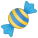 | [链接](https://github.githubassets.com/images/icons/emoji/unicode/1f36c.png?v8) |
| canoe | `1f6f6` |  | [链接](https://github.githubassets.com/images/icons/emoji/unicode/1f6f6.png?v8) |
| cape_verde | `1f1e8-1f1fb` |  | [链接](https://github.githubassets.com/images/icons/emoji/unicode/1f1e8-1f1fb.png?v8) |
| capital_abcd | `1f520` |  | [链接](https://github.githubassets.com/images/icons/emoji/unicode/1f520.png?v8) |
| capricorn | `2651` |  | [链接](https://github.githubassets.com/images/icons/emoji/unicode/2651.png?v8) |
| car | `1f697` |  | [链接](https://github.githubassets.com/images/icons/emoji/unicode/1f697.png?v8) |
| card_file_box | `1f5c3` |  | [链接](https://github.githubassets.com/images/icons/emoji/unicode/1f5c3.png?v8) |
| card_index | `1f4c7` |  | [链接](https://github.githubassets.com/images/icons/emoji/unicode/1f4c7.png?v8) |
| card_index_dividers | `1f5c2` |  | [链接](https://github.githubassets.com/images/icons/emoji/unicode/1f5c2.png?v8) |
| caribbean_netherlands | `1f1e7-1f1f6` |  | [链接](https://github.githubassets.com/images/icons/emoji/unicode/1f1e7-1f1f6.png?v8) |
| carousel_horse | `1f3a0` |  | [链接](https://github.githubassets.com/images/icons/emoji/unicode/1f3a0.png?v8) |
| carrot | `1f955` |  | [链接](https://github.githubassets.com/images/icons/emoji/unicode/1f955.png?v8) |
| cat | `1f431` |  | [链接](https://github.githubassets.com/images/icons/emoji/unicode/1f431.png?v8) |
| cat2 | `1f408` |  | [链接](https://github.githubassets.com/images/icons/emoji/unicode/1f408.png?v8) |
| cayman_islands | `1f1f0-1f1fe` |  | [链接](https://github.githubassets.com/images/icons/emoji/unicode/1f1f0-1f1fe.png?v8) |
| cd | `1f4bf` |  | [链接](https://github.githubassets.com/images/icons/emoji/unicode/1f4bf.png?v8) |
| central_african_republic | `1f1e8-1f1eb` |  | [链接](https://github.githubassets.com/images/icons/emoji/unicode/1f1e8-1f1eb.png?v8) |
| chad | `1f1f9-1f1e9` |  | [链接](https://github.githubassets.com/images/icons/emoji/unicode/1f1f9-1f1e9.png?v8) |
| chains | `26d3` | 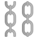 | [链接](https://github.githubassets.com/images/icons/emoji/unicode/26d3.png?v8) |
| champagne | `1f37e` |  | [链接](https://github.githubassets.com/images/icons/emoji/unicode/1f37e.png?v8) |
| chart | `1f4b9` |  | [链接](https://github.githubassets.com/images/icons/emoji/unicode/1f4b9.png?v8) |
| chart_with_downwards_trend | `1f4c9` |  | [链接](https://github.githubassets.com/images/icons/emoji/unicode/1f4c9.png?v8) |
| chart_with_upwards_trend | `1f4c8` |  | [链接](https://github.githubassets.com/images/icons/emoji/unicode/1f4c8.png?v8) |
| checkered_flag | `1f3c1` |  | [链接](https://github.githubassets.com/images/icons/emoji/unicode/1f3c1.png?v8) |
| cheese | `1f9c0` |  | [链接](https://github.githubassets.com/images/icons/emoji/unicode/1f9c0.png?v8) |
| cherries | `1f352` |  | [链接](https://github.githubassets.com/images/icons/emoji/unicode/1f352.png?v8) |
| cherry_blossom | `1f338` |  | [链接](https://github.githubassets.com/images/icons/emoji/unicode/1f338.png?v8) |
| chestnut | `1f330` | 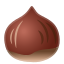 | [链接](https://github.githubassets.com/images/icons/emoji/unicode/1f330.png?v8) |
| chicken | `1f414` |  | [链接](https://github.githubassets.com/images/icons/emoji/unicode/1f414.png?v8) |
| children_crossing | `1f6b8` |  | [链接](https://github.githubassets.com/images/icons/emoji/unicode/1f6b8.png?v8) |
| chile | `1f1e8-1f1f1` |  | [链接](https://github.githubassets.com/images/icons/emoji/unicode/1f1e8-1f1f1.png?v8) |
| chipmunk | `1f43f` |  | [链接](https://github.githubassets.com/images/icons/emoji/unicode/1f43f.png?v8) |
| chocolate_bar | `1f36b` |  | [链接](https://github.githubassets.com/images/icons/emoji/unicode/1f36b.png?v8) |
| christmas_island | `1f1e8-1f1fd` |  | [链接](https://github.githubassets.com/images/icons/emoji/unicode/1f1e8-1f1fd.png?v8) |
| christmas_tree | `1f384` |  | [链接](https://github.githubassets.com/images/icons/emoji/unicode/1f384.png?v8) |
| church | `26ea` |  | [链接](https://github.githubassets.com/images/icons/emoji/unicode/26ea.png?v8) |
| cinema | `1f3a6` |  | [链接](https://github.githubassets.com/images/icons/emoji/unicode/1f3a6.png?v8) |
| circus_tent | `1f3aa` |  | [链接](https://github.githubassets.com/images/icons/emoji/unicode/1f3aa.png?v8) |
| city_sunrise | `1f307` |  | [链接](https://github.githubassets.com/images/icons/emoji/unicode/1f307.png?v8) |
| city_sunset | `1f306` |  | [链接](https://github.githubassets.com/images/icons/emoji/unicode/1f306.png?v8) |
| cityscape | `1f3d9` |  | [链接](https://github.githubassets.com/images/icons/emoji/unicode/1f3d9.png?v8) |
| cl | `1f191` |  | [链接](https://github.githubassets.com/images/icons/emoji/unicode/1f191.png?v8) |
| clamp | `1f5dc` |  | [链接](https://github.githubassets.com/images/icons/emoji/unicode/1f5dc.png?v8) |
| clap | `1f44f` |  | [链接](https://github.githubassets.com/images/icons/emoji/unicode/1f44f.png?v8) |
| clapper | `1f3ac` |  | [链接](https://github.githubassets.com/images/icons/emoji/unicode/1f3ac.png?v8) |
| classical_building | `1f3db` |  | [链接](https://github.githubassets.com/images/icons/emoji/unicode/1f3db.png?v8) |
| clinking_glasses | `1f942` |  | [链接](https://github.githubassets.com/images/icons/emoji/unicode/1f942.png?v8) |
| clipboard | `1f4cb` |  | [链接](https://github.githubassets.com/images/icons/emoji/unicode/1f4cb.png?v8) |
| clock1 | `1f550` |  | [链接](https://github.githubassets.com/images/icons/emoji/unicode/1f550.png?v8) |
| clock10 | `1f559` |  | [链接](https://github.githubassets.com/images/icons/emoji/unicode/1f559.png?v8) |
| clock1030 | `1f565` |  | [链接](https://github.githubassets.com/images/icons/emoji/unicode/1f565.png?v8) |
| clock11 | `1f55a` |  | [链接](https://github.githubassets.com/images/icons/emoji/unicode/1f55a.png?v8) |
| clock1130 | `1f566` |  | [链接](https://github.githubassets.com/images/icons/emoji/unicode/1f566.png?v8) |
| clock12 | `1f55b` |  | [链接](https://github.githubassets.com/images/icons/emoji/unicode/1f55b.png?v8) |
| clock1230 | `1f567` |  | [链接](https://github.githubassets.com/images/icons/emoji/unicode/1f567.png?v8) |
| clock130 | `1f55c` |  | [链接](https://github.githubassets.com/images/icons/emoji/unicode/1f55c.png?v8) |
| clock2 | `1f551` |  | [链接](https://github.githubassets.com/images/icons/emoji/unicode/1f551.png?v8) |
| clock230 | `1f55d` |  | [链接](https://github.githubassets.com/images/icons/emoji/unicode/1f55d.png?v8) |
| clock3 | `1f552` |  | [链接](https://github.githubassets.com/images/icons/emoji/unicode/1f552.png?v8) |
| clock330 | `1f55e` |  | [链接](https://github.githubassets.com/images/icons/emoji/unicode/1f55e.png?v8) |
| clock4 | `1f553` |  | [链接](https://github.githubassets.com/images/icons/emoji/unicode/1f553.png?v8) |
| clock430 | `1f55f` |  | [链接](https://github.githubassets.com/images/icons/emoji/unicode/1f55f.png?v8) |
| clock5 | `1f554` |  | [链接](https://github.githubassets.com/images/icons/emoji/unicode/1f554.png?v8) |
| clock530 | `1f560` |  | [链接](https://github.githubassets.com/images/icons/emoji/unicode/1f560.png?v8) |
| clock6 | `1f555` |  | [链接](https://github.githubassets.com/images/icons/emoji/unicode/1f555.png?v8) |
| clock630 | `1f561` |  | [链接](https://github.githubassets.com/images/icons/emoji/unicode/1f561.png?v8) |
| clock7 | `1f556` |  | [链接](https://github.githubassets.com/images/icons/emoji/unicode/1f556.png?v8) |
| clock730 | `1f562` |  | [链接](https://github.githubassets.com/images/icons/emoji/unicode/1f562.png?v8) |
| clock8 | `1f557` |  | [链接](https://github.githubassets.com/images/icons/emoji/unicode/1f557.png?v8) |
| clock830 | `1f563` |  | [链接](https://github.githubassets.com/images/icons/emoji/unicode/1f563.png?v8) |
| clock9 | `1f558` |  | [链接](https://github.githubassets.com/images/icons/emoji/unicode/1f558.png?v8) |
| clock930 | `1f564` |  | [链接](https://github.githubassets.com/images/icons/emoji/unicode/1f564.png?v8) |
| closed_book | `1f4d5` |  | [链接](https://github.githubassets.com/images/icons/emoji/unicode/1f4d5.png?v8) |
| closed_lock_with_key | `1f510` |  | [链接](https://github.githubassets.com/images/icons/emoji/unicode/1f510.png?v8) |
| closed_umbrella | `1f302` | 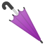 | [链接](https://github.githubassets.com/images/icons/emoji/unicode/1f302.png?v8) |
| cloud | `2601` |  | [链接](https://github.githubassets.com/images/icons/emoji/unicode/2601.png?v8) |
| cloud_with_lightning | `1f329` |  | [链接](https://github.githubassets.com/images/icons/emoji/unicode/1f329.png?v8) |
| cloud_with_lightning_and_rain | `26c8` |  | [链接](https://github.githubassets.com/images/icons/emoji/unicode/26c8.png?v8) |
| cloud_with_rain | `1f327` |  | [链接](https://github.githubassets.com/images/icons/emoji/unicode/1f327.png?v8) |
| cloud_with_snow | `1f328` |  | [链接](https://github.githubassets.com/images/icons/emoji/unicode/1f328.png?v8) |
| clown_face | `1f921` |  | [链接](https://github.githubassets.com/images/icons/emoji/unicode/1f921.png?v8) |
| clubs | `2663` |  | [链接](https://github.githubassets.com/images/icons/emoji/unicode/2663.png?v8) |
| cn | `1f1e8-1f1f3` |  | [链接](https://github.githubassets.com/images/icons/emoji/unicode/1f1e8-1f1f3.png?v8) |
| cocktail | `1f378` |  | [链接](https://github.githubassets.com/images/icons/emoji/unicode/1f378.png?v8) |
| cocos_islands | `1f1e8-1f1e8` |  | [链接](https://github.githubassets.com/images/icons/emoji/unicode/1f1e8-1f1e8.png?v8) |
| coffee | `2615` |  | [链接](https://github.githubassets.com/images/icons/emoji/unicode/2615.png?v8) |
| coffin | `26b0` | 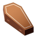 | [链接](https://github.githubassets.com/images/icons/emoji/unicode/26b0.png?v8) |
| cold_sweat | `1f630` |  | [链接](https://github.githubassets.com/images/icons/emoji/unicode/1f630.png?v8) |
| collision | `1f4a5` |  | [链接](https://github.githubassets.com/images/icons/emoji/unicode/1f4a5.png?v8) |
| colombia | `1f1e8-1f1f4` |  | [链接](https://github.githubassets.com/images/icons/emoji/unicode/1f1e8-1f1f4.png?v8) |
| comet | `2604` |  | [链接](https://github.githubassets.com/images/icons/emoji/unicode/2604.png?v8) |
| comoros | `1f1f0-1f1f2` |  | [链接](https://github.githubassets.com/images/icons/emoji/unicode/1f1f0-1f1f2.png?v8) |
| computer | `1f4bb` |  | [链接](https://github.githubassets.com/images/icons/emoji/unicode/1f4bb.png?v8) |
| computer_mouse | `1f5b1` |  | [链接](https://github.githubassets.com/images/icons/emoji/unicode/1f5b1.png?v8) |
| confetti_ball | `1f38a` | 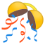 | [链接](https://github.githubassets.com/images/icons/emoji/unicode/1f38a.png?v8) |
| confounded | `1f616` |  | [链接](https://github.githubassets.com/images/icons/emoji/unicode/1f616.png?v8) |
| confused | `1f615` |  | [链接](https://github.githubassets.com/images/icons/emoji/unicode/1f615.png?v8) |
| congo_brazzaville | `1f1e8-1f1ec` |  | [链接](https://github.githubassets.com/images/icons/emoji/unicode/1f1e8-1f1ec.png?v8) |
| congo_kinshasa | `1f1e8-1f1e9` |  | [链接](https://github.githubassets.com/images/icons/emoji/unicode/1f1e8-1f1e9.png?v8) |
| congratulations | `3297` |  | [链接](https://github.githubassets.com/images/icons/emoji/unicode/3297.png?v8) |
| construction | `1f6a7` |  | [链接](https://github.githubassets.com/images/icons/emoji/unicode/1f6a7.png?v8) |
| construction_worker | `1f477` |  | [链接](https://github.githubassets.com/images/icons/emoji/unicode/1f477.png?v8) |
| construction_worker_man | `1f477` |  | [链接](https://github.githubassets.com/images/icons/emoji/unicode/1f477.png?v8) |
| construction_worker_woman | `1f477-2640` |  | [链接](https://github.githubassets.com/images/icons/emoji/unicode/1f477-2640.png?v8) |
| control_knobs | `1f39b` |  | [链接](https://github.githubassets.com/images/icons/emoji/unicode/1f39b.png?v8) |
| convenience_store | `1f3ea` |  | [链接](https://github.githubassets.com/images/icons/emoji/unicode/1f3ea.png?v8) |
| cook_islands | `1f1e8-1f1f0` |  | [链接](https://github.githubassets.com/images/icons/emoji/unicode/1f1e8-1f1f0.png?v8) |
| cookie | `1f36a` |  | [链接](https://github.githubassets.com/images/icons/emoji/unicode/1f36a.png?v8) |
| cool | `1f192` |  | [链接](https://github.githubassets.com/images/icons/emoji/unicode/1f192.png?v8) |
| cop | `1f46e` |  | [链接](https://github.githubassets.com/images/icons/emoji/unicode/1f46e.png?v8) |
| copyright | `00a9` |  | [链接](https://github.githubassets.com/images/icons/emoji/unicode/00a9.png?v8) |
| corn | `1f33d` | 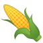 | [链接](https://github.githubassets.com/images/icons/emoji/unicode/1f33d.png?v8) |
| costa_rica | `1f1e8-1f1f7` |  | [链接](https://github.githubassets.com/images/icons/emoji/unicode/1f1e8-1f1f7.png?v8) |
| cote_divoire | `1f1e8-1f1ee` |  | [链接](https://github.githubassets.com/images/icons/emoji/unicode/1f1e8-1f1ee.png?v8) |
| couch_and_lamp | `1f6cb` |  | [链接](https://github.githubassets.com/images/icons/emoji/unicode/1f6cb.png?v8) |
| couple | `1f46b` |  | [链接](https://github.githubassets.com/images/icons/emoji/unicode/1f46b.png?v8) |
| couple_with_heart | `1f491` |  | [链接](https://github.githubassets.com/images/icons/emoji/unicode/1f491.png?v8) |
| couple_with_heart_man_man | `1f468-2764-1f468` |  | [链接](https://github.githubassets.com/images/icons/emoji/unicode/1f468-2764-1f468.png?v8) |
| couple_with_heart_woman_man | `1f491` |  | [链接](https://github.githubassets.com/images/icons/emoji/unicode/1f491.png?v8) |
| couple_with_heart_woman_woman | `1f469-2764-1f469` |  | [链接](https://github.githubassets.com/images/icons/emoji/unicode/1f469-2764-1f469.png?v8) |
| couplekiss_man_man | `1f468-2764-1f48b-1f468` |  | [链接](https://github.githubassets.com/images/icons/emoji/unicode/1f468-2764-1f48b-1f468.png?v8) |
| couplekiss_man_woman | `1f48f` |  | [链接](https://github.githubassets.com/images/icons/emoji/unicode/1f48f.png?v8) |
| couplekiss_woman_woman | `1f469-2764-1f48b-1f469` |  | [链接](https://github.githubassets.com/images/icons/emoji/unicode/1f469-2764-1f48b-1f469.png?v8) |
| cow | `1f42e` |  | [链接](https://github.githubassets.com/images/icons/emoji/unicode/1f42e.png?v8) |
| cow2 | `1f404` |  | [链接](https://github.githubassets.com/images/icons/emoji/unicode/1f404.png?v8) |
| cowboy_hat_face | `1f920` |  | [链接](https://github.githubassets.com/images/icons/emoji/unicode/1f920.png?v8) |
| crab | `1f980` |  | [链接](https://github.githubassets.com/images/icons/emoji/unicode/1f980.png?v8) |
| crayon | `1f58d` |  | [链接](https://github.githubassets.com/images/icons/emoji/unicode/1f58d.png?v8) |
| credit_card | `1f4b3` |  | [链接](https://github.githubassets.com/images/icons/emoji/unicode/1f4b3.png?v8) |
| crescent_moon | `1f319` |  | [链接](https://github.githubassets.com/images/icons/emoji/unicode/1f319.png?v8) |
| cricket | `1f3cf` |  | [链接](https://github.githubassets.com/images/icons/emoji/unicode/1f3cf.png?v8) |
| croatia | `1f1ed-1f1f7` |  | [链接](https://github.githubassets.com/images/icons/emoji/unicode/1f1ed-1f1f7.png?v8) |
| crocodile | `1f40a` |  | [链接](https://github.githubassets.com/images/icons/emoji/unicode/1f40a.png?v8) |
| croissant | `1f950` |  | [链接](https://github.githubassets.com/images/icons/emoji/unicode/1f950.png?v8) |
| crossed_fingers | `1f91e` |  | [链接](https://github.githubassets.com/images/icons/emoji/unicode/1f91e.png?v8) |
| crossed_flags | `1f38c` |  | [链接](https://github.githubassets.com/images/icons/emoji/unicode/1f38c.png?v8) |
| crossed_swords | `2694` |  | [链接](https://github.githubassets.com/images/icons/emoji/unicode/2694.png?v8) |
| crown | `1f451` |  | [链接](https://github.githubassets.com/images/icons/emoji/unicode/1f451.png?v8) |
| cry | `1f622` |  | [链接](https://github.githubassets.com/images/icons/emoji/unicode/1f622.png?v8) |
| crying_cat_face | `1f63f` |  | [链接](https://github.githubassets.com/images/icons/emoji/unicode/1f63f.png?v8) |
| crystal_ball | `1f52e` |  | [链接](https://github.githubassets.com/images/icons/emoji/unicode/1f52e.png?v8) |
| cuba | `1f1e8-1f1fa` |  | [链接](https://github.githubassets.com/images/icons/emoji/unicode/1f1e8-1f1fa.png?v8) |
| cucumber | `1f952` |  | [链接](https://github.githubassets.com/images/icons/emoji/unicode/1f952.png?v8) |
| cupid | `1f498` |  | [链接](https://github.githubassets.com/images/icons/emoji/unicode/1f498.png?v8) |
| curacao | `1f1e8-1f1fc` |  | [链接](https://github.githubassets.com/images/icons/emoji/unicode/1f1e8-1f1fc.png?v8) |
| curly_loop | `27b0` |  | [链接](https://github.githubassets.com/images/icons/emoji/unicode/27b0.png?v8) |
| currency_exchange | `1f4b1` |  | [链接](https://github.githubassets.com/images/icons/emoji/unicode/1f4b1.png?v8) |
| curry | `1f35b` |  | [链接](https://github.githubassets.com/images/icons/emoji/unicode/1f35b.png?v8) |
| custard | `1f36e` |  | [链接](https://github.githubassets.com/images/icons/emoji/unicode/1f36e.png?v8) |
| customs | `1f6c3` |  | [链接](https://github.githubassets.com/images/icons/emoji/unicode/1f6c3.png?v8) |
| cyclone | `1f300` |  | [链接](https://github.githubassets.com/images/icons/emoji/unicode/1f300.png?v8) |
| cyprus | `1f1e8-1f1fe` |  | [链接](https://github.githubassets.com/images/icons/emoji/unicode/1f1e8-1f1fe.png?v8) |
| czech_republic | `1f1e8-1f1ff` |  | [链接](https://github.githubassets.com/images/icons/emoji/unicode/1f1e8-1f1ff.png?v8) |
| dagger | `1f5e1` |  | [链接](https://github.githubassets.com/images/icons/emoji/unicode/1f5e1.png?v8) |
| dancer | `1f483` |  | [链接](https://github.githubassets.com/images/icons/emoji/unicode/1f483.png?v8) |
| dancers | `1f46f` | 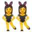 | [链接](https://github.githubassets.com/images/icons/emoji/unicode/1f46f.png?v8) |
| dancing_men | `1f46f-2642` | 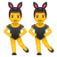 | [链接](https://github.githubassets.com/images/icons/emoji/unicode/1f46f-2642.png?v8) |
| dancing_women | `1f46f` |  | [链接](https://github.githubassets.com/images/icons/emoji/unicode/1f46f.png?v8) |
| dango | `1f361` |  | [链接](https://github.githubassets.com/images/icons/emoji/unicode/1f361.png?v8) |
| dark_sunglasses | `1f576` |  | [链接](https://github.githubassets.com/images/icons/emoji/unicode/1f576.png?v8) |
| dart | `1f3af` |  | [链接](https://github.githubassets.com/images/icons/emoji/unicode/1f3af.png?v8) |
| dash | `1f4a8` |  | [链接](https://github.githubassets.com/images/icons/emoji/unicode/1f4a8.png?v8) |
| date | `1f4c5` |  | [链接](https://github.githubassets.com/images/icons/emoji/unicode/1f4c5.png?v8) |
| de | `1f1e9-1f1ea` |  | [链接](https://github.githubassets.com/images/icons/emoji/unicode/1f1e9-1f1ea.png?v8) |
| deciduous_tree | `1f333` |  | [链接](https://github.githubassets.com/images/icons/emoji/unicode/1f333.png?v8) |
| deer | `1f98c` |  | [链接](https://github.githubassets.com/images/icons/emoji/unicode/1f98c.png?v8) |
| denmark | `1f1e9-1f1f0` |  | [链接](https://github.githubassets.com/images/icons/emoji/unicode/1f1e9-1f1f0.png?v8) |
| department_store | `1f3ec` |  | [链接](https://github.githubassets.com/images/icons/emoji/unicode/1f3ec.png?v8) |
| derelict_house | `1f3da` |  | [链接](https://github.githubassets.com/images/icons/emoji/unicode/1f3da.png?v8) |
| desert | `1f3dc` |  | [链接](https://github.githubassets.com/images/icons/emoji/unicode/1f3dc.png?v8) |
| desert_island | `1f3dd` |  | [链接](https://github.githubassets.com/images/icons/emoji/unicode/1f3dd.png?v8) |
| desktop_computer | `1f5a5` |  | [链接](https://github.githubassets.com/images/icons/emoji/unicode/1f5a5.png?v8) |
| detective | `1f575` |  | [链接](https://github.githubassets.com/images/icons/emoji/unicode/1f575.png?v8) |
| diamond_shape_with_a_dot_inside | `1f4a0` |  | [链接](https://github.githubassets.com/images/icons/emoji/unicode/1f4a0.png?v8) |
| diamonds | `2666` |  | [链接](https://github.githubassets.com/images/icons/emoji/unicode/2666.png?v8) |
| disappointed | `1f61e` |  | [链接](https://github.githubassets.com/images/icons/emoji/unicode/1f61e.png?v8) |
| disappointed_relieved | `1f625` |  | [链接](https://github.githubassets.com/images/icons/emoji/unicode/1f625.png?v8) |
| dizzy | `1f4ab` |  | [链接](https://github.githubassets.com/images/icons/emoji/unicode/1f4ab.png?v8) |
| dizzy_face | `1f635` |  | [链接](https://github.githubassets.com/images/icons/emoji/unicode/1f635.png?v8) |
| djibouti | `1f1e9-1f1ef` |  | [链接](https://github.githubassets.com/images/icons/emoji/unicode/1f1e9-1f1ef.png?v8) |
| do_not_litter | `1f6af` |  | [链接](https://github.githubassets.com/images/icons/emoji/unicode/1f6af.png?v8) |
| dog | `1f436` |  | [链接](https://github.githubassets.com/images/icons/emoji/unicode/1f436.png?v8) |
| dog2 | `1f415` |  | [链接](https://github.githubassets.com/images/icons/emoji/unicode/1f415.png?v8) |
| dollar | `1f4b5` |  | [链接](https://github.githubassets.com/images/icons/emoji/unicode/1f4b5.png?v8) |
| dolls | `1f38e` |  | [链接](https://github.githubassets.com/images/icons/emoji/unicode/1f38e.png?v8) |
| dolphin | `1f42c` |  | [链接](https://github.githubassets.com/images/icons/emoji/unicode/1f42c.png?v8) |
| dominica | `1f1e9-1f1f2` |  | [链接](https://github.githubassets.com/images/icons/emoji/unicode/1f1e9-1f1f2.png?v8) |
| dominican_republic | `1f1e9-1f1f4` |  | [链接](https://github.githubassets.com/images/icons/emoji/unicode/1f1e9-1f1f4.png?v8) |
| door | `1f6aa` |  | [链接](https://github.githubassets.com/images/icons/emoji/unicode/1f6aa.png?v8) |
| doughnut | `1f369` |  | [链接](https://github.githubassets.com/images/icons/emoji/unicode/1f369.png?v8) |
| dove | `1f54a` |  | [链接](https://github.githubassets.com/images/icons/emoji/unicode/1f54a.png?v8) |
| dragon | `1f409` |  | [链接](https://github.githubassets.com/images/icons/emoji/unicode/1f409.png?v8) |
| dragon_face | `1f432` |  | [链接](https://github.githubassets.com/images/icons/emoji/unicode/1f432.png?v8) |
| dress | `1f457` |  | [链接](https://github.githubassets.com/images/icons/emoji/unicode/1f457.png?v8) |
| dromedary_camel | `1f42a` |  | [链接](https://github.githubassets.com/images/icons/emoji/unicode/1f42a.png?v8) |
| drooling_face | `1f924` |  | [链接](https://github.githubassets.com/images/icons/emoji/unicode/1f924.png?v8) |
| droplet | `1f4a7` |  | [链接](https://github.githubassets.com/images/icons/emoji/unicode/1f4a7.png?v8) |
| drum | `1f941` |  | [链接](https://github.githubassets.com/images/icons/emoji/unicode/1f941.png?v8) |
| duck | `1f986` |  | [链接](https://github.githubassets.com/images/icons/emoji/unicode/1f986.png?v8) |
| dvd | `1f4c0` |  | [链接](https://github.githubassets.com/images/icons/emoji/unicode/1f4c0.png?v8) |
| e-mail | `1f4e7` |  | [链接](https://github.githubassets.com/images/icons/emoji/unicode/1f4e7.png?v8) |
| eagle | `1f985` |  | [链接](https://github.githubassets.com/images/icons/emoji/unicode/1f985.png?v8) |
| ear | `1f442` | 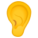 | [链接](https://github.githubassets.com/images/icons/emoji/unicode/1f442.png?v8) |
| ear_of_rice | `1f33e` |  | [链接](https://github.githubassets.com/images/icons/emoji/unicode/1f33e.png?v8) |
| earth_africa | `1f30d` |  | [链接](https://github.githubassets.com/images/icons/emoji/unicode/1f30d.png?v8) |
| earth_americas | `1f30e` |  | [链接](https://github.githubassets.com/images/icons/emoji/unicode/1f30e.png?v8) |
| earth_asia | `1f30f` |  | [链接](https://github.githubassets.com/images/icons/emoji/unicode/1f30f.png?v8) |
| ecuador | `1f1ea-1f1e8` |  | [链接](https://github.githubassets.com/images/icons/emoji/unicode/1f1ea-1f1e8.png?v8) |
| egg | `1f95a` |  | [链接](https://github.githubassets.com/images/icons/emoji/unicode/1f95a.png?v8) |
| eggplant | `1f346` |  | [链接](https://github.githubassets.com/images/icons/emoji/unicode/1f346.png?v8) |
| egypt | `1f1ea-1f1ec` |  | [链接](https://github.githubassets.com/images/icons/emoji/unicode/1f1ea-1f1ec.png?v8) |
| eight | `0038-20e3` |  | [链接](https://github.githubassets.com/images/icons/emoji/unicode/0038-20e3.png?v8) |
| eight_pointed_black_star | `2734` |  | [链接](https://github.githubassets.com/images/icons/emoji/unicode/2734.png?v8) |
| eight_spoked_asterisk | `2733` |  | [链接](https://github.githubassets.com/images/icons/emoji/unicode/2733.png?v8) |
| el_salvador | `1f1f8-1f1fb` |  | [链接](https://github.githubassets.com/images/icons/emoji/unicode/1f1f8-1f1fb.png?v8) |
| electric_plug | `1f50c` |  | [链接](https://github.githubassets.com/images/icons/emoji/unicode/1f50c.png?v8) |
| electron | `electron` |  | [链接](https://github.githubassets.com/images/icons/emoji/electron.png?v8) |
| elephant | `1f418` |  | [链接](https://github.githubassets.com/images/icons/emoji/unicode/1f418.png?v8) |
| email | `2709` |  | [链接](https://github.githubassets.com/images/icons/emoji/unicode/2709.png?v8) |
| end | `1f51a` |  | [链接](https://github.githubassets.com/images/icons/emoji/unicode/1f51a.png?v8) |
| envelope | `2709` |  | [链接](https://github.githubassets.com/images/icons/emoji/unicode/2709.png?v8) |
| envelope_with_arrow | `1f4e9` |  | [链接](https://github.githubassets.com/images/icons/emoji/unicode/1f4e9.png?v8) |
| equatorial_guinea | `1f1ec-1f1f6` |  | [链接](https://github.githubassets.com/images/icons/emoji/unicode/1f1ec-1f1f6.png?v8) |
| eritrea | `1f1ea-1f1f7` |  | [链接](https://github.githubassets.com/images/icons/emoji/unicode/1f1ea-1f1f7.png?v8) |
| es | `1f1ea-1f1f8` |  | [链接](https://github.githubassets.com/images/icons/emoji/unicode/1f1ea-1f1f8.png?v8) |
| estonia | `1f1ea-1f1ea` |  | [链接](https://github.githubassets.com/images/icons/emoji/unicode/1f1ea-1f1ea.png?v8) |
| ethiopia | `1f1ea-1f1f9` |  | [链接](https://github.githubassets.com/images/icons/emoji/unicode/1f1ea-1f1f9.png?v8) |
| eu | `1f1ea-1f1fa` |  | [链接](https://github.githubassets.com/images/icons/emoji/unicode/1f1ea-1f1fa.png?v8) |
| euro | `1f4b6` |  | [链接](https://github.githubassets.com/images/icons/emoji/unicode/1f4b6.png?v8) |
| european_castle | `1f3f0` |  | [链接](https://github.githubassets.com/images/icons/emoji/unicode/1f3f0.png?v8) |
| european_post_office | `1f3e4` |  | [链接](https://github.githubassets.com/images/icons/emoji/unicode/1f3e4.png?v8) |
| european_union | `1f1ea-1f1fa` |  | [链接](https://github.githubassets.com/images/icons/emoji/unicode/1f1ea-1f1fa.png?v8) |
| evergreen_tree | `1f332` |  | [链接](https://github.githubassets.com/images/icons/emoji/unicode/1f332.png?v8) |
| exclamation | `2757` |  | [链接](https://github.githubassets.com/images/icons/emoji/unicode/2757.png?v8) |
| expressionless | `1f611` |  | [链接](https://github.githubassets.com/images/icons/emoji/unicode/1f611.png?v8) |
| eye | `1f441` |  | [链接](https://github.githubassets.com/images/icons/emoji/unicode/1f441.png?v8) |
| eye_speech_bubble | `1f441-1f5e8` |  | [链接](https://github.githubassets.com/images/icons/emoji/unicode/1f441-1f5e8.png?v8) |
| eyeglasses | `1f453` |  | [链接](https://github.githubassets.com/images/icons/emoji/unicode/1f453.png?v8) |
| eyes | `1f440` |  | [链接](https://github.githubassets.com/images/icons/emoji/unicode/1f440.png?v8) |
| face_with_head_bandage | `1f915` |  | [链接](https://github.githubassets.com/images/icons/emoji/unicode/1f915.png?v8) |
| face_with_thermometer | `1f912` |  | [链接](https://github.githubassets.com/images/icons/emoji/unicode/1f912.png?v8) |
| facepunch | `1f44a` |  | [链接](https://github.githubassets.com/images/icons/emoji/unicode/1f44a.png?v8) |
| factory | `1f3ed` |  | [链接](https://github.githubassets.com/images/icons/emoji/unicode/1f3ed.png?v8) |
| falkland_islands | `1f1eb-1f1f0` |  | [链接](https://github.githubassets.com/images/icons/emoji/unicode/1f1eb-1f1f0.png?v8) |
| fallen_leaf | `1f342` |  | [链接](https://github.githubassets.com/images/icons/emoji/unicode/1f342.png?v8) |
| family | `1f46a` |  | [链接](https://github.githubassets.com/images/icons/emoji/unicode/1f46a.png?v8) |
| family_man_boy | `1f468-1f466` |  | [链接](https://github.githubassets.com/images/icons/emoji/unicode/1f468-1f466.png?v8) |
| family_man_boy_boy | `1f468-1f466-1f466` |  | [链接](https://github.githubassets.com/images/icons/emoji/unicode/1f468-1f466-1f466.png?v8) |
| family_man_girl | `1f468-1f467` |  | [链接](https://github.githubassets.com/images/icons/emoji/unicode/1f468-1f467.png?v8) |
| family_man_girl_boy | `1f468-1f467-1f466` |  | [链接](https://github.githubassets.com/images/icons/emoji/unicode/1f468-1f467-1f466.png?v8) |
| family_man_girl_girl | `1f468-1f467-1f467` |  | [链接](https://github.githubassets.com/images/icons/emoji/unicode/1f468-1f467-1f467.png?v8) |
| family_man_man_boy | `1f468-1f468-1f466` |  | [链接](https://github.githubassets.com/images/icons/emoji/unicode/1f468-1f468-1f466.png?v8) |
| family_man_man_boy_boy | `1f468-1f468-1f466-1f466` |  | [链接](https://github.githubassets.com/images/icons/emoji/unicode/1f468-1f468-1f466-1f466.png?v8) |
| family_man_man_girl | `1f468-1f468-1f467` |  | [链接](https://github.githubassets.com/images/icons/emoji/unicode/1f468-1f468-1f467.png?v8) |
| family_man_man_girl_boy | `1f468-1f468-1f467-1f466` |  | [链接](https://github.githubassets.com/images/icons/emoji/unicode/1f468-1f468-1f467-1f466.png?v8) |
| family_man_man_girl_girl | `1f468-1f468-1f467-1f467` |  | [链接](https://github.githubassets.com/images/icons/emoji/unicode/1f468-1f468-1f467-1f467.png?v8) |
| family_man_woman_boy | `1f46a` |  | [链接](https://github.githubassets.com/images/icons/emoji/unicode/1f46a.png?v8) |
| family_man_woman_boy_boy | `1f468-1f469-1f466-1f466` |  | [链接](https://github.githubassets.com/images/icons/emoji/unicode/1f468-1f469-1f466-1f466.png?v8) |
| family_man_woman_girl | `1f468-1f469-1f467` |  | [链接](https://github.githubassets.com/images/icons/emoji/unicode/1f468-1f469-1f467.png?v8) |
| family_man_woman_girl_boy | `1f468-1f469-1f467-1f466` |  | [链接](https://github.githubassets.com/images/icons/emoji/unicode/1f468-1f469-1f467-1f466.png?v8) |
| family_man_woman_girl_girl | `1f468-1f469-1f467-1f467` |  | [链接](https://github.githubassets.com/images/icons/emoji/unicode/1f468-1f469-1f467-1f467.png?v8) |
| family_woman_boy | `1f469-1f466` |  | [链接](https://github.githubassets.com/images/icons/emoji/unicode/1f469-1f466.png?v8) |
| family_woman_boy_boy | `1f469-1f466-1f466` |  | [链接](https://github.githubassets.com/images/icons/emoji/unicode/1f469-1f466-1f466.png?v8) |
| family_woman_girl | `1f469-1f467` |  | [链接](https://github.githubassets.com/images/icons/emoji/unicode/1f469-1f467.png?v8) |
| family_woman_girl_boy | `1f469-1f467-1f466` |  | [链接](https://github.githubassets.com/images/icons/emoji/unicode/1f469-1f467-1f466.png?v8) |
| family_woman_girl_girl | `1f469-1f467-1f467` |  | [链接](https://github.githubassets.com/images/icons/emoji/unicode/1f469-1f467-1f467.png?v8) |
| family_woman_woman_boy | `1f469-1f469-1f466` |  | [链接](https://github.githubassets.com/images/icons/emoji/unicode/1f469-1f469-1f466.png?v8) |
| family_woman_woman_boy_boy | `1f469-1f469-1f466-1f466` |  | [链接](https://github.githubassets.com/images/icons/emoji/unicode/1f469-1f469-1f466-1f466.png?v8) |
| family_woman_woman_girl | `1f469-1f469-1f467` |  | [链接](https://github.githubassets.com/images/icons/emoji/unicode/1f469-1f469-1f467.png?v8) |
| family_woman_woman_girl_boy | `1f469-1f469-1f467-1f466` |  | [链接](https://github.githubassets.com/images/icons/emoji/unicode/1f469-1f469-1f467-1f466.png?v8) |
| family_woman_woman_girl_girl | `1f469-1f469-1f467-1f467` |  | [链接](https://github.githubassets.com/images/icons/emoji/unicode/1f469-1f469-1f467-1f467.png?v8) |
| faroe_islands | `1f1eb-1f1f4` |  | [链接](https://github.githubassets.com/images/icons/emoji/unicode/1f1eb-1f1f4.png?v8) |
| fast_forward | `23e9` |  | [链接](https://github.githubassets.com/images/icons/emoji/unicode/23e9.png?v8) |
| fax | `1f4e0` |  | [链接](https://github.githubassets.com/images/icons/emoji/unicode/1f4e0.png?v8) |
| fearful | `1f628` |  | [链接](https://github.githubassets.com/images/icons/emoji/unicode/1f628.png?v8) |
| feelsgood | `feelsgood` |  | [链接](https://github.githubassets.com/images/icons/emoji/feelsgood.png?v8) |
| feet | `1f43e` |  | [链接](https://github.githubassets.com/images/icons/emoji/unicode/1f43e.png?v8) |
| female_detective | `1f575-2640` |  | [链接](https://github.githubassets.com/images/icons/emoji/unicode/1f575-2640.png?v8) |
| ferris_wheel | `1f3a1` |  | [链接](https://github.githubassets.com/images/icons/emoji/unicode/1f3a1.png?v8) |
| ferry | `26f4` |  | [链接](https://github.githubassets.com/images/icons/emoji/unicode/26f4.png?v8) |
| field_hockey | `1f3d1` |  | [链接](https://github.githubassets.com/images/icons/emoji/unicode/1f3d1.png?v8) |
| fiji | `1f1eb-1f1ef` |  | [链接](https://github.githubassets.com/images/icons/emoji/unicode/1f1eb-1f1ef.png?v8) |
| file_cabinet | `1f5c4` |  | [链接](https://github.githubassets.com/images/icons/emoji/unicode/1f5c4.png?v8) |
| file_folder | `1f4c1` |  | [链接](https://github.githubassets.com/images/icons/emoji/unicode/1f4c1.png?v8) |
| film_projector | `1f4fd` |  | [链接](https://github.githubassets.com/images/icons/emoji/unicode/1f4fd.png?v8) |
| film_strip | `1f39e` |  | [链接](https://github.githubassets.com/images/icons/emoji/unicode/1f39e.png?v8) |
| finland | `1f1eb-1f1ee` |  | [链接](https://github.githubassets.com/images/icons/emoji/unicode/1f1eb-1f1ee.png?v8) |
| finnadie | `finnadie` |  | [链接](https://github.githubassets.com/images/icons/emoji/finnadie.png?v8) |
| fire | `1f525` |  | [链接](https://github.githubassets.com/images/icons/emoji/unicode/1f525.png?v8) |
| fire_engine | `1f692` |  | [链接](https://github.githubassets.com/images/icons/emoji/unicode/1f692.png?v8) |
| fireworks | `1f386` |  | [链接](https://github.githubassets.com/images/icons/emoji/unicode/1f386.png?v8) |
| first_quarter_moon | `1f313` |  | [链接](https://github.githubassets.com/images/icons/emoji/unicode/1f313.png?v8) |
| first_quarter_moon_with_face | `1f31b` |  | [链接](https://github.githubassets.com/images/icons/emoji/unicode/1f31b.png?v8) |
| fish | `1f41f` |  | [链接](https://github.githubassets.com/images/icons/emoji/unicode/1f41f.png?v8) |
| fish_cake | `1f365` |  | [链接](https://github.githubassets.com/images/icons/emoji/unicode/1f365.png?v8) |
| fishing_pole_and_fish | `1f3a3` |  | [链接](https://github.githubassets.com/images/icons/emoji/unicode/1f3a3.png?v8) |
| fist | `270a` |  | [链接](https://github.githubassets.com/images/icons/emoji/unicode/270a.png?v8) |
| fist_left | `1f91b` |  | [链接](https://github.githubassets.com/images/icons/emoji/unicode/1f91b.png?v8) |
| fist_oncoming | `1f44a` |  | [链接](https://github.githubassets.com/images/icons/emoji/unicode/1f44a.png?v8) |
| fist_raised | `270a` |  | [链接](https://github.githubassets.com/images/icons/emoji/unicode/270a.png?v8) |
| fist_right | `1f91c` |  | [链接](https://github.githubassets.com/images/icons/emoji/unicode/1f91c.png?v8) |
| five | `0035-20e3` |  | [链接](https://github.githubassets.com/images/icons/emoji/unicode/0035-20e3.png?v8) |
| flags | `1f38f` | 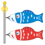 | [链接](https://github.githubassets.com/images/icons/emoji/unicode/1f38f.png?v8) |
| flashlight | `1f526` |  | [链接](https://github.githubassets.com/images/icons/emoji/unicode/1f526.png?v8) |
| fleur_de_lis | `269c` |  | [链接](https://github.githubassets.com/images/icons/emoji/unicode/269c.png?v8) |
| flight_arrival | `1f6ec` |  | [链接](https://github.githubassets.com/images/icons/emoji/unicode/1f6ec.png?v8) |
| flight_departure | `1f6eb` |  | [链接](https://github.githubassets.com/images/icons/emoji/unicode/1f6eb.png?v8) |
| flipper | `1f42c` |  | [链接](https://github.githubassets.com/images/icons/emoji/unicode/1f42c.png?v8) |
| floppy_disk | `1f4be` |  | [链接](https://github.githubassets.com/images/icons/emoji/unicode/1f4be.png?v8) |
| flower_playing_cards | `1f3b4` |  | [链接](https://github.githubassets.com/images/icons/emoji/unicode/1f3b4.png?v8) |
| flushed | `1f633` |  | [链接](https://github.githubassets.com/images/icons/emoji/unicode/1f633.png?v8) |
| fog | `1f32b` |  | [链接](https://github.githubassets.com/images/icons/emoji/unicode/1f32b.png?v8) |
| foggy | `1f301` |  | [链接](https://github.githubassets.com/images/icons/emoji/unicode/1f301.png?v8) |
| football | `1f3c8` |  | [链接](https://github.githubassets.com/images/icons/emoji/unicode/1f3c8.png?v8) |
| footprints | `1f463` |  | [链接](https://github.githubassets.com/images/icons/emoji/unicode/1f463.png?v8) |
| fork_and_knife | `1f374` |  | [链接](https://github.githubassets.com/images/icons/emoji/unicode/1f374.png?v8) |
| fountain | `26f2` |  | [链接](https://github.githubassets.com/images/icons/emoji/unicode/26f2.png?v8) |
| fountain_pen | `1f58b` |  | [链接](https://github.githubassets.com/images/icons/emoji/unicode/1f58b.png?v8) |
| four | `0034-20e3` |  | [链接](https://github.githubassets.com/images/icons/emoji/unicode/0034-20e3.png?v8) |
| four_leaf_clover | `1f340` |  | [链接](https://github.githubassets.com/images/icons/emoji/unicode/1f340.png?v8) |
| fox_face | `1f98a` |  | [链接](https://github.githubassets.com/images/icons/emoji/unicode/1f98a.png?v8) |
| fr | `1f1eb-1f1f7` |  | [链接](https://github.githubassets.com/images/icons/emoji/unicode/1f1eb-1f1f7.png?v8) |
| framed_picture | `1f5bc` |  | [链接](https://github.githubassets.com/images/icons/emoji/unicode/1f5bc.png?v8) |
| free | `1f193` |  | [链接](https://github.githubassets.com/images/icons/emoji/unicode/1f193.png?v8) |
| french_guiana | `1f1ec-1f1eb` |  | [链接](https://github.githubassets.com/images/icons/emoji/unicode/1f1ec-1f1eb.png?v8) |
| french_polynesia | `1f1f5-1f1eb` |  | [链接](https://github.githubassets.com/images/icons/emoji/unicode/1f1f5-1f1eb.png?v8) |
| french_southern_territories | `1f1f9-1f1eb` |  | [链接](https://github.githubassets.com/images/icons/emoji/unicode/1f1f9-1f1eb.png?v8) |
| fried_egg | `1f373` |  | [链接](https://github.githubassets.com/images/icons/emoji/unicode/1f373.png?v8) |
| fried_shrimp | `1f364` | 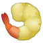 | [链接](https://github.githubassets.com/images/icons/emoji/unicode/1f364.png?v8) |
| fries | `1f35f` |  | [链接](https://github.githubassets.com/images/icons/emoji/unicode/1f35f.png?v8) |
| frog | `1f438` |  | [链接](https://github.githubassets.com/images/icons/emoji/unicode/1f438.png?v8) |
| frowning | `1f626` |  | [链接](https://github.githubassets.com/images/icons/emoji/unicode/1f626.png?v8) |
| frowning_face | `2639` |  | [链接](https://github.githubassets.com/images/icons/emoji/unicode/2639.png?v8) |
| frowning_man | `1f64d-2642` |  | [链接](https://github.githubassets.com/images/icons/emoji/unicode/1f64d-2642.png?v8) |
| frowning_woman | `1f64d` |  | [链接](https://github.githubassets.com/images/icons/emoji/unicode/1f64d.png?v8) |
| fu | `1f595` |  | [链接](https://github.githubassets.com/images/icons/emoji/unicode/1f595.png?v8) |
| fuelpump | `26fd` |  | [链接](https://github.githubassets.com/images/icons/emoji/unicode/26fd.png?v8) |
| full_moon | `1f315` |  | [链接](https://github.githubassets.com/images/icons/emoji/unicode/1f315.png?v8) |
| full_moon_with_face | `1f31d` |  | [链接](https://github.githubassets.com/images/icons/emoji/unicode/1f31d.png?v8) |
| funeral_urn | `26b1` |  | [链接](https://github.githubassets.com/images/icons/emoji/unicode/26b1.png?v8) |
| gabon | `1f1ec-1f1e6` |  | [链接](https://github.githubassets.com/images/icons/emoji/unicode/1f1ec-1f1e6.png?v8) |
| gambia | `1f1ec-1f1f2` |  | [链接](https://github.githubassets.com/images/icons/emoji/unicode/1f1ec-1f1f2.png?v8) |
| game_die | `1f3b2` |  | [链接](https://github.githubassets.com/images/icons/emoji/unicode/1f3b2.png?v8) |
| gb | `1f1ec-1f1e7` |  | [链接](https://github.githubassets.com/images/icons/emoji/unicode/1f1ec-1f1e7.png?v8) |
| gear | `2699` |  | [链接](https://github.githubassets.com/images/icons/emoji/unicode/2699.png?v8) |
| gem | `1f48e` |  | [链接](https://github.githubassets.com/images/icons/emoji/unicode/1f48e.png?v8) |
| gemini | `264a` |  | [链接](https://github.githubassets.com/images/icons/emoji/unicode/264a.png?v8) |
| georgia | `1f1ec-1f1ea` |  | [链接](https://github.githubassets.com/images/icons/emoji/unicode/1f1ec-1f1ea.png?v8) |
| ghana | `1f1ec-1f1ed` |  | [链接](https://github.githubassets.com/images/icons/emoji/unicode/1f1ec-1f1ed.png?v8) |
| ghost | `1f47b` |  | [链接](https://github.githubassets.com/images/icons/emoji/unicode/1f47b.png?v8) |
| gibraltar | `1f1ec-1f1ee` |  | [链接](https://github.githubassets.com/images/icons/emoji/unicode/1f1ec-1f1ee.png?v8) |
| gift | `1f381` |  | [链接](https://github.githubassets.com/images/icons/emoji/unicode/1f381.png?v8) |
| gift_heart | `1f49d` |  | [链接](https://github.githubassets.com/images/icons/emoji/unicode/1f49d.png?v8) |
| girl | `1f467` |  | [链接](https://github.githubassets.com/images/icons/emoji/unicode/1f467.png?v8) |
| globe_with_meridians | `1f310` |  | [链接](https://github.githubassets.com/images/icons/emoji/unicode/1f310.png?v8) |
| goal_net | `1f945` |  | [链接](https://github.githubassets.com/images/icons/emoji/unicode/1f945.png?v8) |
| goat | `1f410` |  | [链接](https://github.githubassets.com/images/icons/emoji/unicode/1f410.png?v8) |
| goberserk | `goberserk` |  | [链接](https://github.githubassets.com/images/icons/emoji/goberserk.png?v8) |
| godmode | `godmode` |  | [链接](https://github.githubassets.com/images/icons/emoji/godmode.png?v8) |
| golf | `26f3` |  | [链接](https://github.githubassets.com/images/icons/emoji/unicode/26f3.png?v8) |
| golfing_man | `1f3cc` | 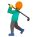 | [链接](https://github.githubassets.com/images/icons/emoji/unicode/1f3cc.png?v8) |
| golfing_woman | `1f3cc-2640` | 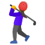 | [链接](https://github.githubassets.com/images/icons/emoji/unicode/1f3cc-2640.png?v8) |
| gorilla | `1f98d` |  | [链接](https://github.githubassets.com/images/icons/emoji/unicode/1f98d.png?v8) |
| grapes | `1f347` |  | [链接](https://github.githubassets.com/images/icons/emoji/unicode/1f347.png?v8) |
| greece | `1f1ec-1f1f7` |  | [链接](https://github.githubassets.com/images/icons/emoji/unicode/1f1ec-1f1f7.png?v8) |
| green_apple | `1f34f` | 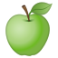 | [链接](https://github.githubassets.com/images/icons/emoji/unicode/1f34f.png?v8) |
| green_book | `1f4d7` |  | [链接](https://github.githubassets.com/images/icons/emoji/unicode/1f4d7.png?v8) |
| green_heart | `1f49a` |  | [链接](https://github.githubassets.com/images/icons/emoji/unicode/1f49a.png?v8) |
| green_salad | `1f957` |  | [链接](https://github.githubassets.com/images/icons/emoji/unicode/1f957.png?v8) |
| greenland | `1f1ec-1f1f1` |  | [链接](https://github.githubassets.com/images/icons/emoji/unicode/1f1ec-1f1f1.png?v8) |
| grenada | `1f1ec-1f1e9` |  | [链接](https://github.githubassets.com/images/icons/emoji/unicode/1f1ec-1f1e9.png?v8) |
| grey_exclamation | `2755` |  | [链接](https://github.githubassets.com/images/icons/emoji/unicode/2755.png?v8) |
| grey_question | `2754` |  | [链接](https://github.githubassets.com/images/icons/emoji/unicode/2754.png?v8) |
| grimacing | `1f62c` |  | [链接](https://github.githubassets.com/images/icons/emoji/unicode/1f62c.png?v8) |
| grin | `1f601` |  | [链接](https://github.githubassets.com/images/icons/emoji/unicode/1f601.png?v8) |
| grinning | `1f600` |  | [链接](https://github.githubassets.com/images/icons/emoji/unicode/1f600.png?v8) |
| guadeloupe | `1f1ec-1f1f5` |  | [链接](https://github.githubassets.com/images/icons/emoji/unicode/1f1ec-1f1f5.png?v8) |
| guam | `1f1ec-1f1fa` |  | [链接](https://github.githubassets.com/images/icons/emoji/unicode/1f1ec-1f1fa.png?v8) |
| guardsman | `1f482` |  | [链接](https://github.githubassets.com/images/icons/emoji/unicode/1f482.png?v8) |
| guardswoman | `1f482-2640` |  | [链接](https://github.githubassets.com/images/icons/emoji/unicode/1f482-2640.png?v8) |
| guatemala | `1f1ec-1f1f9` |  | [链接](https://github.githubassets.com/images/icons/emoji/unicode/1f1ec-1f1f9.png?v8) |
| guernsey | `1f1ec-1f1ec` |  | [链接](https://github.githubassets.com/images/icons/emoji/unicode/1f1ec-1f1ec.png?v8) |
| guinea | `1f1ec-1f1f3` |  | [链接](https://github.githubassets.com/images/icons/emoji/unicode/1f1ec-1f1f3.png?v8) |
| guinea_bissau | `1f1ec-1f1fc` |  | [链接](https://github.githubassets.com/images/icons/emoji/unicode/1f1ec-1f1fc.png?v8) |
| guitar | `1f3b8` | 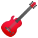 | [链接](https://github.githubassets.com/images/icons/emoji/unicode/1f3b8.png?v8) |
| gun | `1f52b` |  | [链接](https://github.githubassets.com/images/icons/emoji/unicode/1f52b.png?v8) |
| guyana | `1f1ec-1f1fe` |  | [链接](https://github.githubassets.com/images/icons/emoji/unicode/1f1ec-1f1fe.png?v8) |
| haircut | `1f487` |  | [链接](https://github.githubassets.com/images/icons/emoji/unicode/1f487.png?v8) |
| haircut_man | `1f487-2642` |  | [链接](https://github.githubassets.com/images/icons/emoji/unicode/1f487-2642.png?v8) |
| haircut_woman | `1f487` |  | [链接](https://github.githubassets.com/images/icons/emoji/unicode/1f487.png?v8) |
| haiti | `1f1ed-1f1f9` |  | [链接](https://github.githubassets.com/images/icons/emoji/unicode/1f1ed-1f1f9.png?v8) |
| hamburger | `1f354` |  | [链接](https://github.githubassets.com/images/icons/emoji/unicode/1f354.png?v8) |
| hammer | `1f528` | 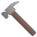 | [链接](https://github.githubassets.com/images/icons/emoji/unicode/1f528.png?v8) |
| hammer_and_pick | `2692` |  | [链接](https://github.githubassets.com/images/icons/emoji/unicode/2692.png?v8) |
| hammer_and_wrench | `1f6e0` |  | [链接](https://github.githubassets.com/images/icons/emoji/unicode/1f6e0.png?v8) |
| hamster | `1f439` |  | [链接](https://github.githubassets.com/images/icons/emoji/unicode/1f439.png?v8) |
| hand | `270b` |  | [链接](https://github.githubassets.com/images/icons/emoji/unicode/270b.png?v8) |
| handbag | `1f45c` |  | [链接](https://github.githubassets.com/images/icons/emoji/unicode/1f45c.png?v8) |
| handshake | `1f91d` |  | [链接](https://github.githubassets.com/images/icons/emoji/unicode/1f91d.png?v8) |
| hankey | `1f4a9` |  | [链接](https://github.githubassets.com/images/icons/emoji/unicode/1f4a9.png?v8) |
| hash | `0023-20e3` |  | [链接](https://github.githubassets.com/images/icons/emoji/unicode/0023-20e3.png?v8) |
| hatched_chick | `1f425` |  | [链接](https://github.githubassets.com/images/icons/emoji/unicode/1f425.png?v8) |
| hatching_chick | `1f423` |  | [链接](https://github.githubassets.com/images/icons/emoji/unicode/1f423.png?v8) |
| headphones | `1f3a7` |  | [链接](https://github.githubassets.com/images/icons/emoji/unicode/1f3a7.png?v8) |
| hear_no_evil | `1f649` |  | [链接](https://github.githubassets.com/images/icons/emoji/unicode/1f649.png?v8) |
| heart | `2764` |  | [链接](https://github.githubassets.com/images/icons/emoji/unicode/2764.png?v8) |
| heart_decoration | `1f49f` |  | [链接](https://github.githubassets.com/images/icons/emoji/unicode/1f49f.png?v8) |
| heart_eyes | `1f60d` |  | [链接](https://github.githubassets.com/images/icons/emoji/unicode/1f60d.png?v8) |
| heart_eyes_cat | `1f63b` |  | [链接](https://github.githubassets.com/images/icons/emoji/unicode/1f63b.png?v8) |
| heartbeat | `1f493` |  | [链接](https://github.githubassets.com/images/icons/emoji/unicode/1f493.png?v8) |
| heartpulse | `1f497` |  | [链接](https://github.githubassets.com/images/icons/emoji/unicode/1f497.png?v8) |
| hearts | `2665` |  | [链接](https://github.githubassets.com/images/icons/emoji/unicode/2665.png?v8) |
| heavy_check_mark | `2714` |  | [链接](https://github.githubassets.com/images/icons/emoji/unicode/2714.png?v8) |
| heavy_division_sign | `2797` |  | [链接](https://github.githubassets.com/images/icons/emoji/unicode/2797.png?v8) |
| heavy_dollar_sign | `1f4b2` |  | [链接](https://github.githubassets.com/images/icons/emoji/unicode/1f4b2.png?v8) |
| heavy_exclamation_mark | `2757` |  | [链接](https://github.githubassets.com/images/icons/emoji/unicode/2757.png?v8) |
| heavy_heart_exclamation | `2763` |  | [链接](https://github.githubassets.com/images/icons/emoji/unicode/2763.png?v8) |
| heavy_minus_sign | `2796` |  | [链接](https://github.githubassets.com/images/icons/emoji/unicode/2796.png?v8) |
| heavy_multiplication_x | `2716` |  | [链接](https://github.githubassets.com/images/icons/emoji/unicode/2716.png?v8) |
| heavy_plus_sign | `2795` |  | [链接](https://github.githubassets.com/images/icons/emoji/unicode/2795.png?v8) |
| helicopter | `1f681` |  | [链接](https://github.githubassets.com/images/icons/emoji/unicode/1f681.png?v8) |
| herb | `1f33f` |  | [链接](https://github.githubassets.com/images/icons/emoji/unicode/1f33f.png?v8) |
| hibiscus | `1f33a` |  | [链接](https://github.githubassets.com/images/icons/emoji/unicode/1f33a.png?v8) |
| high_brightness | `1f506` |  | [链接](https://github.githubassets.com/images/icons/emoji/unicode/1f506.png?v8) |
| high_heel | `1f460` |  | [链接](https://github.githubassets.com/images/icons/emoji/unicode/1f460.png?v8) |
| hocho | `1f52a` |  | [链接](https://github.githubassets.com/images/icons/emoji/unicode/1f52a.png?v8) |
| hole | `1f573` |  | [链接](https://github.githubassets.com/images/icons/emoji/unicode/1f573.png?v8) |
| honduras | `1f1ed-1f1f3` |  | [链接](https://github.githubassets.com/images/icons/emoji/unicode/1f1ed-1f1f3.png?v8) |
| honey_pot | `1f36f` | 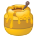 | [链接](https://github.githubassets.com/images/icons/emoji/unicode/1f36f.png?v8) |
| honeybee | `1f41d` |  | [链接](https://github.githubassets.com/images/icons/emoji/unicode/1f41d.png?v8) |
| hong_kong | `1f1ed-1f1f0` |  | [链接](https://github.githubassets.com/images/icons/emoji/unicode/1f1ed-1f1f0.png?v8) |
| horse | `1f434` | 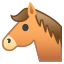 | [链接](https://github.githubassets.com/images/icons/emoji/unicode/1f434.png?v8) |
| horse_racing | `1f3c7` |  | [链接](https://github.githubassets.com/images/icons/emoji/unicode/1f3c7.png?v8) |
| hospital | `1f3e5` |  | [链接](https://github.githubassets.com/images/icons/emoji/unicode/1f3e5.png?v8) |
| hot_pepper | `1f336` |  | [链接](https://github.githubassets.com/images/icons/emoji/unicode/1f336.png?v8) |
| hotdog | `1f32d` |  | [链接](https://github.githubassets.com/images/icons/emoji/unicode/1f32d.png?v8) |
| hotel | `1f3e8` |  | [链接](https://github.githubassets.com/images/icons/emoji/unicode/1f3e8.png?v8) |
| hotsprings | `2668` |  | [链接](https://github.githubassets.com/images/icons/emoji/unicode/2668.png?v8) |
| hourglass | `231b` |  | [链接](https://github.githubassets.com/images/icons/emoji/unicode/231b.png?v8) |
| hourglass_flowing_sand | `23f3` |  | [链接](https://github.githubassets.com/images/icons/emoji/unicode/23f3.png?v8) |
| house | `1f3e0` |  | [链接](https://github.githubassets.com/images/icons/emoji/unicode/1f3e0.png?v8) |
| house_with_garden | `1f3e1` |  | [链接](https://github.githubassets.com/images/icons/emoji/unicode/1f3e1.png?v8) |
| houses | `1f3d8` |  | [链接](https://github.githubassets.com/images/icons/emoji/unicode/1f3d8.png?v8) |
| hugs | `1f917` |  | [链接](https://github.githubassets.com/images/icons/emoji/unicode/1f917.png?v8) |
| hungary | `1f1ed-1f1fa` |  | [链接](https://github.githubassets.com/images/icons/emoji/unicode/1f1ed-1f1fa.png?v8) |
| hurtrealbad | `hurtrealbad` |  | [链接](https://github.githubassets.com/images/icons/emoji/hurtrealbad.png?v8) |
| hushed | `1f62f` |  | [链接](https://github.githubassets.com/images/icons/emoji/unicode/1f62f.png?v8) |
| ice_cream | `1f368` |  | [链接](https://github.githubassets.com/images/icons/emoji/unicode/1f368.png?v8) |
| ice_hockey | `1f3d2` | 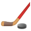 | [链接](https://github.githubassets.com/images/icons/emoji/unicode/1f3d2.png?v8) |
| ice_skate | `26f8` |  | [链接](https://github.githubassets.com/images/icons/emoji/unicode/26f8.png?v8) |
| icecream | `1f366` |  | [链接](https://github.githubassets.com/images/icons/emoji/unicode/1f366.png?v8) |
| iceland | `1f1ee-1f1f8` |  | [链接](https://github.githubassets.com/images/icons/emoji/unicode/1f1ee-1f1f8.png?v8) |
| id | `1f194` |  | [链接](https://github.githubassets.com/images/icons/emoji/unicode/1f194.png?v8) |
| ideograph_advantage | `1f250` |  | [链接](https://github.githubassets.com/images/icons/emoji/unicode/1f250.png?v8) |
| imp | `1f47f` |  | [链接](https://github.githubassets.com/images/icons/emoji/unicode/1f47f.png?v8) |
| inbox_tray | `1f4e5` |  | [链接](https://github.githubassets.com/images/icons/emoji/unicode/1f4e5.png?v8) |
| incoming_envelope | `1f4e8` |  | [链接](https://github.githubassets.com/images/icons/emoji/unicode/1f4e8.png?v8) |
| india | `1f1ee-1f1f3` |  | [链接](https://github.githubassets.com/images/icons/emoji/unicode/1f1ee-1f1f3.png?v8) |
| indonesia | `1f1ee-1f1e9` |  | [链接](https://github.githubassets.com/images/icons/emoji/unicode/1f1ee-1f1e9.png?v8) |
| information_desk_person | `1f481` |  | [链接](https://github.githubassets.com/images/icons/emoji/unicode/1f481.png?v8) |
| information_source | `2139` |  | [链接](https://github.githubassets.com/images/icons/emoji/unicode/2139.png?v8) |
| innocent | `1f607` |  | [链接](https://github.githubassets.com/images/icons/emoji/unicode/1f607.png?v8) |
| interrobang | `2049` |  | [链接](https://github.githubassets.com/images/icons/emoji/unicode/2049.png?v8) |
| iphone | `1f4f1` |  | [链接](https://github.githubassets.com/images/icons/emoji/unicode/1f4f1.png?v8) |
| iran | `1f1ee-1f1f7` |  | [链接](https://github.githubassets.com/images/icons/emoji/unicode/1f1ee-1f1f7.png?v8) |
| iraq | `1f1ee-1f1f6` |  | [链接](https://github.githubassets.com/images/icons/emoji/unicode/1f1ee-1f1f6.png?v8) |
| ireland | `1f1ee-1f1ea` |  | [链接](https://github.githubassets.com/images/icons/emoji/unicode/1f1ee-1f1ea.png?v8) |
| isle_of_man | `1f1ee-1f1f2` |  | [链接](https://github.githubassets.com/images/icons/emoji/unicode/1f1ee-1f1f2.png?v8) |
| israel | `1f1ee-1f1f1` |  | [链接](https://github.githubassets.com/images/icons/emoji/unicode/1f1ee-1f1f1.png?v8) |
| it | `1f1ee-1f1f9` |  | [链接](https://github.githubassets.com/images/icons/emoji/unicode/1f1ee-1f1f9.png?v8) |
| izakaya_lantern | `1f3ee` |  | [链接](https://github.githubassets.com/images/icons/emoji/unicode/1f3ee.png?v8) |
| jack_o_lantern | `1f383` |  | [链接](https://github.githubassets.com/images/icons/emoji/unicode/1f383.png?v8) |
| jamaica | `1f1ef-1f1f2` |  | [链接](https://github.githubassets.com/images/icons/emoji/unicode/1f1ef-1f1f2.png?v8) |
| japan | `1f5fe` |  | [链接](https://github.githubassets.com/images/icons/emoji/unicode/1f5fe.png?v8) |
| japanese_castle | `1f3ef` |  | [链接](https://github.githubassets.com/images/icons/emoji/unicode/1f3ef.png?v8) |
| japanese_goblin | `1f47a` |  | [链接](https://github.githubassets.com/images/icons/emoji/unicode/1f47a.png?v8) |
| japanese_ogre | `1f479` |  | [链接](https://github.githubassets.com/images/icons/emoji/unicode/1f479.png?v8) |
| jeans | `1f456` |  | [链接](https://github.githubassets.com/images/icons/emoji/unicode/1f456.png?v8) |
| jersey | `1f1ef-1f1ea` |  | [链接](https://github.githubassets.com/images/icons/emoji/unicode/1f1ef-1f1ea.png?v8) |
| jordan | `1f1ef-1f1f4` |  | [链接](https://github.githubassets.com/images/icons/emoji/unicode/1f1ef-1f1f4.png?v8) |
| joy | `1f602` |  | [链接](https://github.githubassets.com/images/icons/emoji/unicode/1f602.png?v8) |
| joy_cat | `1f639` |  | [链接](https://github.githubassets.com/images/icons/emoji/unicode/1f639.png?v8) |
| joystick | `1f579` |  | [链接](https://github.githubassets.com/images/icons/emoji/unicode/1f579.png?v8) |
| jp | `1f1ef-1f1f5` |  | [链接](https://github.githubassets.com/images/icons/emoji/unicode/1f1ef-1f1f5.png?v8) |
| kaaba | `1f54b` |  | [链接](https://github.githubassets.com/images/icons/emoji/unicode/1f54b.png?v8) |
| kazakhstan | `1f1f0-1f1ff` |  | [链接](https://github.githubassets.com/images/icons/emoji/unicode/1f1f0-1f1ff.png?v8) |
| kenya | `1f1f0-1f1ea` |  | [链接](https://github.githubassets.com/images/icons/emoji/unicode/1f1f0-1f1ea.png?v8) |
| key | `1f511` |  | [链接](https://github.githubassets.com/images/icons/emoji/unicode/1f511.png?v8) |
| keyboard | `2328` |  | [链接](https://github.githubassets.com/images/icons/emoji/unicode/2328.png?v8) |
| keycap_ten | `1f51f` |  | [链接](https://github.githubassets.com/images/icons/emoji/unicode/1f51f.png?v8) |
| kick_scooter | `1f6f4` |  | [链接](https://github.githubassets.com/images/icons/emoji/unicode/1f6f4.png?v8) |
| kimono | `1f458` |  | [链接](https://github.githubassets.com/images/icons/emoji/unicode/1f458.png?v8) |
| kiribati | `1f1f0-1f1ee` |  | [链接](https://github.githubassets.com/images/icons/emoji/unicode/1f1f0-1f1ee.png?v8) |
| kiss | `1f48b` |  | [链接](https://github.githubassets.com/images/icons/emoji/unicode/1f48b.png?v8) |
| kissing | `1f617` |  | [链接](https://github.githubassets.com/images/icons/emoji/unicode/1f617.png?v8) |
| kissing_cat | `1f63d` |  | [链接](https://github.githubassets.com/images/icons/emoji/unicode/1f63d.png?v8) |
| kissing_closed_eyes | `1f61a` |  | [链接](https://github.githubassets.com/images/icons/emoji/unicode/1f61a.png?v8) |
| kissing_heart | `1f618` |  | [链接](https://github.githubassets.com/images/icons/emoji/unicode/1f618.png?v8) |
| kissing_smiling_eyes | `1f619` |  | [链接](https://github.githubassets.com/images/icons/emoji/unicode/1f619.png?v8) |
| kiwi_fruit | `1f95d` |  | [链接](https://github.githubassets.com/images/icons/emoji/unicode/1f95d.png?v8) |
| knife | `1f52a` |  | [链接](https://github.githubassets.com/images/icons/emoji/unicode/1f52a.png?v8) |
| koala | `1f428` |  | [链接](https://github.githubassets.com/images/icons/emoji/unicode/1f428.png?v8) |
| koko | `1f201` |  | [链接](https://github.githubassets.com/images/icons/emoji/unicode/1f201.png?v8) |
| kosovo | `1f1fd-1f1f0` |  | [链接](https://github.githubassets.com/images/icons/emoji/unicode/1f1fd-1f1f0.png?v8) |
| kr | `1f1f0-1f1f7` |  | [链接](https://github.githubassets.com/images/icons/emoji/unicode/1f1f0-1f1f7.png?v8) |
| kuwait | `1f1f0-1f1fc` |  | [链接](https://github.githubassets.com/images/icons/emoji/unicode/1f1f0-1f1fc.png?v8) |
| kyrgyzstan | `1f1f0-1f1ec` |  | [链接](https://github.githubassets.com/images/icons/emoji/unicode/1f1f0-1f1ec.png?v8) |
| label | `1f3f7` |  | [链接](https://github.githubassets.com/images/icons/emoji/unicode/1f3f7.png?v8) |
| lantern | `1f3ee` |  | [链接](https://github.githubassets.com/images/icons/emoji/unicode/1f3ee.png?v8) |
| laos | `1f1f1-1f1e6` |  | [链接](https://github.githubassets.com/images/icons/emoji/unicode/1f1f1-1f1e6.png?v8) |
| large_blue_circle | `1f535` |  | [链接](https://github.githubassets.com/images/icons/emoji/unicode/1f535.png?v8) |
| large_blue_diamond | `1f537` |  | [链接](https://github.githubassets.com/images/icons/emoji/unicode/1f537.png?v8) |
| large_orange_diamond | `1f536` |  | [链接](https://github.githubassets.com/images/icons/emoji/unicode/1f536.png?v8) |
| last_quarter_moon | `1f317` |  | [链接](https://github.githubassets.com/images/icons/emoji/unicode/1f317.png?v8) |
| last_quarter_moon_with_face | `1f31c` |  | [链接](https://github.githubassets.com/images/icons/emoji/unicode/1f31c.png?v8) |
| latin_cross | `271d` |  | [链接](https://github.githubassets.com/images/icons/emoji/unicode/271d.png?v8) |
| latvia | `1f1f1-1f1fb` |  | [链接](https://github.githubassets.com/images/icons/emoji/unicode/1f1f1-1f1fb.png?v8) |
| laughing | `1f606` |  | [链接](https://github.githubassets.com/images/icons/emoji/unicode/1f606.png?v8) |
| leaves | `1f343` |  | [链接](https://github.githubassets.com/images/icons/emoji/unicode/1f343.png?v8) |
| lebanon | `1f1f1-1f1e7` |  | [链接](https://github.githubassets.com/images/icons/emoji/unicode/1f1f1-1f1e7.png?v8) |
| ledger | `1f4d2` |  | [链接](https://github.githubassets.com/images/icons/emoji/unicode/1f4d2.png?v8) |
| left_luggage | `1f6c5` |  | [链接](https://github.githubassets.com/images/icons/emoji/unicode/1f6c5.png?v8) |
| left_right_arrow | `2194` |  | [链接](https://github.githubassets.com/images/icons/emoji/unicode/2194.png?v8) |
| leftwards_arrow_with_hook | `21a9` |  | [链接](https://github.githubassets.com/images/icons/emoji/unicode/21a9.png?v8) |
| lemon | `1f34b` |  | [链接](https://github.githubassets.com/images/icons/emoji/unicode/1f34b.png?v8) |
| leo | `264c` |  | [链接](https://github.githubassets.com/images/icons/emoji/unicode/264c.png?v8) |
| leopard | `1f406` |  | [链接](https://github.githubassets.com/images/icons/emoji/unicode/1f406.png?v8) |
| lesotho | `1f1f1-1f1f8` |  | [链接](https://github.githubassets.com/images/icons/emoji/unicode/1f1f1-1f1f8.png?v8) |
| level_slider | `1f39a` |  | [链接](https://github.githubassets.com/images/icons/emoji/unicode/1f39a.png?v8) |
| liberia | `1f1f1-1f1f7` |  | [链接](https://github.githubassets.com/images/icons/emoji/unicode/1f1f1-1f1f7.png?v8) |
| libra | `264e` |  | [链接](https://github.githubassets.com/images/icons/emoji/unicode/264e.png?v8) |
| libya | `1f1f1-1f1fe` |  | [链接](https://github.githubassets.com/images/icons/emoji/unicode/1f1f1-1f1fe.png?v8) |
| liechtenstein | `1f1f1-1f1ee` |  | [链接](https://github.githubassets.com/images/icons/emoji/unicode/1f1f1-1f1ee.png?v8) |
| light_rail | `1f688` |  | [链接](https://github.githubassets.com/images/icons/emoji/unicode/1f688.png?v8) |
| link | `1f517` |  | [链接](https://github.githubassets.com/images/icons/emoji/unicode/1f517.png?v8) |
| lion | `1f981` |  | [链接](https://github.githubassets.com/images/icons/emoji/unicode/1f981.png?v8) |
| lips | `1f444` |  | [链接](https://github.githubassets.com/images/icons/emoji/unicode/1f444.png?v8) |
| lipstick | `1f484` |  | [链接](https://github.githubassets.com/images/icons/emoji/unicode/1f484.png?v8) |
| lithuania | `1f1f1-1f1f9` |  | [链接](https://github.githubassets.com/images/icons/emoji/unicode/1f1f1-1f1f9.png?v8) |
| lizard | `1f98e` |  | [链接](https://github.githubassets.com/images/icons/emoji/unicode/1f98e.png?v8) |
| lock | `1f512` |  | [链接](https://github.githubassets.com/images/icons/emoji/unicode/1f512.png?v8) |
| lock_with_ink_pen | `1f50f` |  | [链接](https://github.githubassets.com/images/icons/emoji/unicode/1f50f.png?v8) |
| lollipop | `1f36d` |  | [链接](https://github.githubassets.com/images/icons/emoji/unicode/1f36d.png?v8) |
| loop | `27bf` |  | [链接](https://github.githubassets.com/images/icons/emoji/unicode/27bf.png?v8) |
| loud_sound | `1f50a` |  | [链接](https://github.githubassets.com/images/icons/emoji/unicode/1f50a.png?v8) |
| loudspeaker | `1f4e2` |  | [链接](https://github.githubassets.com/images/icons/emoji/unicode/1f4e2.png?v8) |
| love_hotel | `1f3e9` |  | [链接](https://github.githubassets.com/images/icons/emoji/unicode/1f3e9.png?v8) |
| love_letter | `1f48c` |  | [链接](https://github.githubassets.com/images/icons/emoji/unicode/1f48c.png?v8) |
| low_brightness | `1f505` |  | [链接](https://github.githubassets.com/images/icons/emoji/unicode/1f505.png?v8) |
| luxembourg | `1f1f1-1f1fa` |  | [链接](https://github.githubassets.com/images/icons/emoji/unicode/1f1f1-1f1fa.png?v8) |
| lying_face | `1f925` |  | [链接](https://github.githubassets.com/images/icons/emoji/unicode/1f925.png?v8) |
| m | `24c2` |  | [链接](https://github.githubassets.com/images/icons/emoji/unicode/24c2.png?v8) |
| macau | `1f1f2-1f1f4` |  | [链接](https://github.githubassets.com/images/icons/emoji/unicode/1f1f2-1f1f4.png?v8) |
| macedonia | `1f1f2-1f1f0` |  | [链接](https://github.githubassets.com/images/icons/emoji/unicode/1f1f2-1f1f0.png?v8) |
| madagascar | `1f1f2-1f1ec` |  | [链接](https://github.githubassets.com/images/icons/emoji/unicode/1f1f2-1f1ec.png?v8) |
| mag | `1f50d` |  | [链接](https://github.githubassets.com/images/icons/emoji/unicode/1f50d.png?v8) |
| mag_right | `1f50e` |  | [链接](https://github.githubassets.com/images/icons/emoji/unicode/1f50e.png?v8) |
| mahjong | `1f004` |  | [链接](https://github.githubassets.com/images/icons/emoji/unicode/1f004.png?v8) |
| mailbox | `1f4eb` |  | [链接](https://github.githubassets.com/images/icons/emoji/unicode/1f4eb.png?v8) |
| mailbox_closed | `1f4ea` |  | [链接](https://github.githubassets.com/images/icons/emoji/unicode/1f4ea.png?v8) |
| mailbox_with_mail | `1f4ec` |  | [链接](https://github.githubassets.com/images/icons/emoji/unicode/1f4ec.png?v8) |
| mailbox_with_no_mail | `1f4ed` |  | [链接](https://github.githubassets.com/images/icons/emoji/unicode/1f4ed.png?v8) |
| malawi | `1f1f2-1f1fc` |  | [链接](https://github.githubassets.com/images/icons/emoji/unicode/1f1f2-1f1fc.png?v8) |
| malaysia | `1f1f2-1f1fe` |  | [链接](https://github.githubassets.com/images/icons/emoji/unicode/1f1f2-1f1fe.png?v8) |
| maldives | `1f1f2-1f1fb` |  | [链接](https://github.githubassets.com/images/icons/emoji/unicode/1f1f2-1f1fb.png?v8) |
| male_detective | `1f575` |  | [链接](https://github.githubassets.com/images/icons/emoji/unicode/1f575.png?v8) |
| mali | `1f1f2-1f1f1` |  | [链接](https://github.githubassets.com/images/icons/emoji/unicode/1f1f2-1f1f1.png?v8) |
| malta | `1f1f2-1f1f9` |  | [链接](https://github.githubassets.com/images/icons/emoji/unicode/1f1f2-1f1f9.png?v8) |
| man | `1f468` |  | [链接](https://github.githubassets.com/images/icons/emoji/unicode/1f468.png?v8) |
| man_artist | `1f468-1f3a8` |  | [链接](https://github.githubassets.com/images/icons/emoji/unicode/1f468-1f3a8.png?v8) |
| man_astronaut | `1f468-1f680` |  | [链接](https://github.githubassets.com/images/icons/emoji/unicode/1f468-1f680.png?v8) |
| man_cartwheeling | `1f938-2642` |  | [链接](https://github.githubassets.com/images/icons/emoji/unicode/1f938-2642.png?v8) |
| man_cook | `1f468-1f373` |  | [链接](https://github.githubassets.com/images/icons/emoji/unicode/1f468-1f373.png?v8) |
| man_dancing | `1f57a` |  | [链接](https://github.githubassets.com/images/icons/emoji/unicode/1f57a.png?v8) |
| man_facepalming | `1f926-2642` |  | [链接](https://github.githubassets.com/images/icons/emoji/unicode/1f926-2642.png?v8) |
| man_factory_worker | `1f468-1f3ed` |  | [链接](https://github.githubassets.com/images/icons/emoji/unicode/1f468-1f3ed.png?v8) |
| man_farmer | `1f468-1f33e` |  | [链接](https://github.githubassets.com/images/icons/emoji/unicode/1f468-1f33e.png?v8) |
| man_firefighter | `1f468-1f692` |  | [链接](https://github.githubassets.com/images/icons/emoji/unicode/1f468-1f692.png?v8) |
| man_health_worker | `1f468-2695` |  | [链接](https://github.githubassets.com/images/icons/emoji/unicode/1f468-2695.png?v8) |
| man_in_tuxedo | `1f935` |  | [链接](https://github.githubassets.com/images/icons/emoji/unicode/1f935.png?v8) |
| man_judge | `1f468-2696` |  | [链接](https://github.githubassets.com/images/icons/emoji/unicode/1f468-2696.png?v8) |
| man_juggling | `1f939-2642` |  | [链接](https://github.githubassets.com/images/icons/emoji/unicode/1f939-2642.png?v8) |
| man_mechanic | `1f468-1f527` |  | [链接](https://github.githubassets.com/images/icons/emoji/unicode/1f468-1f527.png?v8) |
| man_office_worker | `1f468-1f4bc` |  | [链接](https://github.githubassets.com/images/icons/emoji/unicode/1f468-1f4bc.png?v8) |
| man_pilot | `1f468-2708` |  | [链接](https://github.githubassets.com/images/icons/emoji/unicode/1f468-2708.png?v8) |
| man_playing_handball | `1f93e-2642` | 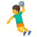 | [链接](https://github.githubassets.com/images/icons/emoji/unicode/1f93e-2642.png?v8) |
| man_playing_water_polo | `1f93d-2642` |  | [链接](https://github.githubassets.com/images/icons/emoji/unicode/1f93d-2642.png?v8) |
| man_scientist | `1f468-1f52c` |  | [链接](https://github.githubassets.com/images/icons/emoji/unicode/1f468-1f52c.png?v8) |
| man_shrugging | `1f937-2642` |  | [链接](https://github.githubassets.com/images/icons/emoji/unicode/1f937-2642.png?v8) |
| man_singer | `1f468-1f3a4` |  | [链接](https://github.githubassets.com/images/icons/emoji/unicode/1f468-1f3a4.png?v8) |
| man_student | `1f468-1f393` |  | [链接](https://github.githubassets.com/images/icons/emoji/unicode/1f468-1f393.png?v8) |
| man_teacher | `1f468-1f3eb` |  | [链接](https://github.githubassets.com/images/icons/emoji/unicode/1f468-1f3eb.png?v8) |
| man_technologist | `1f468-1f4bb` |  | [链接](https://github.githubassets.com/images/icons/emoji/unicode/1f468-1f4bb.png?v8) |
| man_with_gua_pi_mao | `1f472` |  | [链接](https://github.githubassets.com/images/icons/emoji/unicode/1f472.png?v8) |
| man_with_turban | `1f473` |  | [链接](https://github.githubassets.com/images/icons/emoji/unicode/1f473.png?v8) |
| mandarin | `1f34a` |  | [链接](https://github.githubassets.com/images/icons/emoji/unicode/1f34a.png?v8) |
| mans_shoe | `1f45e` |  | [链接](https://github.githubassets.com/images/icons/emoji/unicode/1f45e.png?v8) |
| mantelpiece_clock | `1f570` |  | [链接](https://github.githubassets.com/images/icons/emoji/unicode/1f570.png?v8) |
| maple_leaf | `1f341` |  | [链接](https://github.githubassets.com/images/icons/emoji/unicode/1f341.png?v8) |
| marshall_islands | `1f1f2-1f1ed` |  | [链接](https://github.githubassets.com/images/icons/emoji/unicode/1f1f2-1f1ed.png?v8) |
| martial_arts_uniform | `1f94b` |  | [链接](https://github.githubassets.com/images/icons/emoji/unicode/1f94b.png?v8) |
| martinique | `1f1f2-1f1f6` |  | [链接](https://github.githubassets.com/images/icons/emoji/unicode/1f1f2-1f1f6.png?v8) |
| mask | `1f637` |  | [链接](https://github.githubassets.com/images/icons/emoji/unicode/1f637.png?v8) |
| massage | `1f486` |  | [链接](https://github.githubassets.com/images/icons/emoji/unicode/1f486.png?v8) |
| massage_man | `1f486-2642` |  | [链接](https://github.githubassets.com/images/icons/emoji/unicode/1f486-2642.png?v8) |
| massage_woman | `1f486` |  | [链接](https://github.githubassets.com/images/icons/emoji/unicode/1f486.png?v8) |
| mauritania | `1f1f2-1f1f7` |  | [链接](https://github.githubassets.com/images/icons/emoji/unicode/1f1f2-1f1f7.png?v8) |
| mauritius | `1f1f2-1f1fa` |  | [链接](https://github.githubassets.com/images/icons/emoji/unicode/1f1f2-1f1fa.png?v8) |
| mayotte | `1f1fe-1f1f9` |  | [链接](https://github.githubassets.com/images/icons/emoji/unicode/1f1fe-1f1f9.png?v8) |
| meat_on_bone | `1f356` |  | [链接](https://github.githubassets.com/images/icons/emoji/unicode/1f356.png?v8) |
| medal_military | `1f396` |  | [链接](https://github.githubassets.com/images/icons/emoji/unicode/1f396.png?v8) |
| medal_sports | `1f3c5` |  | [链接](https://github.githubassets.com/images/icons/emoji/unicode/1f3c5.png?v8) |
| mega | `1f4e3` |  | [链接](https://github.githubassets.com/images/icons/emoji/unicode/1f4e3.png?v8) |
| melon | `1f348` |  | [链接](https://github.githubassets.com/images/icons/emoji/unicode/1f348.png?v8) |
| memo | `1f4dd` |  | [链接](https://github.githubassets.com/images/icons/emoji/unicode/1f4dd.png?v8) |
| men_wrestling | `1f93c-2642` |  | [链接](https://github.githubassets.com/images/icons/emoji/unicode/1f93c-2642.png?v8) |
| menorah | `1f54e` |  | [链接](https://github.githubassets.com/images/icons/emoji/unicode/1f54e.png?v8) |
| mens | `1f6b9` |  | [链接](https://github.githubassets.com/images/icons/emoji/unicode/1f6b9.png?v8) |
| metal | `1f918` |  | [链接](https://github.githubassets.com/images/icons/emoji/unicode/1f918.png?v8) |
| metro | `1f687` |  | [链接](https://github.githubassets.com/images/icons/emoji/unicode/1f687.png?v8) |
| mexico | `1f1f2-1f1fd` |  | [链接](https://github.githubassets.com/images/icons/emoji/unicode/1f1f2-1f1fd.png?v8) |
| micronesia | `1f1eb-1f1f2` |  | [链接](https://github.githubassets.com/images/icons/emoji/unicode/1f1eb-1f1f2.png?v8) |
| microphone | `1f3a4` |  | [链接](https://github.githubassets.com/images/icons/emoji/unicode/1f3a4.png?v8) |
| microscope | `1f52c` | 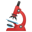 | [链接](https://github.githubassets.com/images/icons/emoji/unicode/1f52c.png?v8) |
| middle_finger | `1f595` |  | [链接](https://github.githubassets.com/images/icons/emoji/unicode/1f595.png?v8) |
| milk_glass | `1f95b` |  | [链接](https://github.githubassets.com/images/icons/emoji/unicode/1f95b.png?v8) |
| milky_way | `1f30c` |  | [链接](https://github.githubassets.com/images/icons/emoji/unicode/1f30c.png?v8) |
| minibus | `1f690` |  | [链接](https://github.githubassets.com/images/icons/emoji/unicode/1f690.png?v8) |
| minidisc | `1f4bd` |  | [链接](https://github.githubassets.com/images/icons/emoji/unicode/1f4bd.png?v8) |
| mobile_phone_off | `1f4f4` |  | [链接](https://github.githubassets.com/images/icons/emoji/unicode/1f4f4.png?v8) |
| moldova | `1f1f2-1f1e9` |  | [链接](https://github.githubassets.com/images/icons/emoji/unicode/1f1f2-1f1e9.png?v8) |
| monaco | `1f1f2-1f1e8` |  | [链接](https://github.githubassets.com/images/icons/emoji/unicode/1f1f2-1f1e8.png?v8) |
| money_mouth_face | `1f911` |  | [链接](https://github.githubassets.com/images/icons/emoji/unicode/1f911.png?v8) |
| money_with_wings | `1f4b8` |  | [链接](https://github.githubassets.com/images/icons/emoji/unicode/1f4b8.png?v8) |
| moneybag | `1f4b0` |  | [链接](https://github.githubassets.com/images/icons/emoji/unicode/1f4b0.png?v8) |
| mongolia | `1f1f2-1f1f3` |  | [链接](https://github.githubassets.com/images/icons/emoji/unicode/1f1f2-1f1f3.png?v8) |
| monkey | `1f412` |  | [链接](https://github.githubassets.com/images/icons/emoji/unicode/1f412.png?v8) |
| monkey_face | `1f435` |  | [链接](https://github.githubassets.com/images/icons/emoji/unicode/1f435.png?v8) |
| monorail | `1f69d` |  | [链接](https://github.githubassets.com/images/icons/emoji/unicode/1f69d.png?v8) |
| montenegro | `1f1f2-1f1ea` |  | [链接](https://github.githubassets.com/images/icons/emoji/unicode/1f1f2-1f1ea.png?v8) |
| montserrat | `1f1f2-1f1f8` |  | [链接](https://github.githubassets.com/images/icons/emoji/unicode/1f1f2-1f1f8.png?v8) |
| moon | `1f314` |  | [链接](https://github.githubassets.com/images/icons/emoji/unicode/1f314.png?v8) |
| morocco | `1f1f2-1f1e6` |  | [链接](https://github.githubassets.com/images/icons/emoji/unicode/1f1f2-1f1e6.png?v8) |
| mortar_board | `1f393` |  | [链接](https://github.githubassets.com/images/icons/emoji/unicode/1f393.png?v8) |
| mosque | `1f54c` |  | [链接](https://github.githubassets.com/images/icons/emoji/unicode/1f54c.png?v8) |
| motor_boat | `1f6e5` |  | [链接](https://github.githubassets.com/images/icons/emoji/unicode/1f6e5.png?v8) |
| motor_scooter | `1f6f5` | 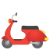 | [链接](https://github.githubassets.com/images/icons/emoji/unicode/1f6f5.png?v8) |
| motorcycle | `1f3cd` |  | [链接](https://github.githubassets.com/images/icons/emoji/unicode/1f3cd.png?v8) |
| motorway | `1f6e3` |  | [链接](https://github.githubassets.com/images/icons/emoji/unicode/1f6e3.png?v8) |
| mount_fuji | `1f5fb` |  | [链接](https://github.githubassets.com/images/icons/emoji/unicode/1f5fb.png?v8) |
| mountain | `26f0` |  | [链接](https://github.githubassets.com/images/icons/emoji/unicode/26f0.png?v8) |
| mountain_bicyclist | `1f6b5` | 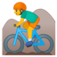 | [链接](https://github.githubassets.com/images/icons/emoji/unicode/1f6b5.png?v8) |
| mountain_biking_man | `1f6b5` |  | [链接](https://github.githubassets.com/images/icons/emoji/unicode/1f6b5.png?v8) |
| mountain_biking_woman | `1f6b5-2640` | 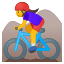 | [链接](https://github.githubassets.com/images/icons/emoji/unicode/1f6b5-2640.png?v8) |
| mountain_cableway | `1f6a0` |  | [链接](https://github.githubassets.com/images/icons/emoji/unicode/1f6a0.png?v8) |
| mountain_railway | `1f69e` |  | [链接](https://github.githubassets.com/images/icons/emoji/unicode/1f69e.png?v8) |
| mountain_snow | `1f3d4` |  | [链接](https://github.githubassets.com/images/icons/emoji/unicode/1f3d4.png?v8) |
| mouse | `1f42d` |  | [链接](https://github.githubassets.com/images/icons/emoji/unicode/1f42d.png?v8) |
| mouse2 | `1f401` |  | [链接](https://github.githubassets.com/images/icons/emoji/unicode/1f401.png?v8) |
| movie_camera | `1f3a5` |  | [链接](https://github.githubassets.com/images/icons/emoji/unicode/1f3a5.png?v8) |
| moyai | `1f5ff` |  | [链接](https://github.githubassets.com/images/icons/emoji/unicode/1f5ff.png?v8) |
| mozambique | `1f1f2-1f1ff` |  | [链接](https://github.githubassets.com/images/icons/emoji/unicode/1f1f2-1f1ff.png?v8) |
| mrs_claus | `1f936` |  | [链接](https://github.githubassets.com/images/icons/emoji/unicode/1f936.png?v8) |
| muscle | `1f4aa` |  | [链接](https://github.githubassets.com/images/icons/emoji/unicode/1f4aa.png?v8) |
| mushroom | `1f344` |  | [链接](https://github.githubassets.com/images/icons/emoji/unicode/1f344.png?v8) |
| musical_keyboard | `1f3b9` |  | [链接](https://github.githubassets.com/images/icons/emoji/unicode/1f3b9.png?v8) |
| musical_note | `1f3b5` |  | [链接](https://github.githubassets.com/images/icons/emoji/unicode/1f3b5.png?v8) |
| musical_score | `1f3bc` |  | [链接](https://github.githubassets.com/images/icons/emoji/unicode/1f3bc.png?v8) |
| mute | `1f507` |  | [链接](https://github.githubassets.com/images/icons/emoji/unicode/1f507.png?v8) |
| myanmar | `1f1f2-1f1f2` |  | [链接](https://github.githubassets.com/images/icons/emoji/unicode/1f1f2-1f1f2.png?v8) |
| nail_care | `1f485` |  | [链接](https://github.githubassets.com/images/icons/emoji/unicode/1f485.png?v8) |
| name_badge | `1f4db` |  | [链接](https://github.githubassets.com/images/icons/emoji/unicode/1f4db.png?v8) |
| namibia | `1f1f3-1f1e6` |  | [链接](https://github.githubassets.com/images/icons/emoji/unicode/1f1f3-1f1e6.png?v8) |
| national_park | `1f3de` |  | [链接](https://github.githubassets.com/images/icons/emoji/unicode/1f3de.png?v8) |
| nauru | `1f1f3-1f1f7` |  | [链接](https://github.githubassets.com/images/icons/emoji/unicode/1f1f3-1f1f7.png?v8) |
| nauseated_face | `1f922` |  | [链接](https://github.githubassets.com/images/icons/emoji/unicode/1f922.png?v8) |
| neckbeard | `neckbeard` |  | [链接](https://github.githubassets.com/images/icons/emoji/neckbeard.png?v8) |
| necktie | `1f454` |  | [链接](https://github.githubassets.com/images/icons/emoji/unicode/1f454.png?v8) |
| negative_squared_cross_mark | `274e` |  | [链接](https://github.githubassets.com/images/icons/emoji/unicode/274e.png?v8) |
| nepal | `1f1f3-1f1f5` |  | [链接](https://github.githubassets.com/images/icons/emoji/unicode/1f1f3-1f1f5.png?v8) |
| nerd_face | `1f913` |  | [链接](https://github.githubassets.com/images/icons/emoji/unicode/1f913.png?v8) |
| netherlands | `1f1f3-1f1f1` |  | [链接](https://github.githubassets.com/images/icons/emoji/unicode/1f1f3-1f1f1.png?v8) |
| neutral_face | `1f610` |  | [链接](https://github.githubassets.com/images/icons/emoji/unicode/1f610.png?v8) |
| new | `1f195` |  | [链接](https://github.githubassets.com/images/icons/emoji/unicode/1f195.png?v8) |
| new_caledonia | `1f1f3-1f1e8` |  | [链接](https://github.githubassets.com/images/icons/emoji/unicode/1f1f3-1f1e8.png?v8) |
| new_moon | `1f311` |  | [链接](https://github.githubassets.com/images/icons/emoji/unicode/1f311.png?v8) |
| new_moon_with_face | `1f31a` |  | [链接](https://github.githubassets.com/images/icons/emoji/unicode/1f31a.png?v8) |
| new_zealand | `1f1f3-1f1ff` |  | [链接](https://github.githubassets.com/images/icons/emoji/unicode/1f1f3-1f1ff.png?v8) |
| newspaper | `1f4f0` |  | [链接](https://github.githubassets.com/images/icons/emoji/unicode/1f4f0.png?v8) |
| newspaper_roll | `1f5de` |  | [链接](https://github.githubassets.com/images/icons/emoji/unicode/1f5de.png?v8) |
| next_track_button | `23ed` |  | [链接](https://github.githubassets.com/images/icons/emoji/unicode/23ed.png?v8) |
| ng | `1f196` |  | [链接](https://github.githubassets.com/images/icons/emoji/unicode/1f196.png?v8) |
| ng_man | `1f645-2642` |  | [链接](https://github.githubassets.com/images/icons/emoji/unicode/1f645-2642.png?v8) |
| ng_woman | `1f645` |  | [链接](https://github.githubassets.com/images/icons/emoji/unicode/1f645.png?v8) |
| nicaragua | `1f1f3-1f1ee` |  | [链接](https://github.githubassets.com/images/icons/emoji/unicode/1f1f3-1f1ee.png?v8) |
| niger | `1f1f3-1f1ea` |  | [链接](https://github.githubassets.com/images/icons/emoji/unicode/1f1f3-1f1ea.png?v8) |
| nigeria | `1f1f3-1f1ec` |  | [链接](https://github.githubassets.com/images/icons/emoji/unicode/1f1f3-1f1ec.png?v8) |
| night_with_stars | `1f303` |  | [链接](https://github.githubassets.com/images/icons/emoji/unicode/1f303.png?v8) |
| nine | `0039-20e3` |  | [链接](https://github.githubassets.com/images/icons/emoji/unicode/0039-20e3.png?v8) |
| niue | `1f1f3-1f1fa` |  | [链接](https://github.githubassets.com/images/icons/emoji/unicode/1f1f3-1f1fa.png?v8) |
| no_bell | `1f515` |  | [链接](https://github.githubassets.com/images/icons/emoji/unicode/1f515.png?v8) |
| no_bicycles | `1f6b3` |  | [链接](https://github.githubassets.com/images/icons/emoji/unicode/1f6b3.png?v8) |
| no_entry | `26d4` |  | [链接](https://github.githubassets.com/images/icons/emoji/unicode/26d4.png?v8) |
| no_entry_sign | `1f6ab` |  | [链接](https://github.githubassets.com/images/icons/emoji/unicode/1f6ab.png?v8) |
| no_good | `1f645` |  | [链接](https://github.githubassets.com/images/icons/emoji/unicode/1f645.png?v8) |
| no_good_man | `1f645-2642` |  | [链接](https://github.githubassets.com/images/icons/emoji/unicode/1f645-2642.png?v8) |
| no_good_woman | `1f645` |  | [链接](https://github.githubassets.com/images/icons/emoji/unicode/1f645.png?v8) |
| no_mobile_phones | `1f4f5` |  | [链接](https://github.githubassets.com/images/icons/emoji/unicode/1f4f5.png?v8) |
| no_mouth | `1f636` |  | [链接](https://github.githubassets.com/images/icons/emoji/unicode/1f636.png?v8) |
| no_pedestrians | `1f6b7` |  | [链接](https://github.githubassets.com/images/icons/emoji/unicode/1f6b7.png?v8) |
| no_smoking | `1f6ad` |  | [链接](https://github.githubassets.com/images/icons/emoji/unicode/1f6ad.png?v8) |
| non-potable_water | `1f6b1` |  | [链接](https://github.githubassets.com/images/icons/emoji/unicode/1f6b1.png?v8) |
| norfolk_island | `1f1f3-1f1eb` |  | [链接](https://github.githubassets.com/images/icons/emoji/unicode/1f1f3-1f1eb.png?v8) |
| north_korea | `1f1f0-1f1f5` |  | [链接](https://github.githubassets.com/images/icons/emoji/unicode/1f1f0-1f1f5.png?v8) |
| northern_mariana_islands | `1f1f2-1f1f5` |  | [链接](https://github.githubassets.com/images/icons/emoji/unicode/1f1f2-1f1f5.png?v8) |
| norway | `1f1f3-1f1f4` |  | [链接](https://github.githubassets.com/images/icons/emoji/unicode/1f1f3-1f1f4.png?v8) |
| nose | `1f443` |  | [链接](https://github.githubassets.com/images/icons/emoji/unicode/1f443.png?v8) |
| notebook | `1f4d3` |  | [链接](https://github.githubassets.com/images/icons/emoji/unicode/1f4d3.png?v8) |
| notebook_with_decorative_cover | `1f4d4` |  | [链接](https://github.githubassets.com/images/icons/emoji/unicode/1f4d4.png?v8) |
| notes | `1f3b6` |  | [链接](https://github.githubassets.com/images/icons/emoji/unicode/1f3b6.png?v8) |
| nut_and_bolt | `1f529` |  | [链接](https://github.githubassets.com/images/icons/emoji/unicode/1f529.png?v8) |
| o | `2b55` |  | [链接](https://github.githubassets.com/images/icons/emoji/unicode/2b55.png?v8) |
| o2 | `1f17e` |  | [链接](https://github.githubassets.com/images/icons/emoji/unicode/1f17e.png?v8) |
| ocean | `1f30a` |  | [链接](https://github.githubassets.com/images/icons/emoji/unicode/1f30a.png?v8) |
| octocat | `octocat` |  | [链接](https://github.githubassets.com/images/icons/emoji/octocat.png?v8) |
| octopus | `1f419` |  | [链接](https://github.githubassets.com/images/icons/emoji/unicode/1f419.png?v8) |
| oden | `1f362` |  | [链接](https://github.githubassets.com/images/icons/emoji/unicode/1f362.png?v8) |
| office | `1f3e2` |  | [链接](https://github.githubassets.com/images/icons/emoji/unicode/1f3e2.png?v8) |
| oil_drum | `1f6e2` |  | [链接](https://github.githubassets.com/images/icons/emoji/unicode/1f6e2.png?v8) |
| ok | `1f197` |  | [链接](https://github.githubassets.com/images/icons/emoji/unicode/1f197.png?v8) |
| ok_hand | `1f44c` |  | [链接](https://github.githubassets.com/images/icons/emoji/unicode/1f44c.png?v8) |
| ok_man | `1f646-2642` |  | [链接](https://github.githubassets.com/images/icons/emoji/unicode/1f646-2642.png?v8) |
| ok_woman | `1f646` |  | [链接](https://github.githubassets.com/images/icons/emoji/unicode/1f646.png?v8) |
| old_key | `1f5dd` |  | [链接](https://github.githubassets.com/images/icons/emoji/unicode/1f5dd.png?v8) |
| older_man | `1f474` |  | [链接](https://github.githubassets.com/images/icons/emoji/unicode/1f474.png?v8) |
| older_woman | `1f475` |  | [链接](https://github.githubassets.com/images/icons/emoji/unicode/1f475.png?v8) |
| om | `1f549` |  | [链接](https://github.githubassets.com/images/icons/emoji/unicode/1f549.png?v8) |
| oman | `1f1f4-1f1f2` |  | [链接](https://github.githubassets.com/images/icons/emoji/unicode/1f1f4-1f1f2.png?v8) |
| on | `1f51b` |  | [链接](https://github.githubassets.com/images/icons/emoji/unicode/1f51b.png?v8) |
| oncoming_automobile | `1f698` |  | [链接](https://github.githubassets.com/images/icons/emoji/unicode/1f698.png?v8) |
| oncoming_bus | `1f68d` |  | [链接](https://github.githubassets.com/images/icons/emoji/unicode/1f68d.png?v8) |
| oncoming_police_car | `1f694` |  | [链接](https://github.githubassets.com/images/icons/emoji/unicode/1f694.png?v8) |
| oncoming_taxi | `1f696` |  | [链接](https://github.githubassets.com/images/icons/emoji/unicode/1f696.png?v8) |
| one | `0031-20e3` |  | [链接](https://github.githubassets.com/images/icons/emoji/unicode/0031-20e3.png?v8) |
| open_book | `1f4d6` |  | [链接](https://github.githubassets.com/images/icons/emoji/unicode/1f4d6.png?v8) |
| open_file_folder | `1f4c2` |  | [链接](https://github.githubassets.com/images/icons/emoji/unicode/1f4c2.png?v8) |
| open_hands | `1f450` |  | [链接](https://github.githubassets.com/images/icons/emoji/unicode/1f450.png?v8) |
| open_mouth | `1f62e` |  | [链接](https://github.githubassets.com/images/icons/emoji/unicode/1f62e.png?v8) |
| open_umbrella | `2602` |  | [链接](https://github.githubassets.com/images/icons/emoji/unicode/2602.png?v8) |
| ophiuchus | `26ce` |  | [链接](https://github.githubassets.com/images/icons/emoji/unicode/26ce.png?v8) |
| orange | `1f34a` |  | [链接](https://github.githubassets.com/images/icons/emoji/unicode/1f34a.png?v8) |
| orange_book | `1f4d9` |  | [链接](https://github.githubassets.com/images/icons/emoji/unicode/1f4d9.png?v8) |
| orthodox_cross | `2626` |  | [链接](https://github.githubassets.com/images/icons/emoji/unicode/2626.png?v8) |
| outbox_tray | `1f4e4` |  | [链接](https://github.githubassets.com/images/icons/emoji/unicode/1f4e4.png?v8) |
| owl | `1f989` |  | [链接](https://github.githubassets.com/images/icons/emoji/unicode/1f989.png?v8) |
| ox | `1f402` | 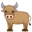 | [链接](https://github.githubassets.com/images/icons/emoji/unicode/1f402.png?v8) |
| package | `1f4e6` |  | [链接](https://github.githubassets.com/images/icons/emoji/unicode/1f4e6.png?v8) |
| page_facing_up | `1f4c4` |  | [链接](https://github.githubassets.com/images/icons/emoji/unicode/1f4c4.png?v8) |
| page_with_curl | `1f4c3` |  | [链接](https://github.githubassets.com/images/icons/emoji/unicode/1f4c3.png?v8) |
| pager | `1f4df` |  | [链接](https://github.githubassets.com/images/icons/emoji/unicode/1f4df.png?v8) |
| paintbrush | `1f58c` |  | [链接](https://github.githubassets.com/images/icons/emoji/unicode/1f58c.png?v8) |
| pakistan | `1f1f5-1f1f0` |  | [链接](https://github.githubassets.com/images/icons/emoji/unicode/1f1f5-1f1f0.png?v8) |
| palau | `1f1f5-1f1fc` |  | [链接](https://github.githubassets.com/images/icons/emoji/unicode/1f1f5-1f1fc.png?v8) |
| palestinian_territories | `1f1f5-1f1f8` |  | [链接](https://github.githubassets.com/images/icons/emoji/unicode/1f1f5-1f1f8.png?v8) |
| palm_tree | `1f334` |  | [链接](https://github.githubassets.com/images/icons/emoji/unicode/1f334.png?v8) |
| panama | `1f1f5-1f1e6` |  | [链接](https://github.githubassets.com/images/icons/emoji/unicode/1f1f5-1f1e6.png?v8) |
| pancakes | `1f95e` |  | [链接](https://github.githubassets.com/images/icons/emoji/unicode/1f95e.png?v8) |
| panda_face | `1f43c` |  | [链接](https://github.githubassets.com/images/icons/emoji/unicode/1f43c.png?v8) |
| paperclip | `1f4ce` |  | [链接](https://github.githubassets.com/images/icons/emoji/unicode/1f4ce.png?v8) |
| paperclips | `1f587` |  | [链接](https://github.githubassets.com/images/icons/emoji/unicode/1f587.png?v8) |
| papua_new_guinea | `1f1f5-1f1ec` |  | [链接](https://github.githubassets.com/images/icons/emoji/unicode/1f1f5-1f1ec.png?v8) |
| paraguay | `1f1f5-1f1fe` |  | [链接](https://github.githubassets.com/images/icons/emoji/unicode/1f1f5-1f1fe.png?v8) |
| parasol_on_ground | `26f1` |  | [链接](https://github.githubassets.com/images/icons/emoji/unicode/26f1.png?v8) |
| parking | `1f17f` |  | [链接](https://github.githubassets.com/images/icons/emoji/unicode/1f17f.png?v8) |
| part_alternation_mark | `303d` |  | [链接](https://github.githubassets.com/images/icons/emoji/unicode/303d.png?v8) |
| partly_sunny | `26c5` |  | [链接](https://github.githubassets.com/images/icons/emoji/unicode/26c5.png?v8) |
| passenger_ship | `1f6f3` |  | [链接](https://github.githubassets.com/images/icons/emoji/unicode/1f6f3.png?v8) |
| passport_control | `1f6c2` |  | [链接](https://github.githubassets.com/images/icons/emoji/unicode/1f6c2.png?v8) |
| pause_button | `23f8` |  | [链接](https://github.githubassets.com/images/icons/emoji/unicode/23f8.png?v8) |
| paw_prints | `1f43e` |  | [链接](https://github.githubassets.com/images/icons/emoji/unicode/1f43e.png?v8) |
| peace_symbol | `262e` |  | [链接](https://github.githubassets.com/images/icons/emoji/unicode/262e.png?v8) |
| peach | `1f351` |  | [链接](https://github.githubassets.com/images/icons/emoji/unicode/1f351.png?v8) |
| peanuts | `1f95c` | 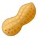 | [链接](https://github.githubassets.com/images/icons/emoji/unicode/1f95c.png?v8) |
| pear | `1f350` | 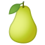 | [链接](https://github.githubassets.com/images/icons/emoji/unicode/1f350.png?v8) |
| pen | `1f58a` |  | [链接](https://github.githubassets.com/images/icons/emoji/unicode/1f58a.png?v8) |
| pencil | `1f4dd` |  | [链接](https://github.githubassets.com/images/icons/emoji/unicode/1f4dd.png?v8) |
| pencil2 | `270f` |  | [链接](https://github.githubassets.com/images/icons/emoji/unicode/270f.png?v8) |
| penguin | `1f427` |  | [链接](https://github.githubassets.com/images/icons/emoji/unicode/1f427.png?v8) |
| pensive | `1f614` |  | [链接](https://github.githubassets.com/images/icons/emoji/unicode/1f614.png?v8) |
| performing_arts | `1f3ad` |  | [链接](https://github.githubassets.com/images/icons/emoji/unicode/1f3ad.png?v8) |
| persevere | `1f623` |  | [链接](https://github.githubassets.com/images/icons/emoji/unicode/1f623.png?v8) |
| person_fencing | `1f93a` |  | [链接](https://github.githubassets.com/images/icons/emoji/unicode/1f93a.png?v8) |
| person_frowning | `1f64d` |  | [链接](https://github.githubassets.com/images/icons/emoji/unicode/1f64d.png?v8) |
| person_with_blond_hair | `1f471` |  | [链接](https://github.githubassets.com/images/icons/emoji/unicode/1f471.png?v8) |
| person_with_pouting_face | `1f64e` |  | [链接](https://github.githubassets.com/images/icons/emoji/unicode/1f64e.png?v8) |
| peru | `1f1f5-1f1ea` |  | [链接](https://github.githubassets.com/images/icons/emoji/unicode/1f1f5-1f1ea.png?v8) |
| philippines | `1f1f5-1f1ed` |  | [链接](https://github.githubassets.com/images/icons/emoji/unicode/1f1f5-1f1ed.png?v8) |
| phone | `260e` |  | [链接](https://github.githubassets.com/images/icons/emoji/unicode/260e.png?v8) |
| pick | `26cf` |  | [链接](https://github.githubassets.com/images/icons/emoji/unicode/26cf.png?v8) |
| pig | `1f437` |  | [链接](https://github.githubassets.com/images/icons/emoji/unicode/1f437.png?v8) |
| pig2 | `1f416` |  | [链接](https://github.githubassets.com/images/icons/emoji/unicode/1f416.png?v8) |
| pig_nose | `1f43d` |  | [链接](https://github.githubassets.com/images/icons/emoji/unicode/1f43d.png?v8) |
| pill | `1f48a` |  | [链接](https://github.githubassets.com/images/icons/emoji/unicode/1f48a.png?v8) |
| pineapple | `1f34d` |  | [链接](https://github.githubassets.com/images/icons/emoji/unicode/1f34d.png?v8) |
| ping_pong | `1f3d3` |  | [链接](https://github.githubassets.com/images/icons/emoji/unicode/1f3d3.png?v8) |
| pisces | `2653` |  | [链接](https://github.githubassets.com/images/icons/emoji/unicode/2653.png?v8) |
| pitcairn_islands | `1f1f5-1f1f3` |  | [链接](https://github.githubassets.com/images/icons/emoji/unicode/1f1f5-1f1f3.png?v8) |
| pizza | `1f355` |  | [链接](https://github.githubassets.com/images/icons/emoji/unicode/1f355.png?v8) |
| place_of_worship | `1f6d0` |  | [链接](https://github.githubassets.com/images/icons/emoji/unicode/1f6d0.png?v8) |
| plate_with_cutlery | `1f37d` |  | [链接](https://github.githubassets.com/images/icons/emoji/unicode/1f37d.png?v8) |
| play_or_pause_button | `23ef` |  | [链接](https://github.githubassets.com/images/icons/emoji/unicode/23ef.png?v8) |
| point_down | `1f447` |  | [链接](https://github.githubassets.com/images/icons/emoji/unicode/1f447.png?v8) |
| point_left | `1f448` |  | [链接](https://github.githubassets.com/images/icons/emoji/unicode/1f448.png?v8) |
| point_right | `1f449` |  | [链接](https://github.githubassets.com/images/icons/emoji/unicode/1f449.png?v8) |
| point_up | `261d` |  | [链接](https://github.githubassets.com/images/icons/emoji/unicode/261d.png?v8) |
| point_up_2 | `1f446` |  | [链接](https://github.githubassets.com/images/icons/emoji/unicode/1f446.png?v8) |
| poland | `1f1f5-1f1f1` |  | [链接](https://github.githubassets.com/images/icons/emoji/unicode/1f1f5-1f1f1.png?v8) |
| police_car | `1f693` |  | [链接](https://github.githubassets.com/images/icons/emoji/unicode/1f693.png?v8) |
| policeman | `1f46e` |  | [链接](https://github.githubassets.com/images/icons/emoji/unicode/1f46e.png?v8) |
| policewoman | `1f46e-2640` |  | [链接](https://github.githubassets.com/images/icons/emoji/unicode/1f46e-2640.png?v8) |
| poodle | `1f429` | 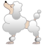 | [链接](https://github.githubassets.com/images/icons/emoji/unicode/1f429.png?v8) |
| poop | `1f4a9` |  | [链接](https://github.githubassets.com/images/icons/emoji/unicode/1f4a9.png?v8) |
| popcorn | `1f37f` |  | [链接](https://github.githubassets.com/images/icons/emoji/unicode/1f37f.png?v8) |
| portugal | `1f1f5-1f1f9` |  | [链接](https://github.githubassets.com/images/icons/emoji/unicode/1f1f5-1f1f9.png?v8) |
| post_office | `1f3e3` |  | [链接](https://github.githubassets.com/images/icons/emoji/unicode/1f3e3.png?v8) |
| postal_horn | `1f4ef` |  | [链接](https://github.githubassets.com/images/icons/emoji/unicode/1f4ef.png?v8) |
| postbox | `1f4ee` |  | [链接](https://github.githubassets.com/images/icons/emoji/unicode/1f4ee.png?v8) |
| potable_water | `1f6b0` |  | [链接](https://github.githubassets.com/images/icons/emoji/unicode/1f6b0.png?v8) |
| potato | `1f954` |  | [链接](https://github.githubassets.com/images/icons/emoji/unicode/1f954.png?v8) |
| pouch | `1f45d` |  | [链接](https://github.githubassets.com/images/icons/emoji/unicode/1f45d.png?v8) |
| poultry_leg | `1f357` | 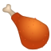 | [链接](https://github.githubassets.com/images/icons/emoji/unicode/1f357.png?v8) |
| pound | `1f4b7` |  | [链接](https://github.githubassets.com/images/icons/emoji/unicode/1f4b7.png?v8) |
| pout | `1f621` |  | [链接](https://github.githubassets.com/images/icons/emoji/unicode/1f621.png?v8) |
| pouting_cat | `1f63e` |  | [链接](https://github.githubassets.com/images/icons/emoji/unicode/1f63e.png?v8) |
| pouting_man | `1f64e-2642` |  | [链接](https://github.githubassets.com/images/icons/emoji/unicode/1f64e-2642.png?v8) |
| pouting_woman | `1f64e` |  | [链接](https://github.githubassets.com/images/icons/emoji/unicode/1f64e.png?v8) |
| pray | `1f64f` |  | [链接](https://github.githubassets.com/images/icons/emoji/unicode/1f64f.png?v8) |
| prayer_beads | `1f4ff` |  | [链接](https://github.githubassets.com/images/icons/emoji/unicode/1f4ff.png?v8) |
| pregnant_woman | `1f930` |  | [链接](https://github.githubassets.com/images/icons/emoji/unicode/1f930.png?v8) |
| previous_track_button | `23ee` |  | [链接](https://github.githubassets.com/images/icons/emoji/unicode/23ee.png?v8) |
| prince | `1f934` |  | [链接](https://github.githubassets.com/images/icons/emoji/unicode/1f934.png?v8) |
| princess | `1f478` |  | [链接](https://github.githubassets.com/images/icons/emoji/unicode/1f478.png?v8) |
| printer | `1f5a8` |  | [链接](https://github.githubassets.com/images/icons/emoji/unicode/1f5a8.png?v8) |
| puerto_rico | `1f1f5-1f1f7` |  | [链接](https://github.githubassets.com/images/icons/emoji/unicode/1f1f5-1f1f7.png?v8) |
| punch | `1f44a` |  | [链接](https://github.githubassets.com/images/icons/emoji/unicode/1f44a.png?v8) |
| purple_heart | `1f49c` |  | [链接](https://github.githubassets.com/images/icons/emoji/unicode/1f49c.png?v8) |
| purse | `1f45b` |  | [链接](https://github.githubassets.com/images/icons/emoji/unicode/1f45b.png?v8) |
| pushpin | `1f4cc` |  | [链接](https://github.githubassets.com/images/icons/emoji/unicode/1f4cc.png?v8) |
| put_litter_in_its_place | `1f6ae` |  | [链接](https://github.githubassets.com/images/icons/emoji/unicode/1f6ae.png?v8) |
| qatar | `1f1f6-1f1e6` |  | [链接](https://github.githubassets.com/images/icons/emoji/unicode/1f1f6-1f1e6.png?v8) |
| question | `2753` |  | [链接](https://github.githubassets.com/images/icons/emoji/unicode/2753.png?v8) |
| rabbit | `1f430` |  | [链接](https://github.githubassets.com/images/icons/emoji/unicode/1f430.png?v8) |
| rabbit2 | `1f407` |  | [链接](https://github.githubassets.com/images/icons/emoji/unicode/1f407.png?v8) |
| racehorse | `1f40e` |  | [链接](https://github.githubassets.com/images/icons/emoji/unicode/1f40e.png?v8) |
| racing_car | `1f3ce` |  | [链接](https://github.githubassets.com/images/icons/emoji/unicode/1f3ce.png?v8) |
| radio | `1f4fb` |  | [链接](https://github.githubassets.com/images/icons/emoji/unicode/1f4fb.png?v8) |
| radio_button | `1f518` |  | [链接](https://github.githubassets.com/images/icons/emoji/unicode/1f518.png?v8) |
| radioactive | `2622` |  | [链接](https://github.githubassets.com/images/icons/emoji/unicode/2622.png?v8) |
| rage | `1f621` |  | [链接](https://github.githubassets.com/images/icons/emoji/unicode/1f621.png?v8) |
| rage1 | `rage1` |  | [链接](https://github.githubassets.com/images/icons/emoji/rage1.png?v8) |
| rage2 | `rage2` |  | [链接](https://github.githubassets.com/images/icons/emoji/rage2.png?v8) |
| rage3 | `rage3` |  | [链接](https://github.githubassets.com/images/icons/emoji/rage3.png?v8) |
| rage4 | `rage4` |  | [链接](https://github.githubassets.com/images/icons/emoji/rage4.png?v8) |
| railway_car | `1f683` |  | [链接](https://github.githubassets.com/images/icons/emoji/unicode/1f683.png?v8) |
| railway_track | `1f6e4` |  | [链接](https://github.githubassets.com/images/icons/emoji/unicode/1f6e4.png?v8) |
| rainbow | `1f308` |  | [链接](https://github.githubassets.com/images/icons/emoji/unicode/1f308.png?v8) |
| rainbow_flag | `1f3f3-1f308` |  | [链接](https://github.githubassets.com/images/icons/emoji/unicode/1f3f3-1f308.png?v8) |
| raised_back_of_hand | `1f91a` |  | [链接](https://github.githubassets.com/images/icons/emoji/unicode/1f91a.png?v8) |
| raised_hand | `270b` |  | [链接](https://github.githubassets.com/images/icons/emoji/unicode/270b.png?v8) |
| raised_hand_with_fingers_splayed | `1f590` |  | [链接](https://github.githubassets.com/images/icons/emoji/unicode/1f590.png?v8) |
| raised_hands | `1f64c` |  | [链接](https://github.githubassets.com/images/icons/emoji/unicode/1f64c.png?v8) |
| raising_hand | `1f64b` |  | [链接](https://github.githubassets.com/images/icons/emoji/unicode/1f64b.png?v8) |
| raising_hand_man | `1f64b-2642` |  | [链接](https://github.githubassets.com/images/icons/emoji/unicode/1f64b-2642.png?v8) |
| raising_hand_woman | `1f64b` |  | [链接](https://github.githubassets.com/images/icons/emoji/unicode/1f64b.png?v8) |
| ram | `1f40f` |  | [链接](https://github.githubassets.com/images/icons/emoji/unicode/1f40f.png?v8) |
| ramen | `1f35c` |  | [链接](https://github.githubassets.com/images/icons/emoji/unicode/1f35c.png?v8) |
| rat | `1f400` |  | [链接](https://github.githubassets.com/images/icons/emoji/unicode/1f400.png?v8) |
| record_button | `23fa` |  | [链接](https://github.githubassets.com/images/icons/emoji/unicode/23fa.png?v8) |
| recycle | `267b` |  | [链接](https://github.githubassets.com/images/icons/emoji/unicode/267b.png?v8) |
| red_car | `1f697` |  | [链接](https://github.githubassets.com/images/icons/emoji/unicode/1f697.png?v8) |
| red_circle | `1f534` |  | [链接](https://github.githubassets.com/images/icons/emoji/unicode/1f534.png?v8) |
| registered | `00ae` |  | [链接](https://github.githubassets.com/images/icons/emoji/unicode/00ae.png?v8) |
| relaxed | `263a` |  | [链接](https://github.githubassets.com/images/icons/emoji/unicode/263a.png?v8) |
| relieved | `1f60c` |  | [链接](https://github.githubassets.com/images/icons/emoji/unicode/1f60c.png?v8) |
| reminder_ribbon | `1f397` |  | [链接](https://github.githubassets.com/images/icons/emoji/unicode/1f397.png?v8) |
| repeat | `1f501` |  | [链接](https://github.githubassets.com/images/icons/emoji/unicode/1f501.png?v8) |
| repeat_one | `1f502` |  | [链接](https://github.githubassets.com/images/icons/emoji/unicode/1f502.png?v8) |
| rescue_worker_helmet | `26d1` |  | [链接](https://github.githubassets.com/images/icons/emoji/unicode/26d1.png?v8) |
| restroom | `1f6bb` |  | [链接](https://github.githubassets.com/images/icons/emoji/unicode/1f6bb.png?v8) |
| reunion | `1f1f7-1f1ea` |  | [链接](https://github.githubassets.com/images/icons/emoji/unicode/1f1f7-1f1ea.png?v8) |
| revolving_hearts | `1f49e` |  | [链接](https://github.githubassets.com/images/icons/emoji/unicode/1f49e.png?v8) |
| rewind | `23ea` |  | [链接](https://github.githubassets.com/images/icons/emoji/unicode/23ea.png?v8) |
| rhinoceros | `1f98f` |  | [链接](https://github.githubassets.com/images/icons/emoji/unicode/1f98f.png?v8) |
| ribbon | `1f380` |  | [链接](https://github.githubassets.com/images/icons/emoji/unicode/1f380.png?v8) |
| rice | `1f35a` |  | [链接](https://github.githubassets.com/images/icons/emoji/unicode/1f35a.png?v8) |
| rice_ball | `1f359` |  | [链接](https://github.githubassets.com/images/icons/emoji/unicode/1f359.png?v8) |
| rice_cracker | `1f358` |  | [链接](https://github.githubassets.com/images/icons/emoji/unicode/1f358.png?v8) |
| rice_scene | `1f391` | 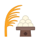 | [链接](https://github.githubassets.com/images/icons/emoji/unicode/1f391.png?v8) |
| right_anger_bubble | `1f5ef` |  | [链接](https://github.githubassets.com/images/icons/emoji/unicode/1f5ef.png?v8) |
| ring | `1f48d` |  | [链接](https://github.githubassets.com/images/icons/emoji/unicode/1f48d.png?v8) |
| robot | `1f916` |  | [链接](https://github.githubassets.com/images/icons/emoji/unicode/1f916.png?v8) |
| rocket | `1f680` |  | [链接](https://github.githubassets.com/images/icons/emoji/unicode/1f680.png?v8) |
| rofl | `1f923` |  | [链接](https://github.githubassets.com/images/icons/emoji/unicode/1f923.png?v8) |
| roll_eyes | `1f644` |  | [链接](https://github.githubassets.com/images/icons/emoji/unicode/1f644.png?v8) |
| roller_coaster | `1f3a2` |  | [链接](https://github.githubassets.com/images/icons/emoji/unicode/1f3a2.png?v8) |
| romania | `1f1f7-1f1f4` |  | [链接](https://github.githubassets.com/images/icons/emoji/unicode/1f1f7-1f1f4.png?v8) |
| rooster | `1f413` | 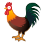 | [链接](https://github.githubassets.com/images/icons/emoji/unicode/1f413.png?v8) |
| rose | `1f339` |  | [链接](https://github.githubassets.com/images/icons/emoji/unicode/1f339.png?v8) |
| rosette | `1f3f5` |  | [链接](https://github.githubassets.com/images/icons/emoji/unicode/1f3f5.png?v8) |
| rotating_light | `1f6a8` |  | [链接](https://github.githubassets.com/images/icons/emoji/unicode/1f6a8.png?v8) |
| round_pushpin | `1f4cd` |  | [链接](https://github.githubassets.com/images/icons/emoji/unicode/1f4cd.png?v8) |
| rowboat | `1f6a3` |  | [链接](https://github.githubassets.com/images/icons/emoji/unicode/1f6a3.png?v8) |
| rowing_man | `1f6a3` |  | [链接](https://github.githubassets.com/images/icons/emoji/unicode/1f6a3.png?v8) |
| rowing_woman | `1f6a3-2640` |  | [链接](https://github.githubassets.com/images/icons/emoji/unicode/1f6a3-2640.png?v8) |
| ru | `1f1f7-1f1fa` |  | [链接](https://github.githubassets.com/images/icons/emoji/unicode/1f1f7-1f1fa.png?v8) |
| rugby_football | `1f3c9` |  | [链接](https://github.githubassets.com/images/icons/emoji/unicode/1f3c9.png?v8) |
| runner | `1f3c3` |  | [链接](https://github.githubassets.com/images/icons/emoji/unicode/1f3c3.png?v8) |
| running | `1f3c3` |  | [链接](https://github.githubassets.com/images/icons/emoji/unicode/1f3c3.png?v8) |
| running_man | `1f3c3` |  | [链接](https://github.githubassets.com/images/icons/emoji/unicode/1f3c3.png?v8) |
| running_shirt_with_sash | `1f3bd` |  | [链接](https://github.githubassets.com/images/icons/emoji/unicode/1f3bd.png?v8) |
| running_woman | `1f3c3-2640` |  | [链接](https://github.githubassets.com/images/icons/emoji/unicode/1f3c3-2640.png?v8) |
| rwanda | `1f1f7-1f1fc` |  | [链接](https://github.githubassets.com/images/icons/emoji/unicode/1f1f7-1f1fc.png?v8) |
| sa | `1f202` |  | [链接](https://github.githubassets.com/images/icons/emoji/unicode/1f202.png?v8) |
| sagittarius | `2650` |  | [链接](https://github.githubassets.com/images/icons/emoji/unicode/2650.png?v8) |
| sailboat | `26f5` |  | [链接](https://github.githubassets.com/images/icons/emoji/unicode/26f5.png?v8) |
| sake | `1f376` |  | [链接](https://github.githubassets.com/images/icons/emoji/unicode/1f376.png?v8) |
| samoa | `1f1fc-1f1f8` |  | [链接](https://github.githubassets.com/images/icons/emoji/unicode/1f1fc-1f1f8.png?v8) |
| san_marino | `1f1f8-1f1f2` |  | [链接](https://github.githubassets.com/images/icons/emoji/unicode/1f1f8-1f1f2.png?v8) |
| sandal | `1f461` | 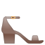 | [链接](https://github.githubassets.com/images/icons/emoji/unicode/1f461.png?v8) |
| santa | `1f385` |  | [链接](https://github.githubassets.com/images/icons/emoji/unicode/1f385.png?v8) |
| sao_tome_principe | `1f1f8-1f1f9` |  | [链接](https://github.githubassets.com/images/icons/emoji/unicode/1f1f8-1f1f9.png?v8) |
| satellite | `1f4e1` |  | [链接](https://github.githubassets.com/images/icons/emoji/unicode/1f4e1.png?v8) |
| satisfied | `1f606` |  | [链接](https://github.githubassets.com/images/icons/emoji/unicode/1f606.png?v8) |
| saudi_arabia | `1f1f8-1f1e6` |  | [链接](https://github.githubassets.com/images/icons/emoji/unicode/1f1f8-1f1e6.png?v8) |
| saxophone | `1f3b7` |  | [链接](https://github.githubassets.com/images/icons/emoji/unicode/1f3b7.png?v8) |
| school | `1f3eb` |  | [链接](https://github.githubassets.com/images/icons/emoji/unicode/1f3eb.png?v8) |
| school_satchel | `1f392` |  | [链接](https://github.githubassets.com/images/icons/emoji/unicode/1f392.png?v8) |
| scissors | `2702` |  | [链接](https://github.githubassets.com/images/icons/emoji/unicode/2702.png?v8) |
| scorpion | `1f982` | 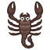 | [链接](https://github.githubassets.com/images/icons/emoji/unicode/1f982.png?v8) |
| scorpius | `264f` |  | [链接](https://github.githubassets.com/images/icons/emoji/unicode/264f.png?v8) |
| scream | `1f631` |  | [链接](https://github.githubassets.com/images/icons/emoji/unicode/1f631.png?v8) |
| scream_cat | `1f640` |  | [链接](https://github.githubassets.com/images/icons/emoji/unicode/1f640.png?v8) |
| scroll | `1f4dc` |  | [链接](https://github.githubassets.com/images/icons/emoji/unicode/1f4dc.png?v8) |
| seat | `1f4ba` |  | [链接](https://github.githubassets.com/images/icons/emoji/unicode/1f4ba.png?v8) |
| secret | `3299` |  | [链接](https://github.githubassets.com/images/icons/emoji/unicode/3299.png?v8) |
| see_no_evil | `1f648` |  | [链接](https://github.githubassets.com/images/icons/emoji/unicode/1f648.png?v8) |
| seedling | `1f331` |  | [链接](https://github.githubassets.com/images/icons/emoji/unicode/1f331.png?v8) |
| selfie | `1f933` |  | [链接](https://github.githubassets.com/images/icons/emoji/unicode/1f933.png?v8) |
| senegal | `1f1f8-1f1f3` |  | [链接](https://github.githubassets.com/images/icons/emoji/unicode/1f1f8-1f1f3.png?v8) |
| serbia | `1f1f7-1f1f8` |  | [链接](https://github.githubassets.com/images/icons/emoji/unicode/1f1f7-1f1f8.png?v8) |
| seven | `0037-20e3` |  | [链接](https://github.githubassets.com/images/icons/emoji/unicode/0037-20e3.png?v8) |
| seychelles | `1f1f8-1f1e8` |  | [链接](https://github.githubassets.com/images/icons/emoji/unicode/1f1f8-1f1e8.png?v8) |
| shallow_pan_of_food | `1f958` |  | [链接](https://github.githubassets.com/images/icons/emoji/unicode/1f958.png?v8) |
| shamrock | `2618` |  | [链接](https://github.githubassets.com/images/icons/emoji/unicode/2618.png?v8) |
| shark | `1f988` |  | [链接](https://github.githubassets.com/images/icons/emoji/unicode/1f988.png?v8) |
| shaved_ice | `1f367` |  | [链接](https://github.githubassets.com/images/icons/emoji/unicode/1f367.png?v8) |
| sheep | `1f411` | 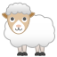 | [链接](https://github.githubassets.com/images/icons/emoji/unicode/1f411.png?v8) |
| shell | `1f41a` |  | [链接](https://github.githubassets.com/images/icons/emoji/unicode/1f41a.png?v8) |
| shield | `1f6e1` |  | [链接](https://github.githubassets.com/images/icons/emoji/unicode/1f6e1.png?v8) |
| shinto_shrine | `26e9` |  | [链接](https://github.githubassets.com/images/icons/emoji/unicode/26e9.png?v8) |
| ship | `1f6a2` |  | [链接](https://github.githubassets.com/images/icons/emoji/unicode/1f6a2.png?v8) |
| shipit | `shipit` |  | [链接](https://github.githubassets.com/images/icons/emoji/shipit.png?v8) |
| shirt | `1f455` |  | [链接](https://github.githubassets.com/images/icons/emoji/unicode/1f455.png?v8) |
| shit | `1f4a9` |  | [链接](https://github.githubassets.com/images/icons/emoji/unicode/1f4a9.png?v8) |
| shoe | `1f45e` |  | [链接](https://github.githubassets.com/images/icons/emoji/unicode/1f45e.png?v8) |
| shopping | `1f6cd` |  | [链接](https://github.githubassets.com/images/icons/emoji/unicode/1f6cd.png?v8) |
| shopping_cart | `1f6d2` |  | [链接](https://github.githubassets.com/images/icons/emoji/unicode/1f6d2.png?v8) |
| shower | `1f6bf` |  | [链接](https://github.githubassets.com/images/icons/emoji/unicode/1f6bf.png?v8) |
| shrimp | `1f990` | 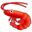 | [链接](https://github.githubassets.com/images/icons/emoji/unicode/1f990.png?v8) |
| sierra_leone | `1f1f8-1f1f1` |  | [链接](https://github.githubassets.com/images/icons/emoji/unicode/1f1f8-1f1f1.png?v8) |
| signal_strength | `1f4f6` |  | [链接](https://github.githubassets.com/images/icons/emoji/unicode/1f4f6.png?v8) |
| singapore | `1f1f8-1f1ec` |  | [链接](https://github.githubassets.com/images/icons/emoji/unicode/1f1f8-1f1ec.png?v8) |
| sint_maarten | `1f1f8-1f1fd` |  | [链接](https://github.githubassets.com/images/icons/emoji/unicode/1f1f8-1f1fd.png?v8) |
| six | `0036-20e3` |  | [链接](https://github.githubassets.com/images/icons/emoji/unicode/0036-20e3.png?v8) |
| six_pointed_star | `1f52f` |  | [链接](https://github.githubassets.com/images/icons/emoji/unicode/1f52f.png?v8) |
| ski | `1f3bf` | 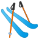 | [链接](https://github.githubassets.com/images/icons/emoji/unicode/1f3bf.png?v8) |
| skier | `26f7` |  | [链接](https://github.githubassets.com/images/icons/emoji/unicode/26f7.png?v8) |
| skull | `1f480` |  | [链接](https://github.githubassets.com/images/icons/emoji/unicode/1f480.png?v8) |
| skull_and_crossbones | `2620` |  | [链接](https://github.githubassets.com/images/icons/emoji/unicode/2620.png?v8) |
| sleeping | `1f634` |  | [链接](https://github.githubassets.com/images/icons/emoji/unicode/1f634.png?v8) |
| sleeping_bed | `1f6cc` |  | [链接](https://github.githubassets.com/images/icons/emoji/unicode/1f6cc.png?v8) |
| sleepy | `1f62a` |  | [链接](https://github.githubassets.com/images/icons/emoji/unicode/1f62a.png?v8) |
| slightly_frowning_face | `1f641` |  | [链接](https://github.githubassets.com/images/icons/emoji/unicode/1f641.png?v8) |
| slightly_smiling_face | `1f642` |  | [链接](https://github.githubassets.com/images/icons/emoji/unicode/1f642.png?v8) |
| slot_machine | `1f3b0` |  | [链接](https://github.githubassets.com/images/icons/emoji/unicode/1f3b0.png?v8) |
| slovakia | `1f1f8-1f1f0` |  | [链接](https://github.githubassets.com/images/icons/emoji/unicode/1f1f8-1f1f0.png?v8) |
| slovenia | `1f1f8-1f1ee` |  | [链接](https://github.githubassets.com/images/icons/emoji/unicode/1f1f8-1f1ee.png?v8) |
| small_airplane | `1f6e9` |  | [链接](https://github.githubassets.com/images/icons/emoji/unicode/1f6e9.png?v8) |
| small_blue_diamond | `1f539` |  | [链接](https://github.githubassets.com/images/icons/emoji/unicode/1f539.png?v8) |
| small_orange_diamond | `1f538` |  | [链接](https://github.githubassets.com/images/icons/emoji/unicode/1f538.png?v8) |
| small_red_triangle | `1f53a` |  | [链接](https://github.githubassets.com/images/icons/emoji/unicode/1f53a.png?v8) |
| small_red_triangle_down | `1f53b` |  | [链接](https://github.githubassets.com/images/icons/emoji/unicode/1f53b.png?v8) |
| smile | `1f604` |  | [链接](https://github.githubassets.com/images/icons/emoji/unicode/1f604.png?v8) |
| smile_cat | `1f638` |  | [链接](https://github.githubassets.com/images/icons/emoji/unicode/1f638.png?v8) |
| smiley | `1f603` |  | [链接](https://github.githubassets.com/images/icons/emoji/unicode/1f603.png?v8) |
| smiley_cat | `1f63a` |  | [链接](https://github.githubassets.com/images/icons/emoji/unicode/1f63a.png?v8) |
| smiling_imp | `1f608` |  | [链接](https://github.githubassets.com/images/icons/emoji/unicode/1f608.png?v8) |
| smirk | `1f60f` |  | [链接](https://github.githubassets.com/images/icons/emoji/unicode/1f60f.png?v8) |
| smirk_cat | `1f63c` |  | [链接](https://github.githubassets.com/images/icons/emoji/unicode/1f63c.png?v8) |
| smoking | `1f6ac` |  | [链接](https://github.githubassets.com/images/icons/emoji/unicode/1f6ac.png?v8) |
| snail | `1f40c` |  | [链接](https://github.githubassets.com/images/icons/emoji/unicode/1f40c.png?v8) |
| snake | `1f40d` |  | [链接](https://github.githubassets.com/images/icons/emoji/unicode/1f40d.png?v8) |
| sneezing_face | `1f927` |  | [链接](https://github.githubassets.com/images/icons/emoji/unicode/1f927.png?v8) |
| snowboarder | `1f3c2` | 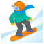 | [链接](https://github.githubassets.com/images/icons/emoji/unicode/1f3c2.png?v8) |
| snowflake | `2744` |  | [链接](https://github.githubassets.com/images/icons/emoji/unicode/2744.png?v8) |
| snowman | `26c4` |  | [链接](https://github.githubassets.com/images/icons/emoji/unicode/26c4.png?v8) |
| snowman_with_snow | `2603` |  | [链接](https://github.githubassets.com/images/icons/emoji/unicode/2603.png?v8) |
| sob | `1f62d` |  | [链接](https://github.githubassets.com/images/icons/emoji/unicode/1f62d.png?v8) |
| soccer | `26bd` |  | [链接](https://github.githubassets.com/images/icons/emoji/unicode/26bd.png?v8) |
| solomon_islands | `1f1f8-1f1e7` |  | [链接](https://github.githubassets.com/images/icons/emoji/unicode/1f1f8-1f1e7.png?v8) |
| somalia | `1f1f8-1f1f4` |  | [链接](https://github.githubassets.com/images/icons/emoji/unicode/1f1f8-1f1f4.png?v8) |
| soon | `1f51c` |  | [链接](https://github.githubassets.com/images/icons/emoji/unicode/1f51c.png?v8) |
| sos | `1f198` |  | [链接](https://github.githubassets.com/images/icons/emoji/unicode/1f198.png?v8) |
| sound | `1f509` |  | [链接](https://github.githubassets.com/images/icons/emoji/unicode/1f509.png?v8) |
| south_africa | `1f1ff-1f1e6` |  | [链接](https://github.githubassets.com/images/icons/emoji/unicode/1f1ff-1f1e6.png?v8) |
| south_georgia_south_sandwich_islands | `1f1ec-1f1f8` |  | [链接](https://github.githubassets.com/images/icons/emoji/unicode/1f1ec-1f1f8.png?v8) |
| south_sudan | `1f1f8-1f1f8` |  | [链接](https://github.githubassets.com/images/icons/emoji/unicode/1f1f8-1f1f8.png?v8) |
| space_invader | `1f47e` |  | [链接](https://github.githubassets.com/images/icons/emoji/unicode/1f47e.png?v8) |
| spades | `2660` |  | [链接](https://github.githubassets.com/images/icons/emoji/unicode/2660.png?v8) |
| spaghetti | `1f35d` |  | [链接](https://github.githubassets.com/images/icons/emoji/unicode/1f35d.png?v8) |
| sparkle | `2747` |  | [链接](https://github.githubassets.com/images/icons/emoji/unicode/2747.png?v8) |
| sparkler | `1f387` |  | [链接](https://github.githubassets.com/images/icons/emoji/unicode/1f387.png?v8) |
| sparkles | `2728` |  | [链接](https://github.githubassets.com/images/icons/emoji/unicode/2728.png?v8) |
| sparkling_heart | `1f496` |  | [链接](https://github.githubassets.com/images/icons/emoji/unicode/1f496.png?v8) |
| speak_no_evil | `1f64a` |  | [链接](https://github.githubassets.com/images/icons/emoji/unicode/1f64a.png?v8) |
| speaker | `1f508` |  | [链接](https://github.githubassets.com/images/icons/emoji/unicode/1f508.png?v8) |
| speaking_head | `1f5e3` |  | [链接](https://github.githubassets.com/images/icons/emoji/unicode/1f5e3.png?v8) |
| speech_balloon | `1f4ac` |  | [链接](https://github.githubassets.com/images/icons/emoji/unicode/1f4ac.png?v8) |
| speedboat | `1f6a4` |  | [链接](https://github.githubassets.com/images/icons/emoji/unicode/1f6a4.png?v8) |
| spider | `1f577` |  | [链接](https://github.githubassets.com/images/icons/emoji/unicode/1f577.png?v8) |
| spider_web | `1f578` |  | [链接](https://github.githubassets.com/images/icons/emoji/unicode/1f578.png?v8) |
| spiral_calendar | `1f5d3` |  | [链接](https://github.githubassets.com/images/icons/emoji/unicode/1f5d3.png?v8) |
| spiral_notepad | `1f5d2` |  | [链接](https://github.githubassets.com/images/icons/emoji/unicode/1f5d2.png?v8) |
| spoon | `1f944` |  | [链接](https://github.githubassets.com/images/icons/emoji/unicode/1f944.png?v8) |
| squid | `1f991` |  | [链接](https://github.githubassets.com/images/icons/emoji/unicode/1f991.png?v8) |
| squirrel | `shipit` |  | [链接](https://github.githubassets.com/images/icons/emoji/shipit.png?v8) |
| sri_lanka | `1f1f1-1f1f0` |  | [链接](https://github.githubassets.com/images/icons/emoji/unicode/1f1f1-1f1f0.png?v8) |
| st_barthelemy | `1f1e7-1f1f1` |  | [链接](https://github.githubassets.com/images/icons/emoji/unicode/1f1e7-1f1f1.png?v8) |
| st_helena | `1f1f8-1f1ed` |  | [链接](https://github.githubassets.com/images/icons/emoji/unicode/1f1f8-1f1ed.png?v8) |
| st_kitts_nevis | `1f1f0-1f1f3` |  | [链接](https://github.githubassets.com/images/icons/emoji/unicode/1f1f0-1f1f3.png?v8) |
| st_lucia | `1f1f1-1f1e8` |  | [链接](https://github.githubassets.com/images/icons/emoji/unicode/1f1f1-1f1e8.png?v8) |
| st_pierre_miquelon | `1f1f5-1f1f2` |  | [链接](https://github.githubassets.com/images/icons/emoji/unicode/1f1f5-1f1f2.png?v8) |
| st_vincent_grenadines | `1f1fb-1f1e8` |  | [链接](https://github.githubassets.com/images/icons/emoji/unicode/1f1fb-1f1e8.png?v8) |
| stadium | `1f3df` |  | [链接](https://github.githubassets.com/images/icons/emoji/unicode/1f3df.png?v8) |
| star | `2b50` |  | [链接](https://github.githubassets.com/images/icons/emoji/unicode/2b50.png?v8) |
| star2 | `1f31f` |  | [链接](https://github.githubassets.com/images/icons/emoji/unicode/1f31f.png?v8) |
| star_and_crescent | `262a` |  | [链接](https://github.githubassets.com/images/icons/emoji/unicode/262a.png?v8) |
| star_of_david | `2721` |  | [链接](https://github.githubassets.com/images/icons/emoji/unicode/2721.png?v8) |
| stars | `1f320` |  | [链接](https://github.githubassets.com/images/icons/emoji/unicode/1f320.png?v8) |
| station | `1f689` |  | [链接](https://github.githubassets.com/images/icons/emoji/unicode/1f689.png?v8) |
| statue_of_liberty | `1f5fd` |  | [链接](https://github.githubassets.com/images/icons/emoji/unicode/1f5fd.png?v8) |
| steam_locomotive | `1f682` |  | [链接](https://github.githubassets.com/images/icons/emoji/unicode/1f682.png?v8) |
| stew | `1f372` |  | [链接](https://github.githubassets.com/images/icons/emoji/unicode/1f372.png?v8) |
| stop_button | `23f9` |  | [链接](https://github.githubassets.com/images/icons/emoji/unicode/23f9.png?v8) |
| stop_sign | `1f6d1` |  | [链接](https://github.githubassets.com/images/icons/emoji/unicode/1f6d1.png?v8) |
| stopwatch | `23f1` |  | [链接](https://github.githubassets.com/images/icons/emoji/unicode/23f1.png?v8) |
| straight_ruler | `1f4cf` |  | [链接](https://github.githubassets.com/images/icons/emoji/unicode/1f4cf.png?v8) |
| strawberry | `1f353` |  | [链接](https://github.githubassets.com/images/icons/emoji/unicode/1f353.png?v8) |
| stuck_out_tongue | `1f61b` |  | [链接](https://github.githubassets.com/images/icons/emoji/unicode/1f61b.png?v8) |
| stuck_out_tongue_closed_eyes | `1f61d` |  | [链接](https://github.githubassets.com/images/icons/emoji/unicode/1f61d.png?v8) |
| stuck_out_tongue_winking_eye | `1f61c` |  | [链接](https://github.githubassets.com/images/icons/emoji/unicode/1f61c.png?v8) |
| studio_microphone | `1f399` |  | [链接](https://github.githubassets.com/images/icons/emoji/unicode/1f399.png?v8) |
| stuffed_flatbread | `1f959` |  | [链接](https://github.githubassets.com/images/icons/emoji/unicode/1f959.png?v8) |
| sudan | `1f1f8-1f1e9` |  | [链接](https://github.githubassets.com/images/icons/emoji/unicode/1f1f8-1f1e9.png?v8) |
| sun_behind_large_cloud | `1f325` |  | [链接](https://github.githubassets.com/images/icons/emoji/unicode/1f325.png?v8) |
| sun_behind_rain_cloud | `1f326` |  | [链接](https://github.githubassets.com/images/icons/emoji/unicode/1f326.png?v8) |
| sun_behind_small_cloud | `1f324` |  | [链接](https://github.githubassets.com/images/icons/emoji/unicode/1f324.png?v8) |
| sun_with_face | `1f31e` |  | [链接](https://github.githubassets.com/images/icons/emoji/unicode/1f31e.png?v8) |
| sunflower | `1f33b` |  | [链接](https://github.githubassets.com/images/icons/emoji/unicode/1f33b.png?v8) |
| sunglasses | `1f60e` |  | [链接](https://github.githubassets.com/images/icons/emoji/unicode/1f60e.png?v8) |
| sunny | `2600` |  | [链接](https://github.githubassets.com/images/icons/emoji/unicode/2600.png?v8) |
| sunrise | `1f305` |  | [链接](https://github.githubassets.com/images/icons/emoji/unicode/1f305.png?v8) |
| sunrise_over_mountains | `1f304` |  | [链接](https://github.githubassets.com/images/icons/emoji/unicode/1f304.png?v8) |
| surfer | `1f3c4` | 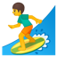 | [链接](https://github.githubassets.com/images/icons/emoji/unicode/1f3c4.png?v8) |
| surfing_man | `1f3c4` |  | [链接](https://github.githubassets.com/images/icons/emoji/unicode/1f3c4.png?v8) |
| surfing_woman | `1f3c4-2640` |  | [链接](https://github.githubassets.com/images/icons/emoji/unicode/1f3c4-2640.png?v8) |
| suriname | `1f1f8-1f1f7` |  | [链接](https://github.githubassets.com/images/icons/emoji/unicode/1f1f8-1f1f7.png?v8) |
| sushi | `1f363` |  | [链接](https://github.githubassets.com/images/icons/emoji/unicode/1f363.png?v8) |
| suspect | `suspect` |  | [链接](https://github.githubassets.com/images/icons/emoji/suspect.png?v8) |
| suspension_railway | `1f69f` |  | [链接](https://github.githubassets.com/images/icons/emoji/unicode/1f69f.png?v8) |
| swaziland | `1f1f8-1f1ff` |  | [链接](https://github.githubassets.com/images/icons/emoji/unicode/1f1f8-1f1ff.png?v8) |
| sweat | `1f613` |  | [链接](https://github.githubassets.com/images/icons/emoji/unicode/1f613.png?v8) |
| sweat_drops | `1f4a6` |  | [链接](https://github.githubassets.com/images/icons/emoji/unicode/1f4a6.png?v8) |
| sweat_smile | `1f605` |  | [链接](https://github.githubassets.com/images/icons/emoji/unicode/1f605.png?v8) |
| sweden | `1f1f8-1f1ea` |  | [链接](https://github.githubassets.com/images/icons/emoji/unicode/1f1f8-1f1ea.png?v8) |
| sweet_potato | `1f360` |  | [链接](https://github.githubassets.com/images/icons/emoji/unicode/1f360.png?v8) |
| swimmer | `1f3ca` |  | [链接](https://github.githubassets.com/images/icons/emoji/unicode/1f3ca.png?v8) |
| swimming_man | `1f3ca` |  | [链接](https://github.githubassets.com/images/icons/emoji/unicode/1f3ca.png?v8) |
| swimming_woman | `1f3ca-2640` |  | [链接](https://github.githubassets.com/images/icons/emoji/unicode/1f3ca-2640.png?v8) |
| switzerland | `1f1e8-1f1ed` |  | [链接](https://github.githubassets.com/images/icons/emoji/unicode/1f1e8-1f1ed.png?v8) |
| symbols | `1f523` |  | [链接](https://github.githubassets.com/images/icons/emoji/unicode/1f523.png?v8) |
| synagogue | `1f54d` |  | [链接](https://github.githubassets.com/images/icons/emoji/unicode/1f54d.png?v8) |
| syria | `1f1f8-1f1fe` |  | [链接](https://github.githubassets.com/images/icons/emoji/unicode/1f1f8-1f1fe.png?v8) |
| syringe | `1f489` |  | [链接](https://github.githubassets.com/images/icons/emoji/unicode/1f489.png?v8) |
| taco | `1f32e` |  | [链接](https://github.githubassets.com/images/icons/emoji/unicode/1f32e.png?v8) |
| tada | `1f389` |  | [链接](https://github.githubassets.com/images/icons/emoji/unicode/1f389.png?v8) |
| taiwan | `1f1f9-1f1fc` |  | [链接](https://github.githubassets.com/images/icons/emoji/unicode/1f1f9-1f1fc.png?v8) |
| tajikistan | `1f1f9-1f1ef` |  | [链接](https://github.githubassets.com/images/icons/emoji/unicode/1f1f9-1f1ef.png?v8) |
| tanabata_tree | `1f38b` | 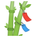 | [链接](https://github.githubassets.com/images/icons/emoji/unicode/1f38b.png?v8) |
| tangerine | `1f34a` |  | [链接](https://github.githubassets.com/images/icons/emoji/unicode/1f34a.png?v8) |
| tanzania | `1f1f9-1f1ff` |  | [链接](https://github.githubassets.com/images/icons/emoji/unicode/1f1f9-1f1ff.png?v8) |
| taurus | `2649` |  | [链接](https://github.githubassets.com/images/icons/emoji/unicode/2649.png?v8) |
| taxi | `1f695` |  | [链接](https://github.githubassets.com/images/icons/emoji/unicode/1f695.png?v8) |
| tea | `1f375` |  | [链接](https://github.githubassets.com/images/icons/emoji/unicode/1f375.png?v8) |
| telephone | `260e` |  | [链接](https://github.githubassets.com/images/icons/emoji/unicode/260e.png?v8) |
| telephone_receiver | `1f4de` |  | [链接](https://github.githubassets.com/images/icons/emoji/unicode/1f4de.png?v8) |
| telescope | `1f52d` | 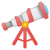 | [链接](https://github.githubassets.com/images/icons/emoji/unicode/1f52d.png?v8) |
| tennis | `1f3be` |  | [链接](https://github.githubassets.com/images/icons/emoji/unicode/1f3be.png?v8) |
| tent | `26fa` |  | [链接](https://github.githubassets.com/images/icons/emoji/unicode/26fa.png?v8) |
| thailand | `1f1f9-1f1ed` |  | [链接](https://github.githubassets.com/images/icons/emoji/unicode/1f1f9-1f1ed.png?v8) |
| thermometer | `1f321` |  | [链接](https://github.githubassets.com/images/icons/emoji/unicode/1f321.png?v8) |
| thinking | `1f914` |  | [链接](https://github.githubassets.com/images/icons/emoji/unicode/1f914.png?v8) |
| thought_balloon | `1f4ad` |  | [链接](https://github.githubassets.com/images/icons/emoji/unicode/1f4ad.png?v8) |
| three | `0033-20e3` |  | [链接](https://github.githubassets.com/images/icons/emoji/unicode/0033-20e3.png?v8) |
| thumbsdown | `1f44e` |  | [链接](https://github.githubassets.com/images/icons/emoji/unicode/1f44e.png?v8) |
| thumbsup | `1f44d` |  | [链接](https://github.githubassets.com/images/icons/emoji/unicode/1f44d.png?v8) |
| ticket | `1f3ab` |  | [链接](https://github.githubassets.com/images/icons/emoji/unicode/1f3ab.png?v8) |
| tickets | `1f39f` |  | [链接](https://github.githubassets.com/images/icons/emoji/unicode/1f39f.png?v8) |
| tiger | `1f42f` |  | [链接](https://github.githubassets.com/images/icons/emoji/unicode/1f42f.png?v8) |
| tiger2 | `1f405` |  | [链接](https://github.githubassets.com/images/icons/emoji/unicode/1f405.png?v8) |
| timer_clock | `23f2` |  | [链接](https://github.githubassets.com/images/icons/emoji/unicode/23f2.png?v8) |
| timor_leste | `1f1f9-1f1f1` |  | [链接](https://github.githubassets.com/images/icons/emoji/unicode/1f1f9-1f1f1.png?v8) |
| tipping_hand_man | `1f481-2642` |  | [链接](https://github.githubassets.com/images/icons/emoji/unicode/1f481-2642.png?v8) |
| tipping_hand_woman | `1f481` |  | [链接](https://github.githubassets.com/images/icons/emoji/unicode/1f481.png?v8) |
| tired_face | `1f62b` |  | [链接](https://github.githubassets.com/images/icons/emoji/unicode/1f62b.png?v8) |
| tm | `2122` |  | [链接](https://github.githubassets.com/images/icons/emoji/unicode/2122.png?v8) |
| togo | `1f1f9-1f1ec` |  | [链接](https://github.githubassets.com/images/icons/emoji/unicode/1f1f9-1f1ec.png?v8) |
| toilet | `1f6bd` |  | [链接](https://github.githubassets.com/images/icons/emoji/unicode/1f6bd.png?v8) |
| tokelau | `1f1f9-1f1f0` |  | [链接](https://github.githubassets.com/images/icons/emoji/unicode/1f1f9-1f1f0.png?v8) |
| tokyo_tower | `1f5fc` |  | [链接](https://github.githubassets.com/images/icons/emoji/unicode/1f5fc.png?v8) |
| tomato | `1f345` |  | [链接](https://github.githubassets.com/images/icons/emoji/unicode/1f345.png?v8) |
| tonga | `1f1f9-1f1f4` |  | [链接](https://github.githubassets.com/images/icons/emoji/unicode/1f1f9-1f1f4.png?v8) |
| tongue | `1f445` |  | [链接](https://github.githubassets.com/images/icons/emoji/unicode/1f445.png?v8) |
| top | `1f51d` |  | [链接](https://github.githubassets.com/images/icons/emoji/unicode/1f51d.png?v8) |
| tophat | `1f3a9` |  | [链接](https://github.githubassets.com/images/icons/emoji/unicode/1f3a9.png?v8) |
| tornado | `1f32a` | 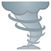 | [链接](https://github.githubassets.com/images/icons/emoji/unicode/1f32a.png?v8) |
| tr | `1f1f9-1f1f7` |  | [链接](https://github.githubassets.com/images/icons/emoji/unicode/1f1f9-1f1f7.png?v8) |
| trackball | `1f5b2` |  | [链接](https://github.githubassets.com/images/icons/emoji/unicode/1f5b2.png?v8) |
| tractor | `1f69c` |  | [链接](https://github.githubassets.com/images/icons/emoji/unicode/1f69c.png?v8) |
| traffic_light | `1f6a5` |  | [链接](https://github.githubassets.com/images/icons/emoji/unicode/1f6a5.png?v8) |
| train | `1f68b` |  | [链接](https://github.githubassets.com/images/icons/emoji/unicode/1f68b.png?v8) |
| train2 | `1f686` |  | [链接](https://github.githubassets.com/images/icons/emoji/unicode/1f686.png?v8) |
| tram | `1f68a` |  | [链接](https://github.githubassets.com/images/icons/emoji/unicode/1f68a.png?v8) |
| triangular_flag_on_post | `1f6a9` |  | [链接](https://github.githubassets.com/images/icons/emoji/unicode/1f6a9.png?v8) |
| triangular_ruler | `1f4d0` |  | [链接](https://github.githubassets.com/images/icons/emoji/unicode/1f4d0.png?v8) |
| trident | `1f531` |  | [链接](https://github.githubassets.com/images/icons/emoji/unicode/1f531.png?v8) |
| trinidad_tobago | `1f1f9-1f1f9` |  | [链接](https://github.githubassets.com/images/icons/emoji/unicode/1f1f9-1f1f9.png?v8) |
| triumph | `1f624` |  | [链接](https://github.githubassets.com/images/icons/emoji/unicode/1f624.png?v8) |
| trolleybus | `1f68e` |  | [链接](https://github.githubassets.com/images/icons/emoji/unicode/1f68e.png?v8) |
| trollface | `trollface` |  | [链接](https://github.githubassets.com/images/icons/emoji/trollface.png?v8) |
| trophy | `1f3c6` |  | [链接](https://github.githubassets.com/images/icons/emoji/unicode/1f3c6.png?v8) |
| tropical_drink | `1f379` |  | [链接](https://github.githubassets.com/images/icons/emoji/unicode/1f379.png?v8) |
| tropical_fish | `1f420` |  | [链接](https://github.githubassets.com/images/icons/emoji/unicode/1f420.png?v8) |
| truck | `1f69a` |  | [链接](https://github.githubassets.com/images/icons/emoji/unicode/1f69a.png?v8) |
| trumpet | `1f3ba` |  | [链接](https://github.githubassets.com/images/icons/emoji/unicode/1f3ba.png?v8) |
| tshirt | `1f455` |  | [链接](https://github.githubassets.com/images/icons/emoji/unicode/1f455.png?v8) |
| tulip | `1f337` |  | [链接](https://github.githubassets.com/images/icons/emoji/unicode/1f337.png?v8) |
| tumbler_glass | `1f943` |  | [链接](https://github.githubassets.com/images/icons/emoji/unicode/1f943.png?v8) |
| tunisia | `1f1f9-1f1f3` |  | [链接](https://github.githubassets.com/images/icons/emoji/unicode/1f1f9-1f1f3.png?v8) |
| turkey | `1f983` |  | [链接](https://github.githubassets.com/images/icons/emoji/unicode/1f983.png?v8) |
| turkmenistan | `1f1f9-1f1f2` |  | [链接](https://github.githubassets.com/images/icons/emoji/unicode/1f1f9-1f1f2.png?v8) |
| turks_caicos_islands | `1f1f9-1f1e8` |  | [链接](https://github.githubassets.com/images/icons/emoji/unicode/1f1f9-1f1e8.png?v8) |
| turtle | `1f422` |  | [链接](https://github.githubassets.com/images/icons/emoji/unicode/1f422.png?v8) |
| tuvalu | `1f1f9-1f1fb` |  | [链接](https://github.githubassets.com/images/icons/emoji/unicode/1f1f9-1f1fb.png?v8) |
| tv | `1f4fa` |  | [链接](https://github.githubassets.com/images/icons/emoji/unicode/1f4fa.png?v8) |
| twisted_rightwards_arrows | `1f500` |  | [链接](https://github.githubassets.com/images/icons/emoji/unicode/1f500.png?v8) |
| two | `0032-20e3` |  | [链接](https://github.githubassets.com/images/icons/emoji/unicode/0032-20e3.png?v8) |
| two_hearts | `1f495` |  | [链接](https://github.githubassets.com/images/icons/emoji/unicode/1f495.png?v8) |
| two_men_holding_hands | `1f46c` |  | [链接](https://github.githubassets.com/images/icons/emoji/unicode/1f46c.png?v8) |
| two_women_holding_hands | `1f46d` |  | [链接](https://github.githubassets.com/images/icons/emoji/unicode/1f46d.png?v8) |
| u5272 | `1f239` |  | [链接](https://github.githubassets.com/images/icons/emoji/unicode/1f239.png?v8) |
| u5408 | `1f234` |  | [链接](https://github.githubassets.com/images/icons/emoji/unicode/1f234.png?v8) |
| u55b6 | `1f23a` |  | [链接](https://github.githubassets.com/images/icons/emoji/unicode/1f23a.png?v8) |
| u6307 | `1f22f` |  | [链接](https://github.githubassets.com/images/icons/emoji/unicode/1f22f.png?v8) |
| u6708 | `1f237` |  | [链接](https://github.githubassets.com/images/icons/emoji/unicode/1f237.png?v8) |
| u6709 | `1f236` |  | [链接](https://github.githubassets.com/images/icons/emoji/unicode/1f236.png?v8) |
| u6e80 | `1f235` |  | [链接](https://github.githubassets.com/images/icons/emoji/unicode/1f235.png?v8) |
| u7121 | `1f21a` |  | [链接](https://github.githubassets.com/images/icons/emoji/unicode/1f21a.png?v8) |
| u7533 | `1f238` |  | [链接](https://github.githubassets.com/images/icons/emoji/unicode/1f238.png?v8) |
| u7981 | `1f232` |  | [链接](https://github.githubassets.com/images/icons/emoji/unicode/1f232.png?v8) |
| u7a7a | `1f233` |  | [链接](https://github.githubassets.com/images/icons/emoji/unicode/1f233.png?v8) |
| uganda | `1f1fa-1f1ec` |  | [链接](https://github.githubassets.com/images/icons/emoji/unicode/1f1fa-1f1ec.png?v8) |
| uk | `1f1ec-1f1e7` |  | [链接](https://github.githubassets.com/images/icons/emoji/unicode/1f1ec-1f1e7.png?v8) |
| ukraine | `1f1fa-1f1e6` |  | [链接](https://github.githubassets.com/images/icons/emoji/unicode/1f1fa-1f1e6.png?v8) |
| umbrella | `2614` |  | [链接](https://github.githubassets.com/images/icons/emoji/unicode/2614.png?v8) |
| unamused | `1f612` |  | [链接](https://github.githubassets.com/images/icons/emoji/unicode/1f612.png?v8) |
| underage | `1f51e` |  | [链接](https://github.githubassets.com/images/icons/emoji/unicode/1f51e.png?v8) |
| unicorn | `1f984` |  | [链接](https://github.githubassets.com/images/icons/emoji/unicode/1f984.png?v8) |
| united_arab_emirates | `1f1e6-1f1ea` |  | [链接](https://github.githubassets.com/images/icons/emoji/unicode/1f1e6-1f1ea.png?v8) |
| unlock | `1f513` |  | [链接](https://github.githubassets.com/images/icons/emoji/unicode/1f513.png?v8) |
| up | `1f199` |  | [链接](https://github.githubassets.com/images/icons/emoji/unicode/1f199.png?v8) |
| upside_down_face | `1f643` |  | [链接](https://github.githubassets.com/images/icons/emoji/unicode/1f643.png?v8) |
| uruguay | `1f1fa-1f1fe` |  | [链接](https://github.githubassets.com/images/icons/emoji/unicode/1f1fa-1f1fe.png?v8) |
| us | `1f1fa-1f1f8` |  | [链接](https://github.githubassets.com/images/icons/emoji/unicode/1f1fa-1f1f8.png?v8) |
| us_virgin_islands | `1f1fb-1f1ee` |  | [链接](https://github.githubassets.com/images/icons/emoji/unicode/1f1fb-1f1ee.png?v8) |
| uzbekistan | `1f1fa-1f1ff` |  | [链接](https://github.githubassets.com/images/icons/emoji/unicode/1f1fa-1f1ff.png?v8) |
| v | `270c` |  | [链接](https://github.githubassets.com/images/icons/emoji/unicode/270c.png?v8) |
| vanuatu | `1f1fb-1f1fa` |  | [链接](https://github.githubassets.com/images/icons/emoji/unicode/1f1fb-1f1fa.png?v8) |
| vatican_city | `1f1fb-1f1e6` |  | [链接](https://github.githubassets.com/images/icons/emoji/unicode/1f1fb-1f1e6.png?v8) |
| venezuela | `1f1fb-1f1ea` |  | [链接](https://github.githubassets.com/images/icons/emoji/unicode/1f1fb-1f1ea.png?v8) |
| vertical_traffic_light | `1f6a6` |  | [链接](https://github.githubassets.com/images/icons/emoji/unicode/1f6a6.png?v8) |
| vhs | `1f4fc` |  | [链接](https://github.githubassets.com/images/icons/emoji/unicode/1f4fc.png?v8) |
| vibration_mode | `1f4f3` |  | [链接](https://github.githubassets.com/images/icons/emoji/unicode/1f4f3.png?v8) |
| video_camera | `1f4f9` |  | [链接](https://github.githubassets.com/images/icons/emoji/unicode/1f4f9.png?v8) |
| video_game | `1f3ae` |  | [链接](https://github.githubassets.com/images/icons/emoji/unicode/1f3ae.png?v8) |
| vietnam | `1f1fb-1f1f3` |  | [链接](https://github.githubassets.com/images/icons/emoji/unicode/1f1fb-1f1f3.png?v8) |
| violin | `1f3bb` |  | [链接](https://github.githubassets.com/images/icons/emoji/unicode/1f3bb.png?v8) |
| virgo | `264d` |  | [链接](https://github.githubassets.com/images/icons/emoji/unicode/264d.png?v8) |
| volcano | `1f30b` |  | [链接](https://github.githubassets.com/images/icons/emoji/unicode/1f30b.png?v8) |
| volleyball | `1f3d0` |  | [链接](https://github.githubassets.com/images/icons/emoji/unicode/1f3d0.png?v8) |
| vs | `1f19a` |  | [链接](https://github.githubassets.com/images/icons/emoji/unicode/1f19a.png?v8) |
| vulcan_salute | `1f596` |  | [链接](https://github.githubassets.com/images/icons/emoji/unicode/1f596.png?v8) |
| walking | `1f6b6` |  | [链接](https://github.githubassets.com/images/icons/emoji/unicode/1f6b6.png?v8) |
| walking_man | `1f6b6` |  | [链接](https://github.githubassets.com/images/icons/emoji/unicode/1f6b6.png?v8) |
| walking_woman | `1f6b6-2640` |  | [链接](https://github.githubassets.com/images/icons/emoji/unicode/1f6b6-2640.png?v8) |
| wallis_futuna | `1f1fc-1f1eb` |  | [链接](https://github.githubassets.com/images/icons/emoji/unicode/1f1fc-1f1eb.png?v8) |
| waning_crescent_moon | `1f318` |  | [链接](https://github.githubassets.com/images/icons/emoji/unicode/1f318.png?v8) |
| waning_gibbous_moon | `1f316` |  | [链接](https://github.githubassets.com/images/icons/emoji/unicode/1f316.png?v8) |
| warning | `26a0` |  | [链接](https://github.githubassets.com/images/icons/emoji/unicode/26a0.png?v8) |
| wastebasket | `1f5d1` |  | [链接](https://github.githubassets.com/images/icons/emoji/unicode/1f5d1.png?v8) |
| watch | `231a` | 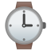 | [链接](https://github.githubassets.com/images/icons/emoji/unicode/231a.png?v8) |
| water_buffalo | `1f403` |  | [链接](https://github.githubassets.com/images/icons/emoji/unicode/1f403.png?v8) |
| watermelon | `1f349` |  | [链接](https://github.githubassets.com/images/icons/emoji/unicode/1f349.png?v8) |
| wave | `1f44b` |  | [链接](https://github.githubassets.com/images/icons/emoji/unicode/1f44b.png?v8) |
| wavy_dash | `3030` |  | [链接](https://github.githubassets.com/images/icons/emoji/unicode/3030.png?v8) |
| waxing_crescent_moon | `1f312` |  | [链接](https://github.githubassets.com/images/icons/emoji/unicode/1f312.png?v8) |
| waxing_gibbous_moon | `1f314` |  | [链接](https://github.githubassets.com/images/icons/emoji/unicode/1f314.png?v8) |
| wc | `1f6be` |  | [链接](https://github.githubassets.com/images/icons/emoji/unicode/1f6be.png?v8) |
| weary | `1f629` |  | [链接](https://github.githubassets.com/images/icons/emoji/unicode/1f629.png?v8) |
| wedding | `1f492` |  | [链接](https://github.githubassets.com/images/icons/emoji/unicode/1f492.png?v8) |
| weight_lifting_man | `1f3cb` |  | [链接](https://github.githubassets.com/images/icons/emoji/unicode/1f3cb.png?v8) |
| weight_lifting_woman | `1f3cb-2640` |  | [链接](https://github.githubassets.com/images/icons/emoji/unicode/1f3cb-2640.png?v8) |
| western_sahara | `1f1ea-1f1ed` |  | [链接](https://github.githubassets.com/images/icons/emoji/unicode/1f1ea-1f1ed.png?v8) |
| whale | `1f433` |  | [链接](https://github.githubassets.com/images/icons/emoji/unicode/1f433.png?v8) |
| whale2 | `1f40b` |  | [链接](https://github.githubassets.com/images/icons/emoji/unicode/1f40b.png?v8) |
| wheel_of_dharma | `2638` |  | [链接](https://github.githubassets.com/images/icons/emoji/unicode/2638.png?v8) |
| wheelchair | `267f` |  | [链接](https://github.githubassets.com/images/icons/emoji/unicode/267f.png?v8) |
| white_check_mark | `2705` |  | [链接](https://github.githubassets.com/images/icons/emoji/unicode/2705.png?v8) |
| white_circle | `26aa` |  | [链接](https://github.githubassets.com/images/icons/emoji/unicode/26aa.png?v8) |
| white_flag | `1f3f3` |  | [链接](https://github.githubassets.com/images/icons/emoji/unicode/1f3f3.png?v8) |
| white_flower | `1f4ae` |  | [链接](https://github.githubassets.com/images/icons/emoji/unicode/1f4ae.png?v8) |
| white_large_square | `2b1c` |  | [链接](https://github.githubassets.com/images/icons/emoji/unicode/2b1c.png?v8) |
| white_medium_small_square | `25fd` |  | [链接](https://github.githubassets.com/images/icons/emoji/unicode/25fd.png?v8) |
| white_medium_square | `25fb` |  | [链接](https://github.githubassets.com/images/icons/emoji/unicode/25fb.png?v8) |
| white_small_square | `25ab` |  | [链接](https://github.githubassets.com/images/icons/emoji/unicode/25ab.png?v8) |
| white_square_button | `1f533` |  | [链接](https://github.githubassets.com/images/icons/emoji/unicode/1f533.png?v8) |
| wilted_flower | `1f940` |  | [链接](https://github.githubassets.com/images/icons/emoji/unicode/1f940.png?v8) |
| wind_chime | `1f390` | 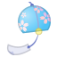 | [链接](https://github.githubassets.com/images/icons/emoji/unicode/1f390.png?v8) |
| wind_face | `1f32c` |  | [链接](https://github.githubassets.com/images/icons/emoji/unicode/1f32c.png?v8) |
| wine_glass | `1f377` |  | [链接](https://github.githubassets.com/images/icons/emoji/unicode/1f377.png?v8) |
| wink | `1f609` |  | [链接](https://github.githubassets.com/images/icons/emoji/unicode/1f609.png?v8) |
| wolf | `1f43a` |  | [链接](https://github.githubassets.com/images/icons/emoji/unicode/1f43a.png?v8) |
| woman | `1f469` |  | [链接](https://github.githubassets.com/images/icons/emoji/unicode/1f469.png?v8) |
| woman_artist | `1f469-1f3a8` |  | [链接](https://github.githubassets.com/images/icons/emoji/unicode/1f469-1f3a8.png?v8) |
| woman_astronaut | `1f469-1f680` |  | [链接](https://github.githubassets.com/images/icons/emoji/unicode/1f469-1f680.png?v8) |
| woman_cartwheeling | `1f938-2640` |  | [链接](https://github.githubassets.com/images/icons/emoji/unicode/1f938-2640.png?v8) |
| woman_cook | `1f469-1f373` |  | [链接](https://github.githubassets.com/images/icons/emoji/unicode/1f469-1f373.png?v8) |
| woman_facepalming | `1f926-2640` |  | [链接](https://github.githubassets.com/images/icons/emoji/unicode/1f926-2640.png?v8) |
| woman_factory_worker | `1f469-1f3ed` |  | [链接](https://github.githubassets.com/images/icons/emoji/unicode/1f469-1f3ed.png?v8) |
| woman_farmer | `1f469-1f33e` |  | [链接](https://github.githubassets.com/images/icons/emoji/unicode/1f469-1f33e.png?v8) |
| woman_firefighter | `1f469-1f692` |  | [链接](https://github.githubassets.com/images/icons/emoji/unicode/1f469-1f692.png?v8) |
| woman_health_worker | `1f469-2695` |  | [链接](https://github.githubassets.com/images/icons/emoji/unicode/1f469-2695.png?v8) |
| woman_judge | `1f469-2696` |  | [链接](https://github.githubassets.com/images/icons/emoji/unicode/1f469-2696.png?v8) |
| woman_juggling | `1f939-2640` |  | [链接](https://github.githubassets.com/images/icons/emoji/unicode/1f939-2640.png?v8) |
| woman_mechanic | `1f469-1f527` |  | [链接](https://github.githubassets.com/images/icons/emoji/unicode/1f469-1f527.png?v8) |
| woman_office_worker | `1f469-1f4bc` |  | [链接](https://github.githubassets.com/images/icons/emoji/unicode/1f469-1f4bc.png?v8) |
| woman_pilot | `1f469-2708` |  | [链接](https://github.githubassets.com/images/icons/emoji/unicode/1f469-2708.png?v8) |
| woman_playing_handball | `1f93e-2640` |  | [链接](https://github.githubassets.com/images/icons/emoji/unicode/1f93e-2640.png?v8) |
| woman_playing_water_polo | `1f93d-2640` |  | [链接](https://github.githubassets.com/images/icons/emoji/unicode/1f93d-2640.png?v8) |
| woman_scientist | `1f469-1f52c` |  | [链接](https://github.githubassets.com/images/icons/emoji/unicode/1f469-1f52c.png?v8) |
| woman_shrugging | `1f937-2640` |  | [链接](https://github.githubassets.com/images/icons/emoji/unicode/1f937-2640.png?v8) |
| woman_singer | `1f469-1f3a4` |  | [链接](https://github.githubassets.com/images/icons/emoji/unicode/1f469-1f3a4.png?v8) |
| woman_student | `1f469-1f393` |  | [链接](https://github.githubassets.com/images/icons/emoji/unicode/1f469-1f393.png?v8) |
| woman_teacher | `1f469-1f3eb` |  | [链接](https://github.githubassets.com/images/icons/emoji/unicode/1f469-1f3eb.png?v8) |
| woman_technologist | `1f469-1f4bb` |  | [链接](https://github.githubassets.com/images/icons/emoji/unicode/1f469-1f4bb.png?v8) |
| woman_with_turban | `1f473-2640` |  | [链接](https://github.githubassets.com/images/icons/emoji/unicode/1f473-2640.png?v8) |
| womans_clothes | `1f45a` |  | [链接](https://github.githubassets.com/images/icons/emoji/unicode/1f45a.png?v8) |
| womans_hat | `1f452` |  | [链接](https://github.githubassets.com/images/icons/emoji/unicode/1f452.png?v8) |
| women_wrestling | `1f93c-2640` |  | [链接](https://github.githubassets.com/images/icons/emoji/unicode/1f93c-2640.png?v8) |
| womens | `1f6ba` |  | [链接](https://github.githubassets.com/images/icons/emoji/unicode/1f6ba.png?v8) |
| world_map | `1f5fa` |  | [链接](https://github.githubassets.com/images/icons/emoji/unicode/1f5fa.png?v8) |
| worried | `1f61f` |  | [链接](https://github.githubassets.com/images/icons/emoji/unicode/1f61f.png?v8) |
| wrench | `1f527` |  | [链接](https://github.githubassets.com/images/icons/emoji/unicode/1f527.png?v8) |
| writing_hand | `270d` |  | [链接](https://github.githubassets.com/images/icons/emoji/unicode/270d.png?v8) |
| x | `274c` |  | [链接](https://github.githubassets.com/images/icons/emoji/unicode/274c.png?v8) |
| yellow_heart | `1f49b` |  | [链接](https://github.githubassets.com/images/icons/emoji/unicode/1f49b.png?v8) |
| yemen | `1f1fe-1f1ea` |  | [链接](https://github.githubassets.com/images/icons/emoji/unicode/1f1fe-1f1ea.png?v8) |
| yen | `1f4b4` |  | [链接](https://github.githubassets.com/images/icons/emoji/unicode/1f4b4.png?v8) |
| yin_yang | `262f` |  | [链接](https://github.githubassets.com/images/icons/emoji/unicode/262f.png?v8) |
| yum | `1f60b` |  | [链接](https://github.githubassets.com/images/icons/emoji/unicode/1f60b.png?v8) |
| zambia | `1f1ff-1f1f2` |  | [链接](https://github.githubassets.com/images/icons/emoji/unicode/1f1ff-1f1f2.png?v8) |
| zap | `26a1` |  | [链接](https://github.githubassets.com/images/icons/emoji/unicode/26a1.png?v8) |
| zero | `0030-20e3` |  | [链接](https://github.githubassets.com/images/icons/emoji/unicode/0030-20e3.png?v8) |
| zimbabwe | `1f1ff-1f1fc` |  | [链接](https://github.githubassets.com/images/icons/emoji/unicode/1f1ff-1f1fc.png?v8) |
| zipper_mouth_face | `1f910` |  | [链接](https://github.githubassets.com/images/icons/emoji/unicode/1f910.png?v8) |
| zzz | `1f4a4` |  | [链接](https://github.githubassets.com/images/icons/emoji/unicode/1f4a4.png?v8) |
